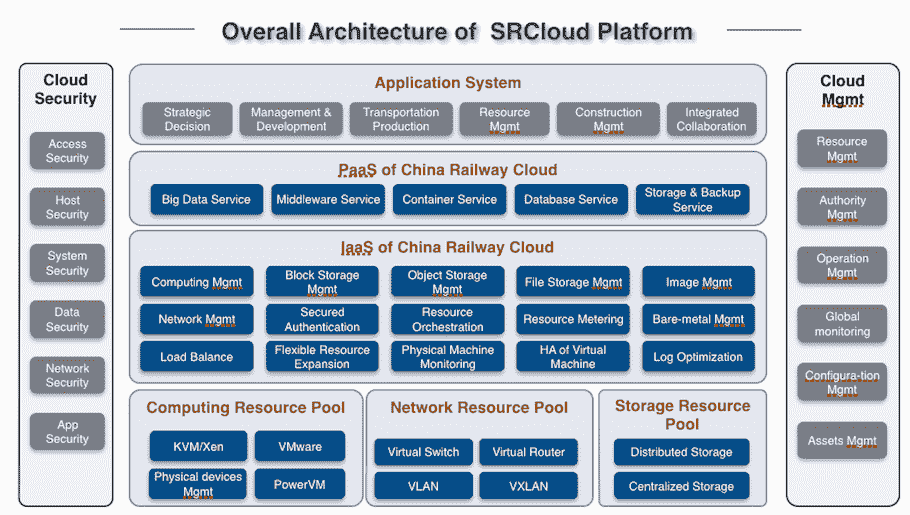

# 中国铁路的私有云基础设施为业务增长奠定了基础

> 原文：<https://thenewstack.io/china-railways-private-cloud-infrastructure-provides-roadbed-business-growth/>

在开源的 OpenStack 技术套件上构建和管理世界上最大的铁路网络从根本上改变了中国铁路对其业务的思考方式，正如首席架构师[高明星](https://www.linkedin.com/in/mingxing-gao-244b1035/)所指出的那样，这对任何寻求向云基础设施迁移的大型传统企业都有意义。

2010 年至 2016 年间，中国铁路业务大幅增长:运营里程增长 30%，客运量从 2010 年的 16.7 亿人次增加到 2016 年的 28.1 亿人次。与许多国家一样，铁路不仅仅是运输工具，还是经济的真正驱动力:每天运送货物、劳动力和游客，以确保一个国家的其他经济和社会结构得到服务。

> “我们有一句话:把饭碗掌握在自己手里”——高明星

高在去年的悉尼 OpenStack 峰会上发言，推动了中国铁路私有云基础设施 SinoRail Cloud 的发展，以管理中国铁路的大规模增长，并提供一个全天候的强大应用环境。高是铁道部科技进步一等奖获得者，三次获得二等奖。自 2004 年以来，他一直负责管理中铁云的发展，他表示，这些经验适用于希望从大型机转向云的大型企业。

他说，主要的可转移知识之一是选择私有云基础架构。“我们有一句话:把饭碗掌握在自己手里，”他说。他建议，使用 OpenStack 创建私有云环境可以为企业提供所需的安全性和自主性。“我们使用基于 OpenStack 的云软件，因此它是安全和可控的，”他说。

选择私有云方法还可以让中国铁路以新技术的速度创造新的价值。

高表示，中国铁路技术骨干的设计是基于基础设施即服务(IaaS)和平台即服务(PaaS)的行业标准，使用纳米管模型，不仅能够与 VMware 和 IBM 等第三方供应商进行虚拟化连接，还能够连接各种存储架构的大型功能点。

在构建私有云堆栈时，高利用了一种至今仍在使用的合作模式。与 OpenStack 供应商如中国的 T2Cloud 合作给了这个运输巨头一个学习速度，这是它自己无法实现的。随着新云技术的快速发展以及管理 24/7/265 运营的需求，与外部技术合作伙伴合作意味着他们可以从每个版本中学习，每次进行大约 1，200 个测试案例。

中铁云拥有 800 个物理服务器节点，运行 100，000 台虚拟机。“这是令人难以置信的事情，但我们做到了，”高说。

就像德勤[与美国美国国家铁路客运公司](https://thenewstack.io/amtrak-rolls-past-containers-serverless/)的无服务器合作一样，中铁云的私有云基础设施支持创建更多实时数据应用。高指出，流量估计提高了网络的整体效率，中国的机车远程监控和诊断系统目前正在生产中，管理着约 5000 辆列车，使用无线传输和卫星导航不仅可以实时监控列车的位置，还可以从中央总部进行交互和状态检查。

高说，在云基础设施上运行可以减少大约一半的能耗，他计算出比以前的裸机方法节省了 46%。

虽然高参指出，这些成本节约、更快的应用程序开发以及新优化的运营和监控性能是其迁移的主要优势，但真正的优势在于中国铁路现已部署云技术架构后出现的新思维。高表示，中国铁路的新思维是将自己视为一个以市场为导向的企业，能够开发新的用例及业务流。高认为没有云管理是不可能的。

高说，中国铁路可以扩展客运服务，包括火车上的餐饮，酒店预订和旅客目的地的汽车接送；启用新的货运产品，以新的方式利用车站用地，并引入全新的铁路网络，将中国与欧洲和泰国连接起来。

“三四年前，我们不能这样想，”高说。

专题图片:[康斯坦丁·普拉宁斯基](https://unsplash.com/photos/Aw2FSwNsb4M?utm_source=unsplash&utm_medium=referral&utm_content=creditCopyText)在 [Unsplash](https://unsplash.com/search/photos/train-cloud?utm_source=unsplash&utm_medium=referral&utm_content=creditCopyText) 拍摄的照片

***幻灯片图片:*** 来自[中国铁路如何利用开源云实现业务创新](https://www.openstack.org/assets/presentation-media/How-China-Railway-to-Achieve-Business-Innovation-by-Leveraging-Open-Source-Cloud-3.pptx)，发表于 2017 年 11 月悉尼 OpenStack 峰会。

<svg xmlns:xlink="http://www.w3.org/1999/xlink" viewBox="0 0 68 31" version="1.1"><title>Group</title> <desc>Created with Sketch.</desc></svg>