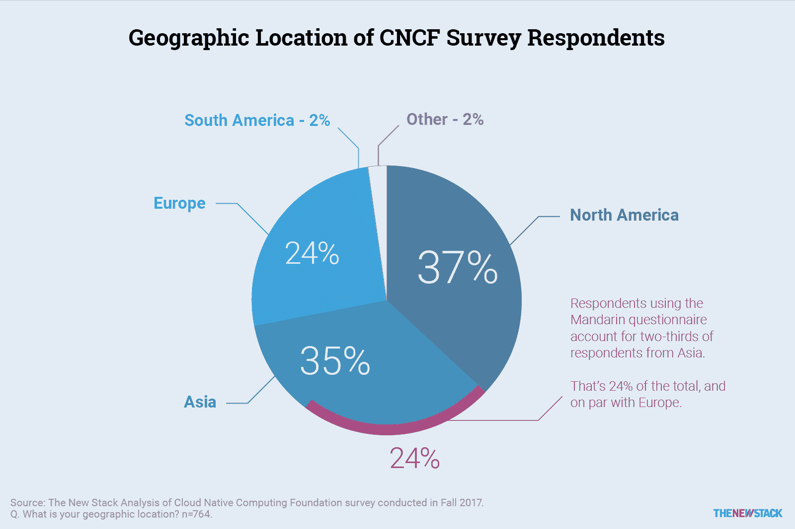
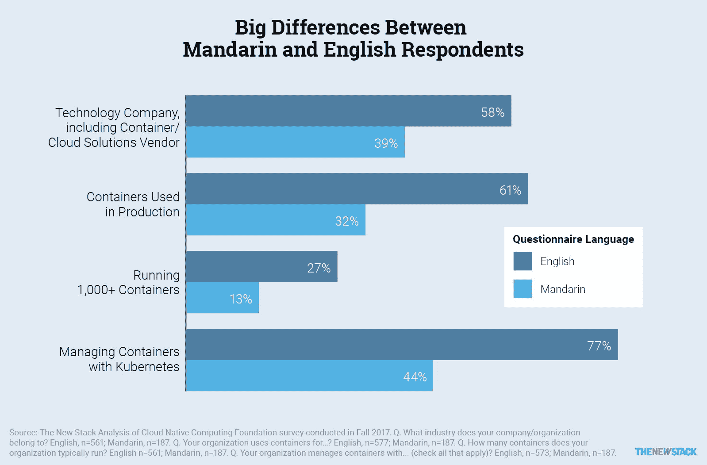
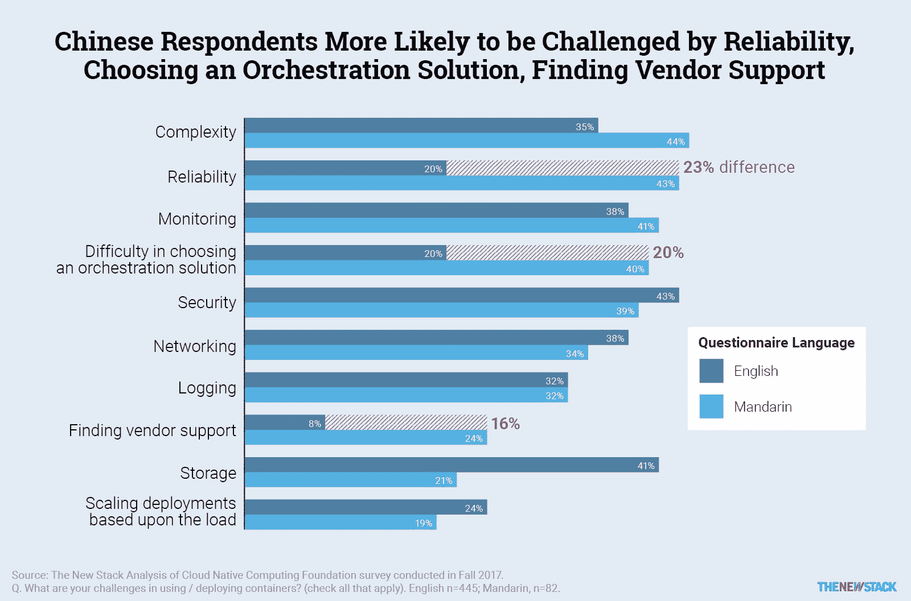
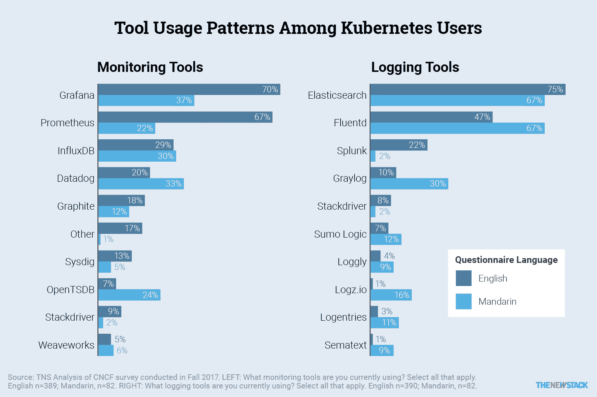
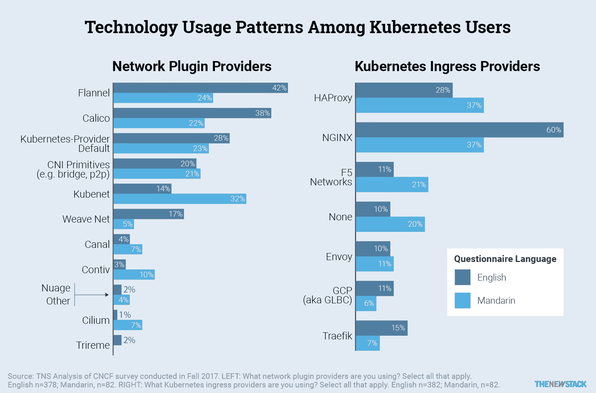

# 中国与世界:库伯内特和集装箱视角

> 原文：<https://thenewstack.io/china-vs-the-world-a-kubernetes-and-container-perspective/>

从[云原生计算基金会](https://www.cncf.io/)对云原生社区的普通话翻译调查中发布的新数据显示，总体而言，来自中国的受访者在部署容器和 Kubernetes 方面进展不太顺利。与英国受访者相比，他们也更有可能将容器部署到阿里云和 OpenStack 云提供商。普通话受访者认为可靠性是一个挑战的可能性也是两倍。

在 CNCF 2017 年的调查中，764 名受访者直接通过 CNCF 参与者、他们的社交网络和更大的云原生学习公司社区招募。该调查问卷的英文版在全世界分发，收到了 577 份答复。此外，CNCF 还收到了另外 187 份翻译成中文的问卷回复。CNCF 刚刚公布了这些普通话回答的数据，这篇文章提供了对新堆栈数据的独立分析。

在 Kubernetes 的采用者中，微软 Azure 在中国市场表现突出，在美国三大云提供商中的采用率领先于 GCP。请注意，调查中没有询问几家著名的中国云提供商。

用普通话进行调查意味着，与其他调查不同，CNCF 的调查不是由北美受访者主导的。来自亚洲和欧洲的受访者占样本的 59%。由于调查被翻译成了普通话，亚洲的样本倾向于中国，而不是印度或日本。尽管调查问题完全相同，但由于研究工具的编程方式略有不同，数据必须进行转换。此外，对“其他，请具体说明”选项的具体回答没有从中文翻译成英文。

[cyclone slider id = " kubernetes-series-book-2-赞助商"]

正如我们前面提到的综合调查数据，97%的样本在某种程度上使用容器，61%的样本在生产环境中使用容器。对于普通话受访者，这一数字下降到 32%。

新的堆栈认为，虽然中国的采用可能比西方同行落后几个月，但差异也是出于两个其他原因。首先，普通话样本对科技公司的影响要小得多，只有 39%的受访者在科技行业工作，而样本中其他人的比例为 58%。第二，英文问卷可能更多是由定期参加 CNCF 和 Kubernetes 会议的早期采用者完成的。

## 阿里巴巴和西方云提供商

总的来说，地理位置确实在云采用趋势中发挥了作用，因为 AWS 在北美和南亚的采用程度更高。这种趋势在 CNCF 的数据中也很明显，但更值得注意的是基于问卷是否是中文的环境变化。阿里云以 46%的份额遥遥领先于普通话使用者的供应商环境，但只有 1%的剩余参与者在那里部署 Kubernetes。

有可能是阿里巴巴向其客户群推广了这项调查，从而影响了调查结果。然而，在这一群体中，其他云提供商的使用率也明显较低。例如，虽然 AWS 以 63%的比例在世界其他地区处于领先地位，但只有 26%的普通话使用者在那里部署 Kubernetes。谷歌云平台的降幅也很大，从 35%降至 7%。

另一个显著的区别是，44%说普通话的人将 Kubernetes 部署到 OpenStack，而在世界其他地方只有 19%的人这样做。这种现象可能是因为 OpenStack 在中国更受欢迎，也可能是因为使用 OpenStack 的供应商推动了这项调查。

## 顶级集装箱挑战

值得注意的是，46%讲普通话的受访者在选择流程编排解决方案时面临挑战，这一比例比调查中的其他人高出 20 个百分点。很可能这些受访者要么处于 Kubernetes 采用的早期，要么仍然在质疑他们使用 Kubernetes 的决定，因为他们中很少有人在容器采用和成熟度方面走得这么远。此外，普通话受访者将可靠性视为挑战的可能性是其他人的两倍。这是值得进一步调查，以确定他们是否面临具体的可靠性问题，或者是否可能有一个不同的文化观念围绕这个主题。

## 采用相关技术

下面是另外两个图表，显示了中国技术采用的不同之处。

对于监控，Grafana 和 Prometheus 是中国以外的 Kubernetes 用户更经常使用的监控工具。对于日志记录，中国受访者更有可能使用 Fluentd 和 Graylog。

部分是因为它不是开源的，Splunk 在中国没有被广泛使用(2%对 22%)。

一些与网络相关的技术受到了英语受访者的青睐。对于网络插件提供商，法兰绒和 Calico 在中国表现不佳，而 Kubenet 的采用率几乎是研究其他地区的两倍(32%比 14%)。对于 Kubernetes ingress 来说，与世界其他地方相比，NGINX 在中国的使用要少得多。

## 展望未来

中国受访者在他们的集装箱之旅中走得不太远，但他们可能会从西方同行已经经历的反复试验中受益。没有了谁将赢得容器编排战的不确定性，中国公司可以专注于实施的细节。事实上，已经有许多公司在帮助运营 Kubernetes，Caicloud、DaoCloud、华为和 Wise2C 已经作为中国的 Kubernetes 认证服务提供商进入市场。其他提供 Kubernetes 产品的中国公司包括阿里云、百度云、易栈、和谐云、腾讯云、TenxCloud 和中兴通讯。随着在中国的八次 CNCF 聚会，我们预计 Kubernetes 的部署将变得越来越普遍。

[云本地计算基金会](https://www.cncf.io/)是新堆栈的赞助商。

<svg xmlns:xlink="http://www.w3.org/1999/xlink" viewBox="0 0 68 31" version="1.1"><title>Group</title> <desc>Created with Sketch.</desc></svg>