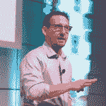

# Chip Childers 在 Cloud Foundry 担任执行董事

> 原文：<https://thenewstack.io/chip-childers-takes-executive-director-role-at-cloud-foundry/>

[云铸造基金会](https://www.cloudfoundry.org/foundation/)宣布，其长期首席技术官[Childers](https://www.linkedin.com/in/chipchilders/)将于 4 月 2 日起担任执行董事。据该组织称，他将接替艾比·卡恩斯(Abby Kearns)的职位，后者已经接受了其他职位。

那些熟悉独立的非营利开源组织 Cloud Foundry Foundation 的人无疑会对卡恩斯的离开感到失望，尽管肯定会同意 Childers 是一个很好的继任者。自 2015 年公司成立以来，他一直担任首席技术官，是该基金会许多技术的代言人，包括旗舰产品 [Cloud Foundry](https://www.cloudfoundry.org/) 开源云应用平台。

Cloud Foundry 是在 3，600 名贡献者的帮助下构建和完善的。仅在过去的 12 个月中，就有超过 39，000 次提交到该平台。 [Gartner research](https://www.cloudfoundry.org/blog/cloud-foundry-foundation-kicks-off-2019-with-new-members/) 估计 Cloud Foundry 的总市值约为 31 亿美元，随着更多组织转向基于开源的云计算，这一数字将在几年内上升至 52.5 亿美元。

我们采访了 Childers，以了解他的新角色、当务之急以及他引领 Cloud Foundry 走向未来的总体战略。

作为新的执行董事，你的首要任务是什么？

我个人的优先事项是确保基金会的工作人员以及社区的领导者围绕我们共同的优先事项保持一致:支持我们的社区，并将 Cloud Foundry 的力量带到各地的 Kubernetes 集群。让我们更深入地讨论这两个问题…

首先，在未来几个月中，我们将非常关注支持捐助群体的持续健康发展。Cloud Foundry 是最大的开源项目之一，该项目得到了多年来一直致力于该项目的所有主要参与者的持续投资。不过，我们可以不断改进，我将特别致力于提高我们社区的包容性。我们想看看我们如何能确保对项目的临时贡献者更低的摩擦。我们希望找到方法为新的贡献者腾出空间，同时确保代码继续前进。

第二，我们共同致力于将我们世界级的开发者体验带给 Kubernetes 用户。这个任务现在显然是我们贡献者的北极星。它指导着我们所有的社区成员和他们的工作。显然，像 Cloud Foundry Foundation 这样的开源基金会不会规定路线图(我们不是一家产品公司)，但我们会尽我们所能帮助我们的生态系统围绕这样的共同任务保持一致。我们在基金会的重点是帮助社区参与者看到合作的机会，否则可能不明显。

Kubernetes 是现代基础设施抽象，它需要云原生开发人员体验才能对组织最有用。我在基础设施即服务方面有很长的历史。可以说，我已经提升了抽象概念，越来越接近我多年前作为企业 web 开发人员的根源。如果你看看围绕“基础架构即服务”的对话是如何围绕这一理念展开的，我们作为一个行业，有望实现某种类型的实用计算模式。这个想法是不同的基础设施平台可以大致互换。事实上，以虚拟机为中心的平台根本不可能是那样的实用服务。Kubernetes 和标准化容器图像是不同的，它们提供了更好的实用性。实施细节肯定会有一些差异，但服务质量也是如此，无论您是在谈论所有公共云提供商及其托管服务，还是将您自己的服务推广到某些基础架构，或者 SUSE 和 VMware 等公司正在做的工作。

这是基础设施的故事，但是 Cloud Foundry 是关于开发者体验的。我们一直把开发者的体验放在首位。这是我们希望为世界各地的 Kubernetes 用户提供的关注点和多年的成功经验。

**执行董事的角色与首席技术官的角色有何不同？**

对我们来说，这一切都是为了转移到一个反映项目成熟度的模型。正如我前面所说，我们的首要任务是确保我们非常、非常专注于支持技术贡献社区。然而，这种转变并不新鲜，因为我在这一点上介入了。这是我们在今年的计划中非常有目的的一个目标。

现在，疫情无疑为我们抛来了一些东西。

我们为今年安排的峰会已经计划与去年的峰会有很大不同。几年来，我们的活动融合了贸易展览和社区协作时间。自从 2015 年基金会成立以来。今年，我们的活动重点是为我们的贡献社区创造高影响力的合作机会。这是第一点。第二，我们希望让社区外围的人能够协作，这些人可能没有构建平台，但作为个人或公司对其进行了大量投资。

所以我们为今年的峰会设计了一个为期一天的活动，附属于 Linux 基金会的开源峰会，北美[和欧洲](https://events.linuxfoundation.org/open-source-summit-north-america/)[的](https://events19.linuxfoundation.org/upcoming-events/)。我们非常有目的地进行这一转变，以符合我们的 2020 年目标。

同样，我的优先事项与我们已经计划和执行的一致。我们只是要进一步提高这一点，并确保我们非常清楚，我的团队中的每个人都将找到方法来帮助提升我们的社区，更好地连接我们的社区。

但这不仅仅是维持社区，因为有很多机会继续多样化和社区的持续增长。我给你举个例子。我们现在正在试行导师/学员计划。它是为那些对与云计算社区的成员建立联系感兴趣的人准备的。我们认为这是一个非常有价值的项目，因为它将让我们接触到世界各地的人们。

我们也在努力寻找一些方法，在全球非常困难的时期帮助支持我们社区中的个人。我们有一种虚拟水冷却器，每天安排两次，给欧洲和美国的人们一个非正式交谈的机会。我坚信，任何偶然交谈的机会都会对人们的福祉大有裨益。

**Cloud Foundry 今天还宣布，VMware 的 [Paul Fazzone](https://www.linkedin.com/in/paulfazzone/) 将接替(戴尔首席技术官)John Roese 担任 Cloud Foundry 基金会董事会主席。你能谈谈保罗吗？**

Paul 已经在我们的董事会任职多年，担任了我们的财务主管。出于几个原因，他担任董事长是一件非常好的事情。首先，Pivotal [被 VMware 收购](/vmware-acquires-pivotal-software-for-more-kubernetes-prowess/)，显然 VMware 在整合他们最近收购的所有公司方面做得非常出色。如果你看看他们对 Bitnami、Heptio 和 Pivotal 的收购，并考虑他们是如何将它们整合在一起的，这是一个令人印象深刻的计划。Paul 负责 [Tanzu 产品组合](https://tanzu.vmware.com/)的研发，他对 Cloud Foundry 项目的持续投入证明了我们社区的项目在 Tanzu 中的重要性。Paul 对确保 VMware 是一个非常非常好的开源参与者的关注也让我深受启发。

Cloud Foundry Foundation、Linux Foundation 和 VMware 是新堆栈的赞助商。

图片由来自 Pixabay 的 Gerd Altmann 提供。

<svg xmlns:xlink="http://www.w3.org/1999/xlink" viewBox="0 0 68 31" version="1.1"><title>Group</title> <desc>Created with Sketch.</desc></svg>