# 为 Kubeflow 和 ML 工作负载选择合适的存储引擎

> 原文：<https://thenewstack.io/choose-the-right-storage-engine-for-kubeflow-and-ml-workloads/>

Kubeflow 是专为 Kubernetes 设计的独特工作负载之一。该平台通过为数据科学家、开发人员、机器学习工程师和操作员提供一组集成功能，抽象了 Kubernetes 的基础。它的独特之处还在于它具备运行一个健壮的、云原生的、企业就绪的机器学习平台的先决条件。

像任何其他为 Kubernetes 设计的成熟应用程序一样，Kubeflow 严重依赖存储层来实现高可用性和交付预期的性能。

Kubernetes 有许多开源的和商业上可用的存储引擎，可以与 Kubeflow 一起使用。从 Ceph/Rook 到 [Red Hat](https://www.openshift.com/try?utm_content=inline-mention) 的 GlusterFS 到好喝的老 NFS，顾客可以从各种选项中选择。但是，没有一个单一的存储层能够满足运行 Kubeflow 平台以及笔记本服务器、管道和 KFServing 等各种组件的所有要求。

当您使用 Kubeflow 时，您需要满足平台的存储要求以及通过 Jupyter 笔记本、管道、Katib 和 KFServing 运行的 ML 作业。重要的是要知道 Kubeflow 平台和 ML 作业有不同的存储要求。

让我们仔细看看这两层的存储配置:Kubeflow 平台和在该平台上运行的用户创建的自定义作业。

## Kubeflow 平台的存储先决条件

Kubeflow 是一个由各种开源组件和项目组装而成的综合堆栈。该平台基于 Argo Workflow、Istio、Jupyter Hub、Knative、MinIO、MySQL 和 Seldon。

有多个 operators、CRDs 和 Kubernetes 对象集成了这些不同的开源项目来提供平台功能。例如，`tf-job-operator`、`pytorch-operator`和`mxnet-operator`是可以运行分布式培训任务的定制资源和操作员的组合。

下面是 Kubeflow 创建的 CRD 和运算符的子集:

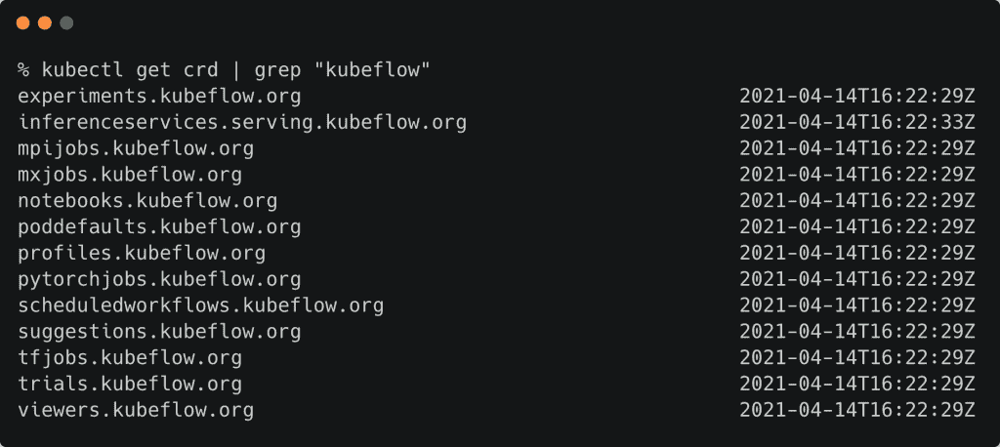

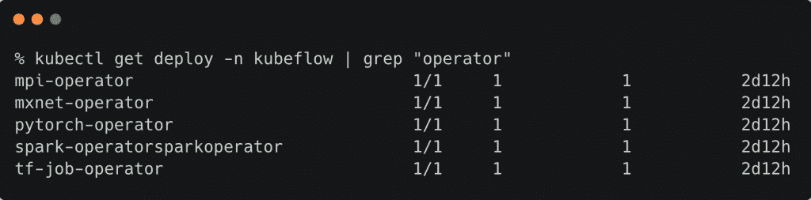

Kubeflow 的 CRD 和操作符依赖于一些作为 Kubernetes statefulsets 部署的有状态服务和带有外部 PVC 的部署。

Kubeflow 需要一个支持动态配置的存储类来动态创建 PVC。

MySQL 和 [MinIO](https://min.io/?utm_content=inline-mention) 等有状态服务需要由高吞吐量存储层支持的持久卷(PV)和持久卷声明(PVC)。

当您在安装 Kubeflow 后立即运行`kubectl get pv`时，您会看到为 MySQL 和 MinIO 创建的持久卷。

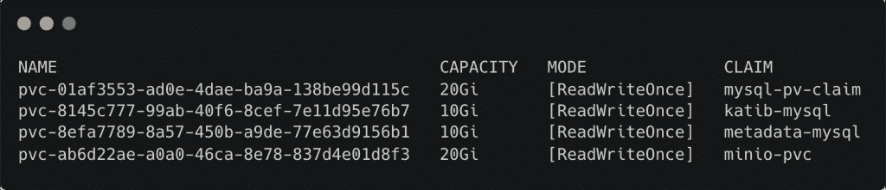

PVs 被绑定到与在`kubeflow`名称空间内运行的 pod 相连的 PVC。

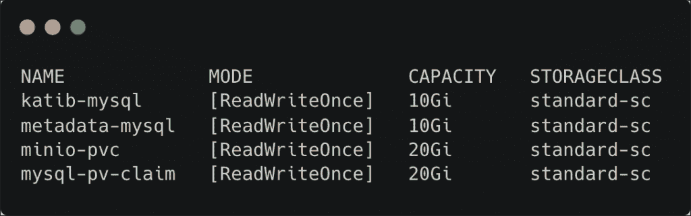

下面截图中突出显示的 pod 使用了这些 PVC。

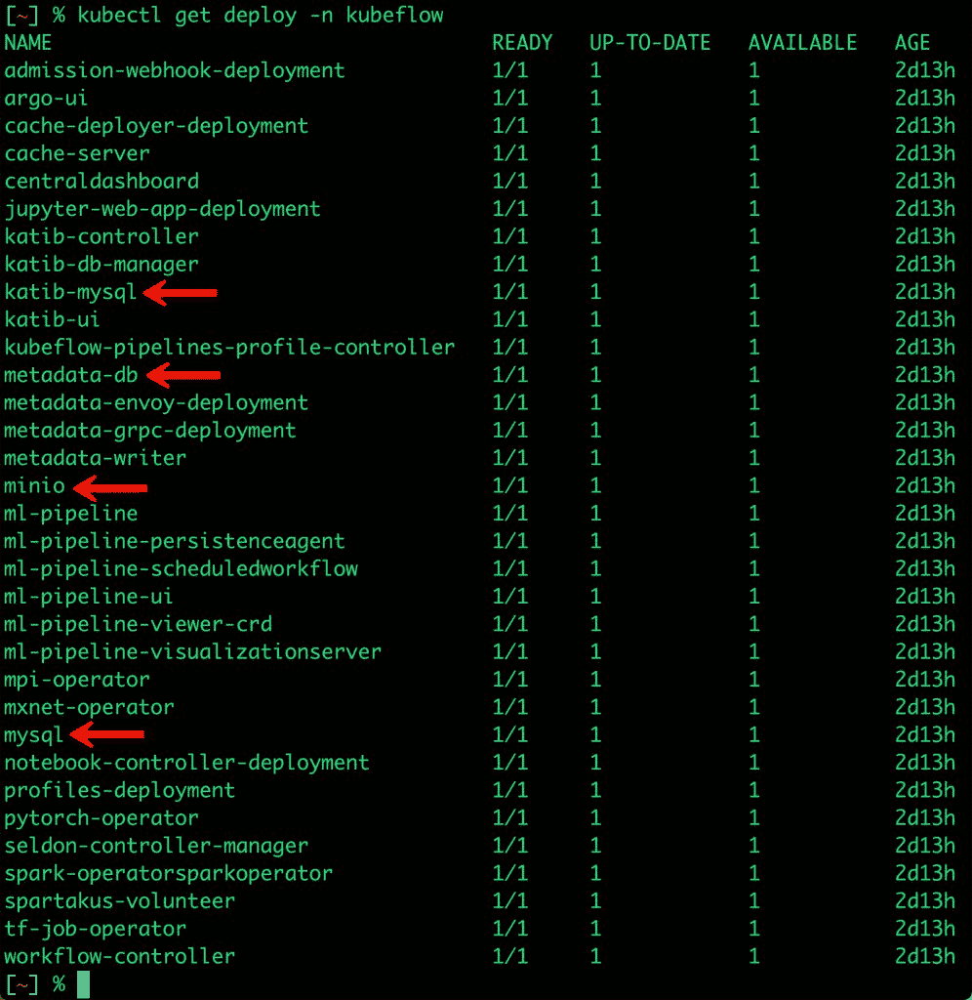

为了确保有状态服务获得预期的吞吐量和 I/O，它们需要一个高性能的存储层。另一个重要的方面是有状态服务没有被配置为 statefulsets。它们是由普通 PVC 支持的普通部署。

如果您使用共享文件系统(如 NFS 和 GlusterFS)配置 Kubeflow，您可能无法获得预期的吞吐量。

关键要点是 Kubeflow 平台层需要一个高可用性、高性能和可靠的存储引擎，能够为 MySQL 和 MinIO 等写密集型工作负载提供吞吐量和 I/O 性能。

## 在 Kubeflow 上运行的机器学习作业的存储要求

现在，让我们来看看 Kubeflow 的一个典型用例——一个组织内的多个团队利用笔记本服务器来构建和部署深度学习模型。

这一切都始于 DevOps 为各个团队——数据科学家、ML 工程师和开发人员——构建容器映像。数据科学团队准备数据并执行功能工程。最终数据集存储在共享位置，ML 工程师可以访问该位置来培训和调整模型。经过训练的模型被保存到另一个共享位置，该位置由构建模型服务和推理应用程序的开发人员使用。

要了解 DevOps 团队如何为每个团队创建三个独特的笔记本电脑服务器，请查看下面的屏幕截图。

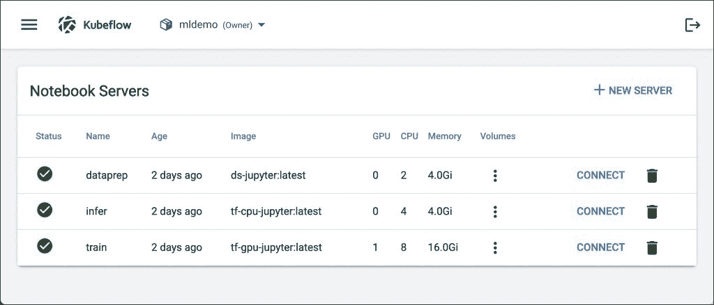

笔记本服务器是在专用的 Kubernetes 名称空间下创建的。在本例中，它们是`mldemo`名称空间的一部分。注意每个笔记本服务器是如何被转换成 statefulset 的一个实例的。

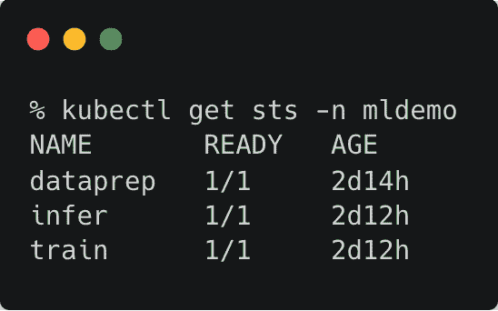

pod、`dataprep-0`、`train-0`和`infer-0`与 Kubeflow 中运行的相应笔记本服务器相关联。

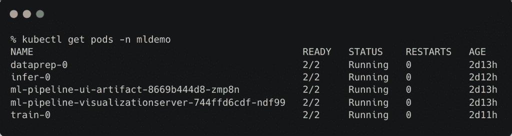

每个笔记本服务器实例都有一个 RWO 模式的专用 PVC，成为用户的主目录。为了实现数据集和模型等工件的共享，每台笔记本服务器还与一个 RWX 模式的共享 PVC 相关联，该共享 PVC 支持多个读写操作。

为了支持这个场景，我们预先创建了两个共享的 PVC，并将它们连接到笔记本服务器。

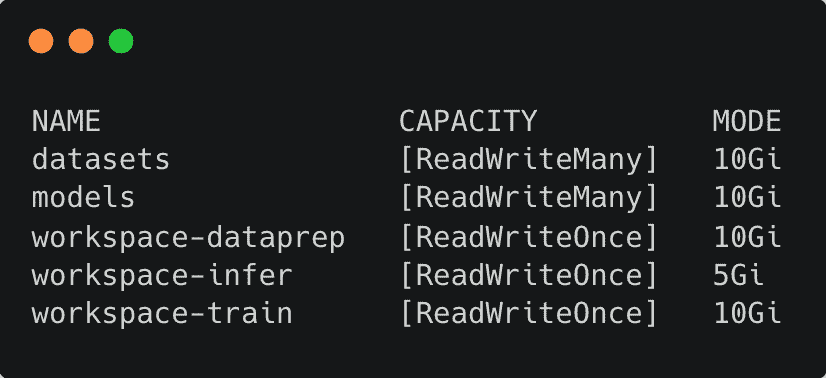

共享 PVs 在创建过程中会连接到笔记本电脑服务器。

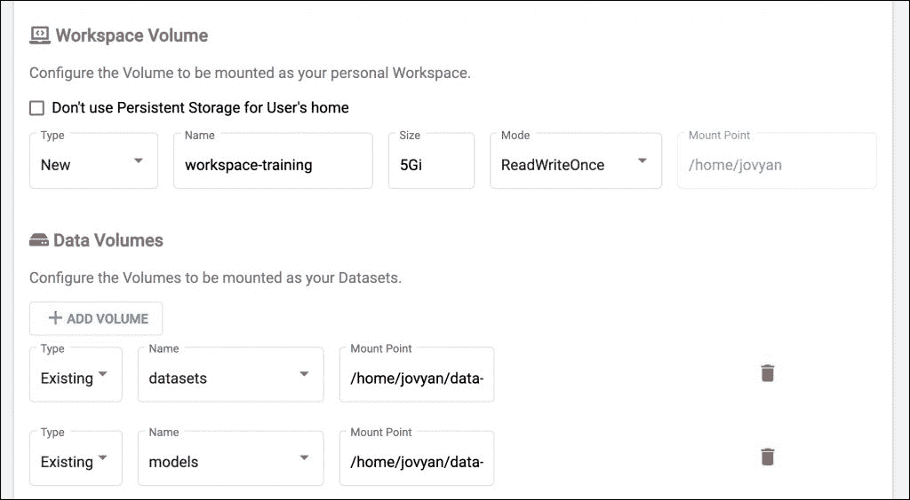

通过这种方法，DevOps 可以为所有团队提供一个共享的环境，以便有效地协作。共享卷是 Kubeflow 应用程序和 ML 作业的关键要求之一。

由于大多数云原生存储引擎不提供开箱即用的共享卷，客户最终使用 NFS 或 GlusterFS for Kubeflow。

我们将在即将发布的基于笔记本服务器和 Kubeflow 管道的 MLOps 教程中进一步探讨这个概念。

## 波特沃克斯纯存储库贝弗洛

正如我们所见，Kubeflow 需要存储引擎的组合——高吞吐量、运行有状态组件的可靠后端，以及运行在 Kubeflow 上的作业的共享存储层。

[Portworx by Pure Storage](https://portworx.com/?utm_content=inline-mention) 是面向 Kubernetes 的云原生、容器粒度、企业级存储引擎。它是独一无二的存储平台之一，具有复制、加密、共享卷以及内置的高可用性和故障切换等功能。

对于 Kubeflow，Portworx by Pure Storage 成为自然选择，原因如下:

*   为运行需要高可用性和高吞吐量的数据库而优化的动态存储类
*   常规状态 pod 的内置复制和高可用性，无需配置状态集
*   Sharedv4 卷提供了创建多写入方共享卷的现成功能

对于 MySQL、MinIO、Jupyter 笔记本等状态服务，以下 Portworx 存储类提供了所有预期的功能。

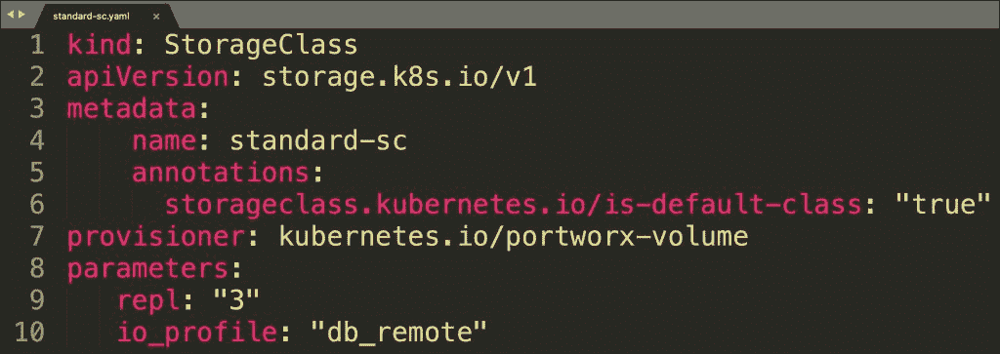

因为存储类被注释为默认，所以动态调配的 PVC 将自动基于此。

参数`repl`确保数据至少有三个副本，这带来了高可用性。`io_profile`参数实现了回写刷新合并算法，确保副本不会在 50 毫秒的窗口内同时失败(内核崩溃或断电)。

为了调配共享卷，我们创建了一个注释为 sharedv4 卷的不同存储类。

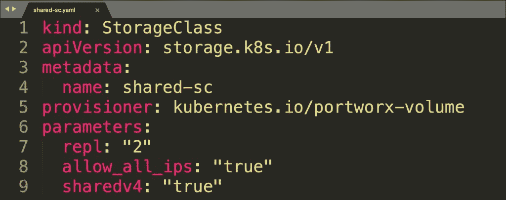

基于上述存储类的 PVCs 支持 RWX 模式，使得跨团队和笔记本服务器共享 ML 工件成为可能。

Portworx by Pure Storage 是市场上唯一一个为专用卷(RWO)和共享卷(RWX)提供无缝支持的存储平台，性能和吞吐量丝毫不打折扣。

*下周五回来查看本系列的下一部分，在那里我将带您了解集成 Portworx Essentials 的步骤，Portworx Pure Storage 的免费容器原生存储引擎与 NVIDIA DeepOps。敬请期待！*

<svg xmlns:xlink="http://www.w3.org/1999/xlink" viewBox="0 0 68 31" version="1.1"><title>Group</title> <desc>Created with Sketch.</desc></svg>