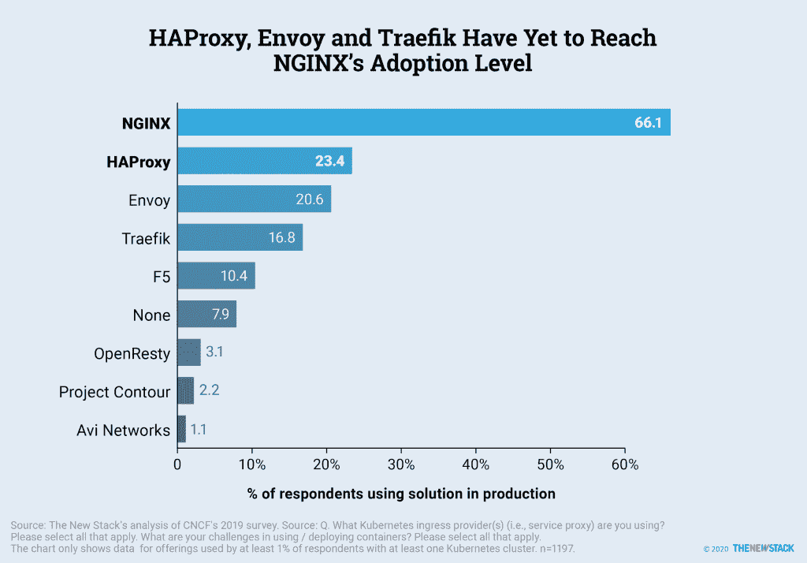

# 为 Kubernetes 选择一个容器本地网络

> 原文：<https://thenewstack.io/choosing-a-container-native-network-for-kubernetes/>

与容器原生存储类似，容器原生网络将物理网络基础设施抽象化，以向容器公开平面网络。它与 Kubernetes 紧密集成，以应对 [pod 到 pod、节点到节点、pod 到服务和外部通信](https://thenewstack.io/choosing-an-operating-system-and-container-runtime-for-your-cloud-native-stack/)中涉及的挑战。

Kubernetes 可以支持大量基于[容器网络接口](https://github.com/containernetworking/cni) (CNI)规范的插件，该规范定义了容器的网络连接性，并在容器被删除时处理网络资源。CNI 项目是[云原生计算基金会](https://www.cncf.io/)的孵化项目之一。

容器本地网络超越了基本的连接。它们提供网络安全规则的动态实施。通过预定义的策略，可以对容器、pod 和节点之间的通信进行细粒度控制。

选择正确的网络堆栈对于维护和保护 CaaS 平台至关重要。客户可以从开源项目中选择栈，包括[纤毛](https://cilium.io/)，Contiv，[法兰绒](https://github.com/coreos/flannel)，[项目印花布](https://www.projectcalico.org/) [，](https://www.projectcalico.org/) [钨布](https://tungsten.io/)和[织网](https://www.weave.works/docs/net/latest/overview/features/)。在商业方面，Tigera 提供 [Calico Enterprise](https://www.tigera.io/tigera-products/calico-enterprise/) 和 [Weave Net](https://www.weave.works/) 的企业订阅，可通过联系 Weaveworks 购买。

公共云供应商的托管 CaaS 产品与现有虚拟网络堆栈紧密集成。比如亚马逊 Web Services 有一个基于亚马逊虚拟私有云(VPC)的亚马逊弹性 Kubernetes 服务(EKS)的 [CNI 插件](https://github.com/aws/amazon-vpc-cni-k8s)，而微软为 Azure Kubernetes 服务(AKS)构建了 [Azure 虚拟网络容器联网接口](https://github.com/Azure/azure-container-networking/blob/master/docs/cni.md) (CNI)。

##### **表格:容器本地网络**

来自 [2019 年 CNCF 调查](https://www.cncf.io/wp-content/uploads/2020/03/CNCF_Survey_Report.pdf)的数据提供了对云原生网络的进一步洞察。

虽然 Kubernetes 用户继续评估入口提供商，但联网是一个挑战，这一挑战近年来有所下降。事实上，虽然一个 Kubernetes 用户平均有 1.5 个入口提供商，但 28%认为网络是一个挑战的受访者平均有 3 个入口提供商。66%的 Kubernetes 都使用 NGNIX 但是它本身并不能满足所有用户的需求。对 HAProxy 和 Envoy 的采用率较低，但在面临网络挑战的客户中有所上升。这表明新的市场进入者被用来解决问题。展望未来，期望提供基于它们支持的协议以及它们是否包括 API 网关的差异化产品。

描述:虽然涉及到 ingress，但是结合 Kubernetes 使用 NGINX 对网络挑战影响不大。来源:调查问题:您使用的是什么 Kubernetes 入口提供商(即服务代理)？请选择所有适用的选项。您在使用/部署容器时面临的挑战是什么？请选择所有适用的选项。该图表仅显示了至少 1%的受访者使用的产品数据，这些受访者至少拥有一个 Kubernetes 集群。n=1197。

亚马逊网络服务和云计算原生计算基金会是新堆栈的赞助商。

<svg xmlns:xlink="http://www.w3.org/1999/xlink" viewBox="0 0 68 31" version="1.1"><title>Group</title> <desc>Created with Sketch.</desc></svg>