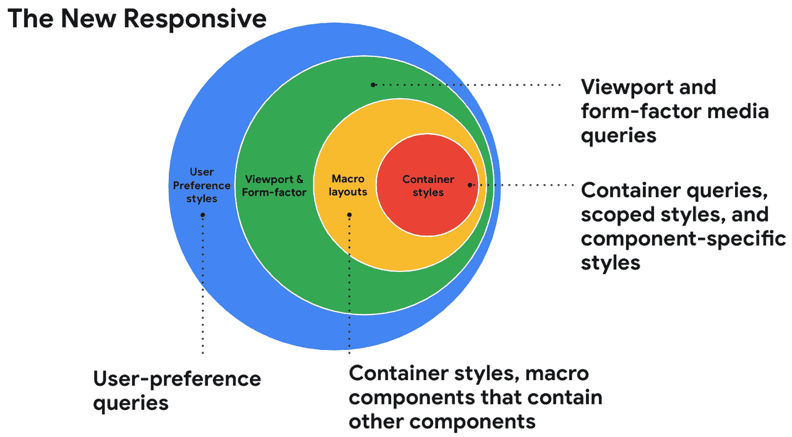

# Chrome 开发峰会:这是网络进化，而不是革命

> 原文：<https://thenewstack.io/chrome-dev-summit-2021-its-a-web-evolution-not-revolution/>

 [理查德·麦克马努斯

理查德是 New Stack 的高级编辑，每周撰写一篇关于网络和应用程序发展趋势的专栏文章。此前，他在 2003 年创立了读写网，并将其打造为全球最具影响力的科技新闻和分析网站之一。在 Twitter @ricmac 上关注他。](https://twitter.com/ricmac) 

今年的 [Chrome Dev Summit](https://developer.chrome.com/devsummit/) 由谷歌虚拟举办，与 2020 年的版本相比是一个相对低调的事件。[去年 12 月](https://thenewstack.io/chrome-dev-summit-the-web-is-closing-the-gap-on-native-apps/)，谷歌告诉我们，网络平台正在快速赶上原生应用，Chrome 扩展是“网络的超级力量”，PWAs(渐进式网络应用)正处于“变革时刻的尖端”

在 2021 年的 Chrome Dev 峰会上，并没有出现如此大的说法。在他的主题介绍中，谷歌网络平台产品管理总监 Ben Galbraith 说“网络进化是这个视频的中心主题。”所以在 2021 年，这是关于进化而不是革命。

也许谷歌故意淡化对这次开发者活动的兴奋，因为 2021 年对大型科技公司的怨恨越来越大。脸书首当其冲，今年 Techmeme 上充斥着源源不断的告密者爆料。但是谷歌也受到了抨击，特别是针对谷歌加速移动页面计划的反垄断诉讼。

该投诉在上个月底没有得到处理，所以我们第一次看到了关于谷歌限制非 AMP 页面速度的指控的细节。谷歌之前曾[称该诉讼](https://blog.google/outreach-initiatives/public-policy/response-doj/)“漏洞百出”，所以我不会在本文中进一步提及。关键是，谷歌和大多数其他大型科技公司一样，正面临着越来越大的公众压力，因为它在网上掌握的权力。

Chrome Dev 峰会的主题演讲试图为负面新闻提供一种解毒剂，通过宣传其“跨浏览器兼容性”倡议(使用一个典型的尴尬的谷歌名称 Compat 2021)，并在 Chrome 中推广“新的隐私保护技术”。

这一切都很好，但主题演讲只有在讨论网络功能时才真正变得有趣，这也是去年活动的大部分内容。

## 网络上的 Photoshop 如果你是 Chrome 用户

最近，[宣布谷歌和 Adobe 合作将 Photoshop 引入网络，这是主题演讲中网络功能部分的亮点。](https://web.dev/ps-on-the-web/)

“几十年来，你只能在一台功能强大的电脑上使用 Photoshop，”Adobe 负责 Photoshop 产品管理和战略的副总裁 Pam Clark 说。“然后 Photoshop 在 iPad 上移动化了，现在我们通过公开测试版让用户可以在网络浏览器上使用 Photoshop。”

克拉克特别提到了 WebAssembly，她说它“允许我们将大部分代码带到网络上。”

将 Photoshop 带到 web 上，尽管没有它的全部桌面功能，但不可否认是 web 开发的一个里程碑事件。鉴于其复杂性，人们一直认为 Photoshop 不可能成为一个网络应用程序。在[一条祝贺的推特](https://twitter.com/bengoodger/status/1453036957521510403)中，谷歌的 [Ben Goodger](https://www.linkedin.com/in/bengoodger/) ，一位资深的浏览器开发者，现在是 Chrome 团队的产品总监，称其为“一个巨大的飞跃——也是一个奇妙的例子，说明为什么让网络变得更强大是如此重要！”

然而，在主题演讲后的问答环节中，就连 Photoshop 的新闻也受到了公众的监督。一位玩家问道:“这难道不是纯 Chrome 网站的又一个例子吗？为什么这在 Firefox 和其他浏览器中不起作用？”

Goodger 是谷歌问答小组的成员之一，他站出来回答了这个问题。

“实际上，API 在所有浏览器中同时出现的情况非常罕见，”他说。“预计我们将继续迭代这些 API，我们真的很欢迎关于这些 API 形状的跨浏览器对话。当我们想出办法让它们成为耐用零件并最终成为标准时，我们预计会对它们做出改变。”

这里的含义是，在网络上实现 Photoshop 的 API 必须由某人开发，那么为什么不是谷歌呢？坦率地说，我不认为这种立场有什么错。事实上，我希望主题演讲更多地关注谷歌在网络平台上的例外主义。

只要让 Photoshop 在网络上得以实现的 API 对所有人开放，Goodger 暗示会是这样，开发者就应该庆祝这样的创新。

## 新的响应式

或许在 2021 年 Chrome Dev 峰会上宣布的网络平台的另一个重大进步与[rendering](https://developer.chrome.com/blog/renderingng/)项目有关，Galbraith 称之为“Chrome 渲染引擎的雄心勃勃的重构”。基本上，这是浏览器的一部分，将 HTML 和 CSS 转换为屏幕上的像素。

[谷歌 Chrome 的高级开发者关系工程师乌纳·克拉韦茨](https://www.linkedin.com/in/una-kravets-a3582730/)解释说，RenderingNG 使开发者能够“在组件驱动的架构模型中，基于个性化的用户偏好，创建定制的用户体验。”她将这款产品命名为“[新的响应式](https://web.dev/new-responsive/)”，暗示这一新功能增强了适应用户意愿或他们正在使用的设备类型的能力。

来源:谷歌

这里最有趣的特性是“容器查询”，克拉韦茨说这是“开发者高度要求的特性”顾名思义，容器查询允许开发人员进行组件级而不是页面级的响应式设计。

“组件在它们所在的地方拥有它们所有的单独的响应样式，”克拉韦茨解释道，“并且不依赖全局视口来调整样式。”

谷歌与 [CSS 工作组](https://www.w3.org/Style/CSS/members.en.php3)合作，“规范这一功能，并且【我们】已经能够通过 Chrome 渲染引擎中最近的变化来解锁实现。”

## 进化万岁

尽管谷歌缓和了今年 Chrome Dev 峰会的措辞，但最终网络开发者会对过去一年网络平台的发展感到满意。

然而，这次活动并不完全令人满意。在今年的活动中，人们对 pwa 的关注没有那么多——但正如我之前解释的那样，[在采用渐进式网络应用方面，现在球在苹果的球场上](https://thenewstack.io/apples-browser-engine-ban-is-holding-back-web-app-innovation/)。

此外，主导主题演讲的隐私功能让人感觉有些乏味。谷歌如何实现隐私将继续被争论，但这更多的是一个政策问题，而不是一个能力问题。

不过总的来说，随着 Photoshop 在网络上令人印象深刻的推出，以及 Chrome 在渲染方面的增强，毫无疑问网络每年都在变得越来越强大。对于互联网开放标准和互操作性的支持者来说，这是个好消息。

<svg xmlns:xlink="http://www.w3.org/1999/xlink" viewBox="0 0 68 31" version="1.1"><title>Group</title> <desc>Created with Sketch.</desc></svg>