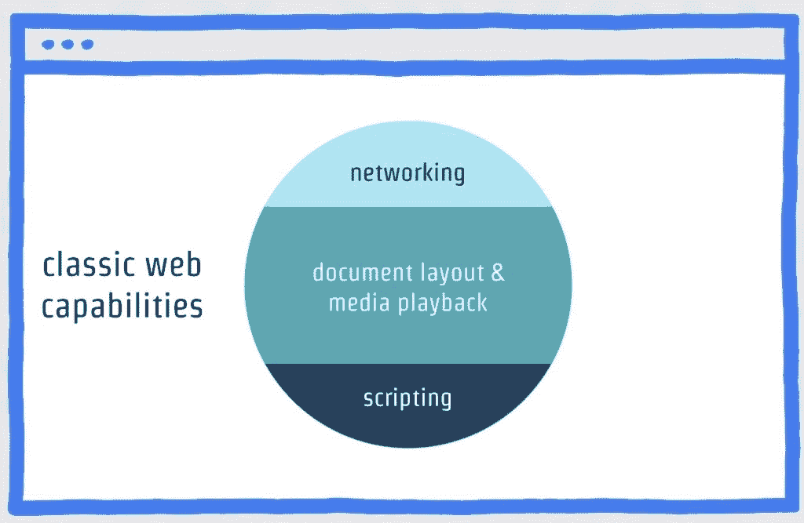
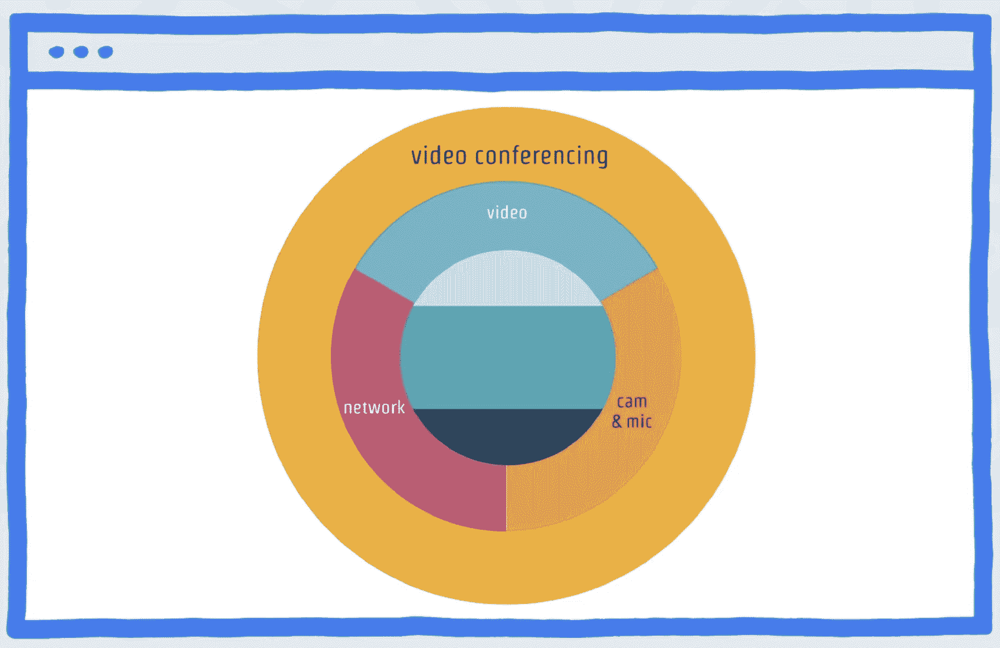
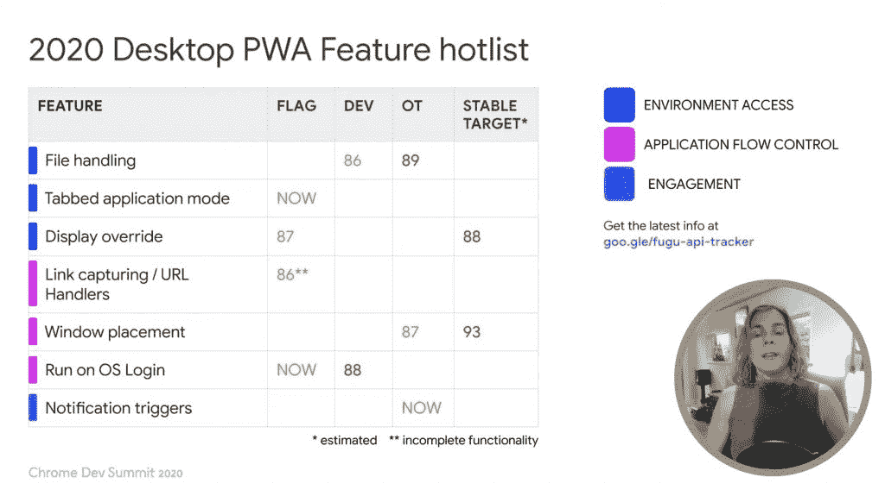
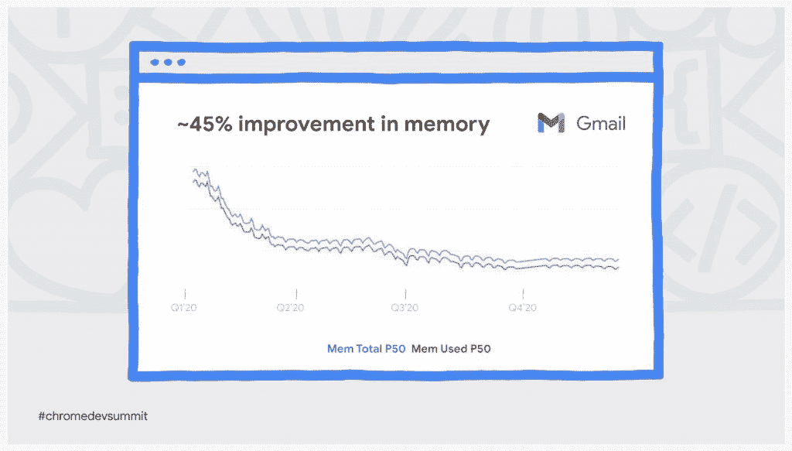

# Chrome 开发峰会:网络正在缩小本地应用的差距

> 原文：<https://thenewstack.io/chrome-dev-summit-the-web-is-closing-the-gap-on-native-apps/>

在上周为期两天的 Chrome Dev 峰会上，我们看到了谷歌在 2021 年的网络技术优先发展方向。虽然活动的大部分时间都集中在 Chrome 浏览器对性能、安全性和隐私的持续改进上——这被定位为三大支柱——但很明显，谷歌在扩展网络功能方面也取得了良好的进展，特别是像[谷歌会议](https://meet.google.com/)和[体育场](https://stadia.google.com/)这样的现代云应用，第三方浏览器扩展的持续增长，以及渐进式网络应用(PWAs)的最新实验。

 [理查德·麦克马努斯

Richard 是 New Stack 的高级编辑，每周撰写一篇专栏文章，探讨云计算原生互联网的未来。此前，他在 2003 年创立了读写网，并将其打造为全球最具影响力的科技新闻和分析网站之一。](https://twitter.com/ricmac) 

自从 2008 年苹果和安卓应用商店推出以来，iOS 和安卓上的原生应用已经转移了人们对网络平台的注意力。但是，正如谷歌工程师亚历克斯·罗素在第二天峰会的最后一个主题演讲中解释的那样，网络是一个“元平台”,在功能上正在逐渐赶上本地应用。因此，根据 Russell 的说法，虽然“媒体焦点”在过去十年左右的时间里一直集中在原生操作系统应用程序上，特别是智能手机应用程序，但事实上，近年来网络平台已经弥合了这一能力差距。

为了进一步解释这一点，Russell 首先指出，从早期开始，网络就具备了某些功能:

多年来，网络扩展了这些功能。为了说明这一点，Russell 举了视频会议的例子。

“就在不久前，网络的历史优势还不足以让视频会议在浏览器中运行良好，”他说。但后来，“浏览器变得擅长视频，接下来，我们学会了与摄像机和麦克风交谈，并使用低延迟网络协议。”

随着时间的推移，这种创新最终使得像 Google Meet 这样的视频会议应用程序能够构建在浏览器中(至少在桌面上)。尽管不得不说，2020 年最突出的视频会议应用——Zoom——有一个相对较差的网络客户端，功能有限。因此，除了谷歌自己的服务之外，罗素所说的高级网络功能还不一定会普及。

最后，Russell 指出，使视频会议和其他最近的网络应用蓬勃发展的技术(例如，生产力应用)也正在实现“一个全新的应用类别”他引用了“桌面共享和流媒体游戏”，以谷歌的云游戏服务 Stadia 为例。

## 延伸超能力

在 Chrome Dev 峰会的开幕主题演讲中也提到了扩展网络功能的主题。用谷歌工程总监迪翁·阿尔梅尔的话说，Chrome 团队专注于“为网络增加更多功能，在平台上实现更丰富、更多样的应用。”

Almaer 强调了扩展平台，该平台在活动期间获得了重大更新—[Chrome 扩展的 Manifest V3](https://developer.chrome.com/docs/extensions/mv3/intro/) “使扩展在默认情况下更加安全、高效和尊重隐私”(根据[博客公告](https://blog.chromium.org/2020/12/manifest-v3-now-available-on-m88-beta.html))。正如 9to5Google [在](https://9to5google.com/2020/12/09/chrome-88-beta-extension-manifest-v3/)中提到的，“这是自 2012 年 V2 清单发布以来对该规范的首次重大修订。”

阿尔梅尔称扩展是“网络的超级力量”和“一个允许第一方和第三方添加丰富功能的售后市场，这些功能可以增强网站或整个网络体验。”他指出，现在 Chrome 网络商店中有超过 250，000 个扩展和超过 200，000 名活跃的开发者。它们也很受 Chrome 用户的欢迎。

“我们估计用户已经安装了超过 20，000 个扩展，就在这个主题演讲开始后的几分钟内，”Almaer 说。

作为 Chromebook 的一名用户，我不得不说，我经常使用的应用程序的扩展可用性参差不齐。例如，Evernote 有一个很好的 Chrome 扩展，但我喜欢的编写应用程序(如 Bear 和 Scrivener)目前不提供扩展。

但是 250，000 个可用的扩展是不容忽视的，所以 Chrome Extensions 是一个不断增长的平台，这对网络来说是一个积极的消息。

## 渐进式网络应用

渐进式网络应用(PWA)是谷歌试图让网络成为像 Android 或 iOS 一样强大的平台的另一种方式。PWA 的定义有些模糊，但 Mozilla 称它是一种“设计模式”, PWA 是“使用新兴网络浏览器 API 和功能以及传统渐进增强策略的网络应用，为跨平台网络应用带来类似本地应用的用户体验。”谷歌选择了一个[更简单的定义](https://web.dev/progressive-web-apps/):“服用了所有正确维生素的网站。”

在一场题为“桌面下一级网络应用”的演讲中，谷歌项目经理[PJ·麦克拉克伦](https://twitter.com/b1tr0t)对 Chrome 最新的 PWA 开发进行了一次旋风式的参观。McLachlan 表示，pwa“正处于另一个转型时刻的尖端”，类似于 21 世纪初随着 Gmail 的推出，AJAX(异步 JavaScript 和 XML)彻底改变了网络电子邮件。

McLachlan 列举了一些现在在 web 应用程序中可行的功能，这些功能以前主要是本地应用程序的领域:

## 增强谷歌目前的网络服务

虽然通过 PWAs 和扩展来扩展 web 功能可能是今年 Chrome Dev 峰会上最有趣的事情，但过去一年 Chrome 环境中的各种技术增强也给我留下了深刻的印象。例如，主题演讲中提到，仅今年 Gmail 的内存管理就提高了约 45%。

在隐私方面也取得了长足的进步。谷歌产品高级总监 Ben Galbraith 在开幕主题演讲中描述了“一项名为隐私沙箱的重大举措”，该举措将解决互联网平台和广告商使用 cookies 跟踪网络用户的长期问题。这实际上是在 2020 年初宣布的，但很高兴在 12 月份看到它的更新。

Galbraith 说，一旦“保护隐私的替代品”准备好投入生产，就打算逐步淘汰 Chrome 的第三方 cookies。目前，谷歌已经对第三方 cookies 进行了限制。

“今天，我们已经让 cookies 对网站和用户来说更加安全，”他继续说道。“今年，Chrome 完成了一项名为‘同一网站’的新政策，该政策默认情况下将 cookie 限制在第一方访问，要求开发者声明哪些 cookie 可以发送到第三方域。”

## 结论

在为期两天的 Chrome Dev 峰会上，有一点变得越来越明显:作为一个平台，网络并没有停滞不前:它实际上正在很好地扩张，这在很大程度上要归功于谷歌通过其市场领先的 Chrome 浏览器进行的管理。我们还可以感谢 Mozilla、苹果和其他浏览器市场的持续创新——事实上还有微软，其新的 Edge 浏览器也在推动网络向前发展。

在一个仍然被智能手机应用程序和围墙花园平台主导的网络世界里说这个感觉很奇怪…但是，网络是活着的，而且很好！

<svg xmlns:xlink="http://www.w3.org/1999/xlink" viewBox="0 0 68 31" version="1.1"><title>Group</title> <desc>Created with Sketch.</desc></svg>