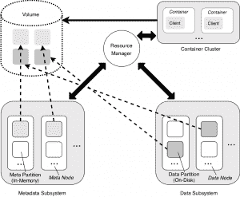

# ChubaoFS:云本地计算基金会的快速新分布式文件系统

> 原文：<https://thenewstack.io/chubaofs-the-cloud-native-computing-foundations-speedy-new-distributed-file-system/>

云原生计算基金会(Cloud Native Computing Foundation)将分布式文件系统 [ChubaoFS](https://github.com/chubaofs/chubaofs) 添加到其早期项目的[沙盒级](https://www.cncf.io/sandbox-projects/)入口点，从而增加了其不断增长的云原生开源工具库。

中国网上零售巨头 JD.com[为 CNCF 贡献了文件系统。该项目背后的团队认为](https://corporate.jd.com/home) [ChubaoFS](http://chubao.io/) 是分布式文件系统中唯一适合支持云原生工作负载的，这要归功于它几乎无限的可扩展性和跨多个节点的工作内存分布的健壮元数据子系统。

“无论文件大小或文件访问模式如何，ChubaoFS 都为通用分布式/共享存储基础设施提供了一种创新的新选择，”ChubaoFS 创始人、JD 首席架构师兼技术副总裁[刘海峰](https://www.linkedin.com/in/bladehliu/?originalSubdomain=cn)在一份声明中表示。该文件系统于 2017 年在内部创建，支持京东基于 Kubernetes 的容器平台，运行 160 多种应用程序和服务。据该公司的工程师称，ChubaoFS 已经部署在数千个节点上，其 p99 延迟可以达到 5 毫秒。

## 云原生和 S3 兼容

单击以嵌入。

从一个容器或共享数据的多个容器的角度来看，每个 ChubaoFS 卷都可以被视为一个完整的文件系统(ChubaoFS 可以服务于容器化和非容器化环境)。因为 ChubaoFS 实现了 POSIX 文件系统语义，所以它可以像本地文件系统一样被 Linux OS 挂载。卷大小从几千兆字节到几兆兆字节不等。ChubaoFS 集群可以有成千上万个单独的卷或文件系统，其中每个卷都可以有弹性的块级存储空间。

它还提供了一个简单的与存储服务(S3)兼容的对象存储接口。

ChubaoFS 由元数据子系统、数据子系统和资源管理器组成。ChubaoFS 同时提供对象和文件存储，提供了强大的复制一致性，并且特别针对快速处理小文件进行了优化，这是支持云原生工作负载的另一个有利特征。ChubaoFS 作为其底层存储基础设施与 Kubernetes 配合良好，因为它将计算与存储分开。它已经与集装箱存储接口(CSI)和 Helm 集成。

ChubaoFS 是许多高性能、高可伸缩的分布式文件系统中的一个，专门用于云本地工作负载。对于那些想要货比三家的人来说，ChubaoFS 网站的 [FAQ 部分](https://chubaofs.readthedocs.io/en/latest/faq.html)提供了一些对其他选择的评论:Ceph 可能很难学习，也很难优化。 [HDFS](https://github.com/apache/hadoop) 和 [MooseSF](https://moosefs.com) 都遭遇了基于单节点的元数据瓶颈。像 ChubaoFS 一样，脸书的 [Haystack](https://engineering.fb.com/core-data/needle-in-a-haystack-efficient-storage-of-billions-of-photos/) 将元数据保存在主内存中以提高性能，尽管与脸书的不同，ChubaoFS 在内存中存储文件内容的实际物理偏移量，而不是逻辑索引。它也不需要垃圾收集，因为文件是根据用户请求实时删除的。

根据 GitHub 的统计，截至本文发布时，该项目已经有 19 个贡献者提交了 419 个[。目前，ChubaoFS 可以在 X86_64 和 AMD 平台上运行。](https://github.com/chubaofs/chubaofs/graphs/contributors)

JD.com 在其 ops 中使用了一系列开源和 CNCF 技术，[包括](https://jdcorporateblog.com/how-jd-com-uses-vitess-to-manage-scaling-databases-for-hyperscale/) Kubernetes、Vitess、Prometheus、Helm 和 Harbor。

<svg xmlns:xlink="http://www.w3.org/1999/xlink" viewBox="0 0 68 31" version="1.1"><title>Group</title> <desc>Created with Sketch.</desc></svg>