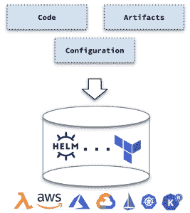

# CI 检查是不够的:Kubernetes 资源中的战斗配置漂移

> 原文：<https://thenewstack.io/ci-checks-are-not-enough-combat-configuration-drift-in-kubernetes-resources/>

[Gadi Naor](https://www.alcide.io/)

[Gadi Naor 作为首席技术官和 Alcide 的联合创始人，拥有 15 年的网络安全产品开发经验。Gadi 将他的管理和技术背景融合在不同的岗位上。Gadi 曾在 CheckPoint 工作，担任业务开发经理和高级开发人员，领导 CheckPoint 的防火墙核心安全引擎和 VPN 软件的开发。](https://www.alcide.io/)

在 CI/CD 系统中，CI(持续集成)是尽可能早地集成来自一个或多个开发人员的变更的应用程序开发过程的一部分，这可能一天发生几次，触发给定项目的自动构建和测试序列，并最终向做出变更的开发人员提供有价值的反馈。CD(连续交付)包括基础架构配置和应用程序部署，这可能是手动的，由多个阶段组成。

重要的是，所有这些过程都是完全自动化的，每次运行都被完整地记录下来，并对整个团队可见。

许多用于集装箱化环境的安全工具被贴上集成到 CI/CD 中的标签，但实际情况是 CI 和 CD 是在不同时间触发的不同过程。DevOps 团队需要理解每个人都是独立的个体。因此，CD 环境需要自己的专用解决方案才能有效工作。

## CI 中的安全性

在 CI 中，我们通常会采用以下一种或多种方法:

*   **安全单元测试**基本上采用了与单元测试相似的方法，但只是从安全的角度出发。
*   **源代码扫描**使用特定语言的 linters 来获得安全最佳实践。
*   **静态分析安全测试(SAST)** :与编程语言兼容的 SAST 扫描器，用于检测您拥有的代码和您导入的(可能不安全的)库中的安全漏洞。

集装箱化应用通常还会采用:

*   **容器漏洞扫描**主要扫描应用程序以及容器映像中的库，寻找已知的漏洞。易受攻击性和可利用性之间有着巨大差异，容器图像因产生许多可能不相关的发现而臭名昭著，且经常直接受到构建细长容器的熟练程度的影响

## kubernetes-CD 中的安全性

DAST(Dynamic Application Security Testing，动态应用程序安全测试)——CD 中的一个成熟实践——在运行状态下对应用程序进行自省，在许多方面就像攻击者所做的一样。大多数情况下，DAST 扫描仪没有特定于语言的依赖性。

有了 Kubernetes，作为主要的容器编排平台，CD 可以用来立即执行安全扫描，作为最终的部署状态。

Kubernetes 资源如此之多，以至于对于所有这些移动部分，您需要有一个扫描不同部署的计划，以检测这些移动部分中发生的任何安全漂移。在部署之后对集群进行有效的扫描，以确保断言在特定环境中从一个部署到另一个部署仍然有效。

这就是为什么 CD 不是 CI，因为你在 CD 里做的事情和你在 CI 阶段做的事情的上下文是不一样的。在 CI 中，您构建您的应用程序，仅此而已。在 CD 中，您将这些资产部署到目标环境中(测试集群、登台集群、生产集群)。

简单地说，在 CI 中，你构建东西；在 CD 中，您可以使用配置将其推出。

部署后，您需要扫描应用程序，可能会发生两种负面的安全变化。首先，如果您更改配置，可能会导致负面的安全漂移。其次，如果您更改部署资源，这些更改也会导致相同的效果。根据公司的文化，对配置参数的更改可以由开发人员或开发人员来完成。

## 为什么 CD 对 Kubernetes 安全至关重要？

例如，Kubernetes 的概念是*变异准入控制器*，它基本上可以改变部署的资源。例如，它可以像 Istio 或 Hashicorp Vault 实现的那样注入侧车容器——实际上，它可以修改 pod 资源、更改标签等。

例如，如果我们想要断言一个 Pod 是否应用了网络策略，那么在所有资源都部署到集群之后，CD 管道的末端将是执行这种检查的正确时间点——这仅仅是因为网络策略关联是基于标签的，并且如果标签是由查看 Git 中的文件的*变异准入控制器*最终确定的，或者甚至在部署之前就可能产生不正确的断言。

对于这种非常独特的 Kubernetes(灵活)行为网络策略相关的检查，以及 PodSecurityPolicy 等其他资源，服务需要在 CD 管道的末端进行分析，以便获得准确的结果。

## 检测安全配置漂移的方法

Kubernetes 作为一个极其灵活和强大的编排平台，有许多旋钮和标志来控制部署的工作负载和支持这些工作负载的组件的行为。检测配置漂移的实用方法包括以下方法:

1.  对于每个安全标志/旋钮/配置
2.  建立允许启用此标志/旋钮/配置的资源的排除列表
3.  对于每个部署，验证没有与此标志/旋钮/配置相关的新异常
4.  失败时
    1.  通知未能通过 Kubernetes 资源
    2.  如果存在严重级别的健康异常，请回滚部署

## CD 护栏示例

**特权工作负载**

Kubernetes 的特权阶层有很多面孔。特权可以是以下一项或多项:

*   以根用户身份运行容器
*   运行具有额外处理能力的容器，开放系统范围的访问
*   装载主机文件系统或容器运行时套接字的运行 Pod
*   在主机网络中运行 Pod
*   …以及更多

我们希望将我们的安全漂移检测方法应用于上述每一项。

**过度访问权限(RBAC 库伯内特)**

库伯内特斯过度 RBAC 穿多面。仅举几个例子:

*   创建 Pod 或最终创建 Pod 的任何资源的权限
*   阅读机密的特权
*   创建变异准入控制器的权限
*   创建/删除服务资源的权限

同样，我们希望将我们的安全漂移检测方法应用于上述每一项

## 你未来的自己会感谢你的

不要误以为 CI 和 CD 是一回事。通过确保您的组织区分 CI 和 CD，并利用这两个领域，节省您处理可预防的安全违规的时间、金钱和麻烦。CI 工具不应被重新分配给 CD。完全足够的 CI 工具要么会遗漏管道中 CD 部分的内容，要么会标记出完全不相关的内容。除非工具具有专门为 CD 构建的功能，否则它是不够的。

无论是作为增强您现有 CI 安全性的独立解决方案，还是作为扩展您 CI 安全性的集成方案，实施具有这些功能并能执行这些最佳实践的 CD 安全解决方案都将为您现有的安全开发生命周期(SDL)添加一个关键工具，尤其是对于使用基于 Kubernetes 的平台交付的应用程序。

<svg xmlns:xlink="http://www.w3.org/1999/xlink" viewBox="0 0 68 31" version="1.1"><title>Group</title> <desc>Created with Sketch.</desc></svg>