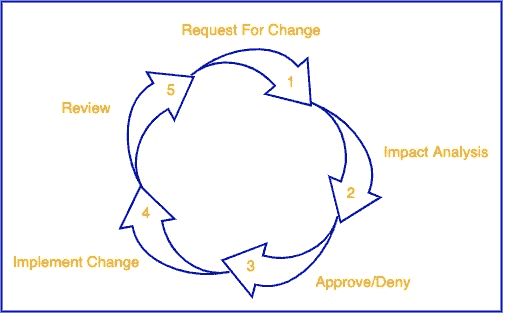
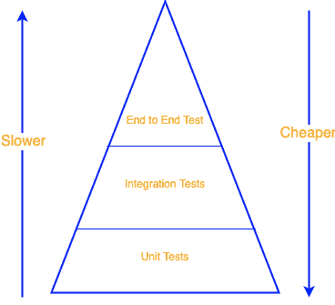

# 有效变革管理的 CI 可观察性

> 原文：<https://thenewstack.io/ci-observability-for-effective-change-management/>

[sarje El Yusuf](https://www.linkedin.com/in/syedsarj/)

[sarje El 是 Atlassian 的一名产品经理，负责引导 Atlassian 工具在其功能集中促进 DevOps 功能。](https://www.linkedin.com/in/syedsarj/)

根据[约束理论](https://www.leanproduction.com/theory-of-constraints.html)，每个系统都有一个阻碍系统进步的限制因素。当考虑软件开发管道时，这比以往任何时候都更加深刻。我们不能再将我们的开发实践视为独立领域的一部分。相反，我们需要更全面的方法。将软件发布到产品中的每一步都是相互关联的，这意味着约束范围的扩大。

此外，随着行业正在经历的标志性转变，开发和部署的重要性正在增加。再加上 DevOps 的兴起，持续集成/持续部署(CI/CD)在我们的讨论中变得越来越突出。这是因为 [CI/CD 是我们从开发过渡到运营的地方](https://blog.thundra.io/what-ci-observability-means-for-devops)。

因此，在这个阶段，约束通常对整个开发流程有很大的破坏性，影响了原本被认为独立于 CI/CD 阶段的实践。一个这样的实践是变更管理，一个经常被忽视或者被认为太难采用的概念，但是在开发生命周期中被证明是非常有效的。

因此，这篇文章介绍了变更管理，并将 CI/CD 开发阶段与不断左移的开发世界联系起来。我还将介绍易变的测试，这是 CI/CD 阶段的一个主要关注点，并解释这种约束如何成为破坏变更管理过程的瓶颈，而变更管理过程已经是整个产品开发中的一个瓶颈。

## 变革管理，朋友还是敌人？

[变更管理](https://www.atlassian.com/itsm/change-management)是对系统的人为变更进行构思、计划、验证并推向生产的过程。该流程的目标是在进行系统性变革的同时减少潜在的中断。相反，事件管理旨在减轻生产中断的影响。

通常，这个过程是以变更请求为中心的，变更请求捕获了对系统的期望变更。然后，通常对这些变更进行计划和审查，并评估变更的风险。一旦变更请求被批准，它将按照计划进行部署。部署后，将评估变更的影响，并在必要时启动回滚。

组织[经常忽视](https://blog.prosci.com/avoid-these-change-management-obstacles)变更管理最佳实践。这是因为变更管理是抽象的，通常被认为会减缓生产中的部署。结果，许多变更管理被淡化为基本的拉式请求批准，在这种情况下，代码本身被检查，而没有整体地考虑变更的影响。

事实上，在写这篇文章的时候，像英国航空公司和汇丰银行这样的大公司经历了他们的网站由于 Akamai Technologies[错误的](https://twitter.com/Akamai/status/1418271515192270850?s=20)配置改变而[中断，Akamai Technologies 被用来提供内容交付网络服务。如果有更具体、更主动的变革管理实践，这是可以避免的。](https://news.sky.com/story/several-high-profile-websites-including-hsbc-airbnb-and-british-airways-hit-by-outages-12361521)

然而，可以理解为什么公司不太热衷于成熟的变革管理实践，为什么依赖基本的[公关批准](https://www.contino.io/insights/pull-requests-change-control)就足够了。传统上，这种实践是相当手工的，并且在评估一个变更是否应该进行的过程中涉及到涉众的大量参与。

因此，变更管理的价值常常被忽视，因为它能够提高整体速度，同时依靠事件管理能力来处理潜在的中断。然而，当从整体上考虑系统和性能时，这种思考过程会对总体目标产生反作用。

市场上出现了新的解决方案来解决一些棘手的问题，但是这些解决方案局限于变更管理领域。为了理解约束的总体可能性，我们必须考虑系统的整体，尤其是填充软件变更的变更请求对象的 CI/CD 阶段。

## CI/CD 和变革管理

如上所述，变更管理的最基本的版本可以被分解为批准拉请求。在整个过程中，我们认识到 CI/CD 在变更请求的概念中起着至关重要的作用。可能会有一些解决方案，比如亚特兰大的 JSM 或 T2 的 ServiceNow，它们旨在授权变革管理流程。然而，从行业的现状来看，为了速度的利益，公司宁愿放弃整个过程。

当然，完全放弃变更管理是不明智的，但是也许我们可以简化过程并减轻任何负面影响。这就是我们必须关注 CI/CD 的地方，无意中跳上了左移的列车。

理想的情况是，在代码库上工作的开发人员创建一个 pull 请求，然后被批准并添加到主代码库中，导致整个系统的变化。接下来的问题是，公共关系需要满足哪些条件才能获得批准和执行？

通常，审批者会关注代码的健全性，并验证这种变更是否会导致中断。这主要涉及对直接服务和从属服务的影响。我们还可以考虑文体错误和编程格式。

当然，审批者还可以考虑其他方面，如特定时间范围内的业务影响、回滚效率等。然而，对潜在中断和代码遵从性的核心检查可以通过各种测试和林挺工具合并到 CI 阶段。

通过确保严格的单元测试、集成测试和端到端测试，以及所需的任何林挺检查，我们可以使用 CI 阶段来自动化变更管理的大部分核心。这是我们在谈论 [GitOps](https://blog.thundra.io/under-the-hood-of-gitops) 时已经看到执行的东西。

诚然，在 CI 阶段进行测试并不是一件容易的事情。要克服的一个主要障碍是写测试的文化。然而，随着时间的推移，这种文化可以融入任何组织。使用正确的工具集，可以促进 CI 阶段的测试文化。尽管如此，另一个比文化改变更需要的因素是对 CI 测试和构建的信心。如果对 CI 阶段创建的东西缺乏信心，那么乏味的手工变更管理就变得必要了。

这种信心主要受测试覆盖率和测试本身的影响。测试覆盖率主要与文化相关。另一方面，测试以及它们传达潜在危害的成功或失败取决于那些编写测试的人以及 CI 工具如何执行测试，这就是一个主要问题出现的地方:脆弱的测试现象。

如果我们不再知道测试成功或失败的原因，那么对测试的信心就会减弱。结果，为了提高速度，实际上失败的测试可能会被认为是不可靠的测试。总的来说，这将降低 CI 阶段的信心，并将责任转移给变更审批者。这将导致冗长的变更管理过程，这是我们希望在利用 CI 阶段时避免的。

因此，这个问题的解决方案是 CI 可观察性。

## CI 可观察性有助于更好的变革管理

在试图抛弃传统的和费力的变更管理实践时，依赖 CI 测试是至关重要的，但是正如上面所讨论的，我们需要确保对我们执行这些测试的方式的信心。CI 可观察性，一个从传统的应用程序可观察性和监控中借鉴而来的过程，旨在提供对测试如何执行的黑盒环境的洞察。

通过跟踪各种指标，如质量和基于时间的指标，同时在测试和调试场景中利用指标跟踪和日志，我们可以有效地摆脱传统 CI 的困境。

因此，通过这些指标，我们实际上可以列出主要优势:

*   在 CI/CD 阶段，通过提供实际状态和理解的指标，在团队之间建立信任。
*   为解决失败和不可靠的测试提供至关重要的见解。
*   由于增加了一层调试，降低了生产中发生事故和中断的风险。
*   在 CI/CD 阶段和整个 DevOps 管道中建立弹性。

通过合并 CI 可观察性实践，团队可以将所需的信心和可靠性重新安装到他们的 CI 过程中，允许组织将 CI/CD 的大部分用于变更管理目的，减少对验证软件变更的单独变更管理过程的需要。

## 结论

变更管理是任何组织中确保更好可用性的关键过程。然而，传统的变更管理实践经常被视为阻碍速度，因此被忽视。

然而，如果我们考虑与代码或配置变更相关的变更请求的核心，我们注意到在变更管理过程中许多需要验证的内容可以在 CI/CD 阶段完成。通过编写一套全面的测试并建立一种主动的测试文化，自动化 CI 测试可以消除许多验证变更的痛苦。

然而，诸如片状测试的问题阻碍了 CI 测试的可靠性。这就是 CI 可观察性需要作为解决方案引入的地方。

要阅读更多关于 CI 可观察性的内容，请查看桑德拉首席技术官 Serkan Ozal 关于这个主题的博客文章。

<svg xmlns:xlink="http://www.w3.org/1999/xlink" viewBox="0 0 68 31" version="1.1"><title>Group</title> <desc>Created with Sketch.</desc></svg>