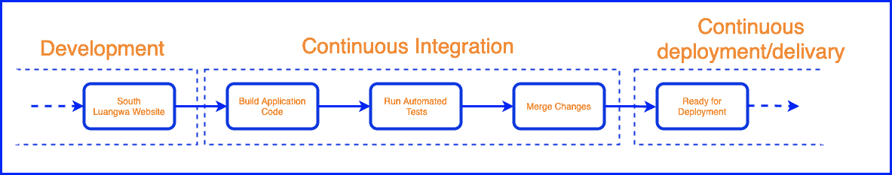
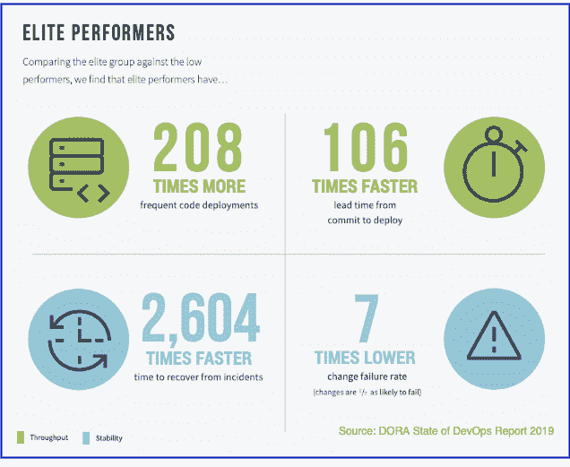
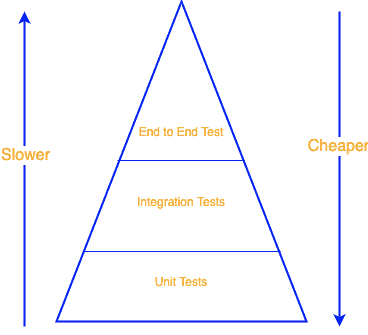

# 大规模持续集成的陷阱

> 原文：<https://thenewstack.io/ci-pitfalls-at-scale/>

[sarje El Yusuf](https://www.linkedin.com/in/syedsarj/)

[sarje El 是 Atlassian 的一名产品经理，负责引导 Atlassian 工具在其功能集中促进 DevOps 功能。](https://www.linkedin.com/in/syedsarj/)

在这个世界上，快速移动和保持软件开发的可用性和质量是产品成功的关键因素，许多人期待 DevOps 实践来帮助他们的开发之旅。这个 DevOps 实践[的核心是持续集成/持续交付(CI/CD](https://blog.thundra.io/what-ci-observability-means-for-devops) )，它在开发管道中架起了 dev 和 Ops 之间的桥梁。

因此，CI/CD 阶段对于有效的 DevOps 实践至关重要。在这一阶段的失败可能会削减采用 DevOps 时从文化和开发过程的艰难转变中预期的任何好处。因此，在构建开发管道的这一阶段时，确保有效、健壮的解决方案同时满足当前的开发需求是至关重要的。这适用于 CI 渠道和 CD 渠道。

在本文的范围内，我们将具体考虑 CI 渠道、扩大规模时可能出现的问题以及围绕这些问题的解决方案。

## 大规模问题

理解 CI 渠道的责任和结果正如上一节所讨论的，有几个难点是值得注意的。这些问题可能会对用于衡量开发运维成功的各种指标产生负面影响。根据 [DORA](https://www.blueoptima.com/blog/how-to-measure-devops-success-why-dora-metrics-are-important) 指标，这些指标包括以下四个指标:

*   提前期。
*   部署频率。
*   变更故障率(CFR)。
*   平均解决时间(MTTR)。

## 隐藏的瓶颈

随着开发规模的扩大和开发代码库的开发人员数量的增加，会产生更多的版本，CI 渠道会成为瓶颈。

2020 年 10 月，工程经理 [Mayank Sawney](https://www.linkedin.com/in/mayanksawhney/?originalSubdomain=in) 和我在 Atlassian 的 [team.work 2020](https://events.atlassian.com/atlassian_teamwork_conference_2020_internal/home?sid=374000) 会议上就 monolith 的 DevOps 做了一次会议演讲。在这次演讲中，我们强调了亚特兰蒂斯生态系统的几个领域中的前端代码库是一个整体。最显而易见的做法是将整体结构分解成微服务。尽管承认分解为微服务会带来好处，但使用单一 CI 管道发布所有版本仍然存在潜在的威胁。

因此，无论你如何划分团队，如何分解整体，当所有这些不同的团队或开发人员试图同时创建一个发布版本时，你都会碰壁。突然之间，开发人员正在排队等候，而其他人正在使用 CI 管道和测试环境。

因此，CI 管道成为开发管道上的一个巨大瓶颈。由于团队相互等待，提前时间和部署频率受到了很大的影响。对于较小的团队和组织来说，这不是一个主要问题，但是对于任何正在扩展的组织来说，这将是毁灭性的。

## 局部失稳构型

通过正确的变更管理和发布计划实践，组织可以在一定程度上减轻瓶颈效应。然而，随着代码库的扩展，CI 管道将不得不遵守不同类型发布的所有要求，以反映正在构建的系统的不同部分。

因此，构建过程中的参数数量可能会变得难以管理，并且对 CI 管道的更改可能会有风险。为了增加管道构建和测试的灵活性，失败的管道可能会导致整个发布操作停止。现在，每个人都必须等待运营团队来修复管道操作。这代表了单点故障。

预计这也会对交付时间和部署频率产生影响。此外，它可能会对变更失败率产生影响，因为不稳定的管道具有各种配置参数，这可能会导致错误配置的构建。一个构建可能通过所有的测试，但是会导致潜在的失败点——这对于一个简单的代码库来说是不可预料的。然而，随着应用程序复杂性的扩展，将需要更复杂的 CI，正如我们所讨论的，它不能有效地随应用程序本身的轨迹扩展。

## 规模发展和信心萎缩

感染 CI 领域的一种常见瘟疫是[片状测试](https://thenewstack.io/the-unexpected-costs-of-flaky-tests/)。易变测试是在完全相同的代码上执行时，失败或成功看似随机的测试。这里的问题是识别哪些测试是不可靠的。一个在过去被认为不可靠的测试可能在一个特定的构建中因为合理的原因而失败，但是现在仍然被认为是不可靠的。

这反过来降低了团队的信心，增加了构建的挫败感。我们不再确定失败的测试是不可靠的测试还是真正的失败。随着开发规模的扩大，这更加令人沮丧。随着管道中测试数量的增加，片状测试的可能性也会增加。

因此，我们可以预期更大的变更失败率值。将测试视为不可靠的继续开发过程到部署意味着在生产中目睹更多的中断和事故。如果对测试给予更多关注，中断本来是可以避免的。

此外，实际上试图主动调查这些不可靠的测试可能会导致很长的交付时间，尤其是当许多团队或开发人员依赖相同的管道时。因此，前面讨论的令人恼火的瓶颈问题，导致了对部署频率和交付时间度量的影响。

## 有效缩放

从上一节中确定的伸缩问题来看，很明显，CI 管道像许多其他组件一样，应该模块化，同时提供有效的措施来处理不稳定的测试。

当考虑扩展时，最好的起点是考虑分离 CI 服务器，每个 CI 服务器和管道将在一个隔离的环境中运行。这些独立的服务器可以服务于不同团队的不同需求，这些团队需要构建各种类型的构建。这将防止 CI 成为瓶颈，同时也允许不太复杂的管道。

然而，这说起来容易做起来难。在维护同步应用程序的同时复制服务器的需求本身就是一个挑战。在这种情况下，我们可以将基础架构视为代码(IaC)工具，它允许我们定义和执行这些隔离的 CI 服务器的加速运行。考虑到在我们扩展时拥有多个 CI 渠道和服务器的运营成本，这一点至关重要。如果不采用 IaC 实践，我们会在扩展时遇到与管理多个 CI 管道相关的问题。

此外，我们需要考虑将不同的 CI 服务器与我们将要执行测试的相同环境同步。当使用 monolith 时，这是必须的，以确保可以使用最新版本的应用程序。甲骨文公司的首席工程师伊恩·巴菲尔德介绍了一种“分而治之”的方法来缓解这个问题。Brainly 的 DevOps 团队后来意识到了这一点，首席基础设施工程师 [Mateusz Trojak](https://www.linkedin.com/in/matisq/?originalSubdomain=pl) 在他的[文章](https://medium.com/engineering-brainly/ci-cd-at-scale-fdfb0f49e031)中阐述了他们扩展 CI 管道的故事。

当考虑 Brainly 的故事时，缩放 CI 并不是一个新概念。然而，围绕更好的促进，正在开发一些概念和技术。现在被采用来帮助扩展 CI 的一个概念是 CI 可观察性。

这一概念旨在提供对诸如不可靠测试等问题的正确见解，以恢复对 CI 测试的信心。桑德拉就是这样一个 SaaS 解决方案，它正朝着提供解决这一问题的正确 CI 可观察性指标的方向发展。

在早期访问计划中，桑德拉前瞻计划旨在帮助回答一些关键问题，如为什么测试会失败，什么可能导致构建缓慢，从而解决大规模困扰 CI 的核心问题。

## 结论

CI 和 CD 是 DevOps 实践的核心，因为它是将开发和运营结合在一起的步骤。在开发管道的这个阶段的失败可能会阻碍一个组织或团队实现 DevOps 的好处，不管它在开发管道的其他领域有多好。

考虑到 CI 大规模出现的棘手问题，CI 模块化和可观察性显然至关重要。任何形式的扩展都有可能妨碍团队保持速度、质量和可用性的能力。只有通过自省和愿意集成正确的实践，团队才能见证有效的扩展。

<svg xmlns:xlink="http://www.w3.org/1999/xlink" viewBox="0 0 68 31" version="1.1"><title>Group</title> <desc>Created with Sketch.</desc></svg>