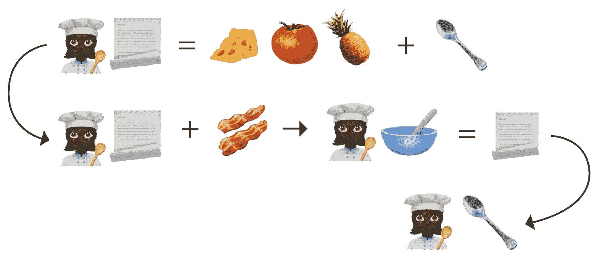
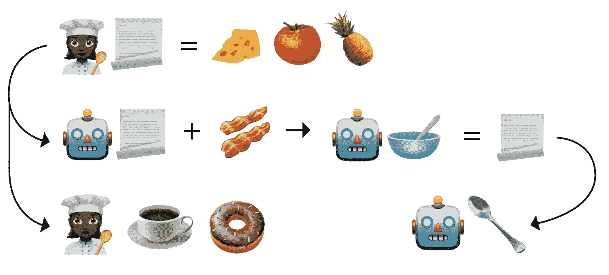

# 用表情符号解释 CI 与 CD:第 1 部分，持续集成

> 原文：<https://thenewstack.io/ci-vs-cd-explained-by-emoji-part-1-continuous-integration/>

 [玛格丽特·弗朗西斯

玛格丽特是 Armory 的总裁兼首席运营官，也是少数族裔和女性主导的企业的种子投资者。此前，她是 Heroku 的产品高级副总裁兼总经理。她拥有耶鲁大学学士学位和 SFAI 大学艺术硕士学位。为了好玩，她读了很多科幻小说，和她的孩子一起玩。](https://www.linkedin.com/in/margaretfrancis/) 

预计本世纪的技术变革将以我们大多数人都会感到震惊的速度加速。DevOps 的原则和文化是创新企业事实上的标准。为了使 DevOps 有效，它必须与专门的工具配对，这就是为什么持续集成/持续交付(CI/CD)成为另一种变革的驱动力。但是对于 CI/CD 的含义、CI 和 CD 之间的区别以及它们是如何实现的，仍然存在困惑。

CI/CD 涵盖了从开发人员提交代码🧀开始的软件生命周期🍅🥓🍍到代码发布到产品中的时间。如果 CI/CD 是一家披萨外卖公司(为什么不呢),它将涵盖从将所有原料放在一起制作新披萨食谱的整个过程📃烹饪它，检查它的质量，直到送货上门。

诚然，在这个披萨的类比中，我们的“CI/CD Pizza (Git)Hut Company”将是披萨外卖的亚马逊。该公司将大规模、高度自动化地运作。它将有一个工业化的 R&D 厨房，一组厨师每天快速地将不同的配料混合在一起，炮制新的食谱并烹制比萨饼。根据食谱制作的每一个披萨都要经过严格的质量保证测试和验证测试，沿着自动传送带传送，装箱，然后作为热腾腾的披萨迅速送到店内饥饿的顾客手中。本质上，这告诉你关于 CI/CD 的是，它在彻底测试后将产品更快地投入生产，并将遗留公司远远甩在后面。

要理解 CI/CD 是如何工作的，您需要知道 CI/CD 的持续集成(CI)组件是集中在开发阶段的。开发人员是在中央厨房工作的厨师，不断尝试新的配料。

CI 的工作基础是软件的最新稳定版本在任何时候都是可用的，位于一个集中的存储库中。CI 还期望我们的开发团队在同一个主分支上工作，并且频繁地对代码进行修改，通常是每天都要修改，并提交给主分支。我们可以将稳定的构建描述为我们的秘密、获奖但不断发展的披萨食谱。

如果你喜欢，代码提交是新的比萨饼配料，厨师们正在尝试生产一种新鲜和味道更好的比萨饼。像代码提交一样，配料可以是添加到产品中的任何东西，因此面团的面粉混合物可以用花椰菜代替，例如，制作不同类型的比萨饼。类似地，例如，让应用程序在不同的操作系统上工作的功能会创建一个集中存储的新工件。

如您所料，CI 强调频繁的代码检入，并且每次检入都通过创建和测试🥄新版本来验证。

当开发人员准备提交新代码时，通常的方法是删除最新的稳定版本📃，在本地测试它以确保它能在🥄工作，并集成新代码🥣创建新版本。就像一个厨师会品尝测试他们的最新作品一样，开发人员在过程中尽可能早地在本地对他们的新作品进行测试，以确保质量得到保持。

手动集成

CI 工具有助于自动化这种敏捷的开发方法，并建立一个可预测的过程，以便开发人员可以在同一个项目中一起工作。CI 自动化🤖开发者的测试。(是喝咖啡、吃甜甜圈或者去公园散步的时候了。)一旦开发人员满意了，构建就被提交给集成服务器。这最大限度地减少了代码冲突，因为代码在集成服务器上被再次审查和测试，任何问题都被反馈给团队。

连续累计

由于稳定的构建总是存在于中央存储库中，所以如果测试出错或出现问题，任何代码提交都可以恢复到最后一次已知的工作构建。

Jenkins 是 CI 集成服务器的一个很好的例子，因为它集成了 CI 和 CD 生态系统中的许多工具和插件。

这意味着它可以从 CI 扩展到 CD，但 CD 是对其原始设计的扩展，它不是为云部署而设计的，这意味着需要外部脚本✍️。

阅读[第 2 部分](https://thenewstack.io/ci-vs-cd-explained-by-emoji-part-2-continuous-delivery/)，在那里我们讨论了持续交付和持续部署的作用，两者之间的区别，以及——进一步延伸我们的类比——如何大规模制作比妈妈以前做的更好的披萨。

<svg xmlns:xlink="http://www.w3.org/1999/xlink" viewBox="0 0 68 31" version="1.1"><title>Group</title> <desc>Created with Sketch.</desc></svg>