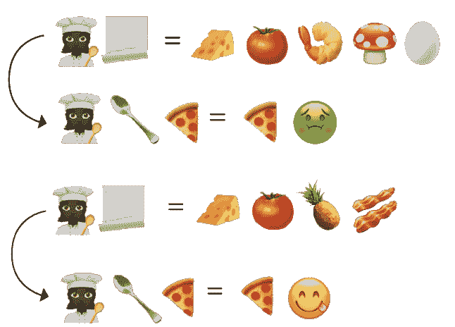
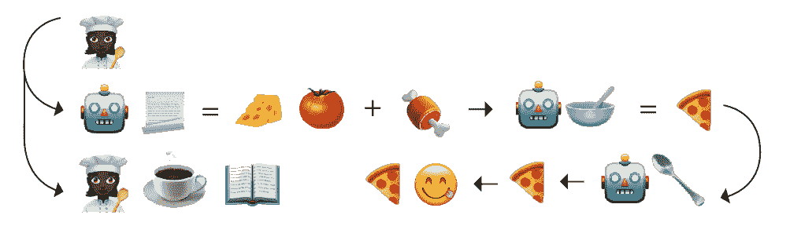

# 用表情符号解释 CI 与 CD:第二部分，持续交付

> 原文：<https://thenewstack.io/ci-vs-cd-explained-by-emoji-part-2-continuous-delivery/>

 [玛格丽特·弗朗西斯

玛格丽特是 Armory 的总裁兼首席运营官，也是少数族裔和女性主导的企业的种子投资者。此前，她是 Heroku 的产品高级副总裁兼总经理。她拥有耶鲁大学学士学位和 SFAI 大学艺术硕士学位。为了好玩，她读了很多科幻小说，和她的孩子一起玩。](https://www.linkedin.com/in/margaretfrancis/) 

持续集成/持续交付(CI/CD)可能会令人困惑。我们认为通过表情符号和披萨的类比来解释这个主题会很有趣。如果您想赶上本系列，请阅读[第 1 部分](https://thenewstack.io/ci-vs-cd-explained-by-emoji-part-1-continuous-integration/)解释 CI/CD 和初始持续集成(CI)过程中涉及的内容。

在第 2 部分中，我们将扩展我们的 CI/CD Pizza (Git)Hut 公司类比，涵盖连续交付(或 CD)以及它与连续部署的不同之处。连续交付(CD)从我们稳定构建的阶段扩展了连续集成📃或者单个工件已经被构建并集中存储，一直到准备生产。在我们的类比中，它需要成熟的披萨食谱，厨师🥣他们根据主要的食谱，用许多不同的方法测试最终的比萨饼，以确保它可以交付，可以被顾客食用。

## **什么是持续交付？**

CD 本质上对待每一个代码提交🍅开发商的🧀👩🏿‍🍳作为发布候选🍕或者，用我们的比萨饼比喻，作为一种潜在的可以“吃”的“新比萨饼”除非被证明是有缺陷的，否则它会沿着自动化部署管道被发送到暂存环境。一旦我们的“发布候选披萨”通过🥄的测试，它就会被放在传送带末端的舞台上，整齐地装箱，等待最后的赞许，然后被送往🛵投入生产。

连续交货

最初在网飞开发的 Spinnaker 是 CD 的一个很好的例子，因为它可以通过 Jenkins 等工具连接到 CI 中的中央存储库阶段👨。Spinnaker 不是作为工件的构建工具而设计的。相反，Spinnaker 被设计为具有针对多云☁️☁️的 CD 焦点，并且可以通过多种部署方法和简单的回滚来处理管道⏪。例如，使用 Jenkins 等现有的 CI 工具，Spinnaker 可以在 Git 中触发一个 webhook 来启动一个临时管道。试运行阶段可以包括许多不同的测试，如 canary 分析，以寻找关键指标，如 5XX 服务器错误和负载测试。它还允许定制何时需要人工判断，例如，测试清理，当然，是否将代码部署到生产中。在整个过程中，它会在打开的票据上生成注释。

## **持续部署适合哪里？**

您可能会发现持续部署与 CI/CD 一起被提及。除了它是一个完全自动化的管道之外，它本质上与连续交付是一样的🤖从开始到结束，包括把披萨扔出门的最后决定。正如你所料，持续部署并不适合所有的用例，除非你相信你的人工智能不会让你食物中毒——或者更糟糕的是，批准一份沙拉披萨并将其交付给客户。然而，当正确实现时，它可以为开发人员或操作人员腾出时间来做其他事情。

持续部署

一旦候选版本通过一个自动化的过程被彻底测试，持续的部署将它交付给客户。

【T2

## **一个完美的披萨需要合适的烤箱**

因此，你可以看到，当 CI 和 CD 结合在一起时，它使想法在更短的时间内从开始到生产。在某些情况下，较小的发布可能一天发生几次，而使用瀑布方法需要六个月或一年。

最终，您会希望将代码从提交到生产就绪自动化。最终是通过手动还是自动批准将取决于软件。当决定最佳方法时，您将需要考虑几个不同的事情，例如避免不可伸缩的脚本，选择具有工具和基础设施集成的解决方案，以及避免过多的插件管理。CI/CD 只有在过程的早期和您建立的各种管道中测试代码的一致性和质量时才有效。

CI/CD 通过消除尽可能多的人为干预来加快上市时间。它集中控制，提供对性能的可见性，并准确监控和标记问题。如果你想做比妈妈以前做的更好的披萨，CI/CD 可以帮你实现。如果你想了解更多关于 Armory 持续交付平台的好处，请查看[我们的 101 指南](https://www.armory.io/learn/what-is-continuous-delivery/)。

<svg xmlns:xlink="http://www.w3.org/1999/xlink" viewBox="0 0 68 31" version="1.1"><title>Group</title> <desc>Created with Sketch.</desc></svg>