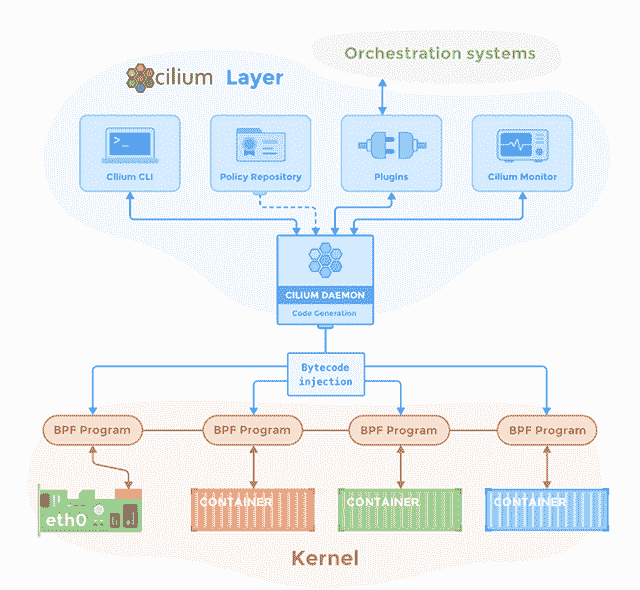

# 纤毛:使 BPF 更容易对 Kubernetes 提高安全性，性能

> 原文：<https://thenewstack.io/cilium-making-bpf-easy-on-kubernetes-for-improved-security-performance/>

在容器和微服务的世界里，基于 iptables 和 ports 的 Linux 安全不再适用，据共价公司的首席技术官 Thomas Graf 所说，共价公司是 T2 纤毛项目 T3 的幕后公司。

它使用扩展版本的 Berkeley Packet Filter (BPF)来提高和简化 Kubernetes 上应用程序的可见性、性能和可伸缩性。

“如果你看看微服务和容器的高度动态世界，我们会看到容器在几秒钟内弹出并消失，因此 IP 地址或端口变得几乎没有意义。20 秒前使用某个 IP 地址的容器可能不再存在。因此，如果你有安全日志或审计跟踪，没有有意义的信息附加到一个 IP 地址，”格拉夫在采访中解释说。

另一件事是，应用程序开发人员使用 REST、Redis、Memcache 等协议，云原生技术使用通过单个端口传输所有内容的协议。因此，服务通过 REST 或基于 HTTP 的 API 相互通信，从安全角度来看，安全操作员可以选择打开或关闭该端口。如果它是开放的，所有的 API 调用都可以进行；如果它是关闭的，就不能进行任何 API 调用。

Cilium 正在用一种叫做 BPF 的“新”技术解决这个问题。他说，Cilium 解决了围绕 IP 地址和端口的[安全问题，基于容器标签上的](https://cilium.io/blog/2018/04/17/why-is-the-kernel-community-replacing-iptables)[身份](https://cilium.io/blog/2018/04/24/cilium-10)，这是开发者实际理解的含义。

## 释放力量

BPF 一点也不新鲜。它于 1992 年在劳伦斯伯克利实验室创建，作为一种更好地过滤和分类网络数据包的方法。从那以后，它一直被扩展以利用现代硬件的进步。它得到了很多关注:谷歌、脸书、网飞在网络安全、负载平衡、性能监控和故障排除等方面都在使用 BPF。

格拉芙称 BPF 是“我在过去 20 年中经历的最激动人心的技术变革”

他说，它正在彻底改变 Linux 内核中的许多东西，不仅在网络和安全方面，而且在剖析、可见性等方面。

BPF 基本上是应用程序开发人员编写一个程序，将其加载到 Linux 内核中，然后在特定事件发生时运行它的能力——当接收到网络数据包或进行系统调用时，当调用特定的系统功能时。然后这个小程序可以执行安全策略，收集信息等等。他说，这基本上是使 Linux 内核可编程。

他说，它在沙箱中运行，所以不会污染内核。这些小程序是即时编译的，就像你重新编译了你的内核一样。

“这听起来很疯狂，但它非常强大，”他说。

“我们在四五年前就预见到了这一点，但完全低估了它的影响。…事实证明，这是推动基于 Linux 的安全网络下一波浪潮的技术，”他说。

## 轻松安全

Cilium 的目标是以一种易于使用的方式将 BPF 的力量带到已知的 Kubernetes 界面上。它提供了对 Kubernetes 服务、策略、网络、负载平衡等高级声明性意图的翻译，并使用 grpc、REST、Kafka 等云原生协议以最高效、最安全的方式实现它们。

例如，Graf 在《新堆栈制造商》的一集[中说，它将连接 pod，并以可扩展的方式提供负载平衡，这比 Kube-proxy 的效率高出许多倍。](https://thenewstack.io/covalent-talks-cilium-and-how-it-brings-bpf-to-kubernetes/)

它还实现了分段和安全性。Cilium 中的安全策略可以在 Kubernetes YAML 文件中定义。它将强制规定只有某些 pod 可以相互通信，或者一个 pod 只能与某个外部服务通信。…或者它将定义一个 pod 只能与某个端口通信。但是它也进入了 API 调用层。如果您允许两个服务通过 API 调用在某个端口(比如端口 80)上相互通信，在传统的安全世界中，您要么向所有 API 调用开放该端口，要么什么都不开放。Graf 解释说，Cilium 使两个服务能够相互对话，但可以强制它们只能发出某个 API 调用。但是，每个单独的连接都必须明确列入白名单。

它使用 [Envoy](https://www.envoyproxy.io/) ，一个成熟的代理，来执行第 7 层安全。他说，按需满足请求——只有需要第 7 层或 API 层安全的连接才会通过 Envoy，但它能够以几乎零开销的方式做到这一点。

当充当[服务网格](https://thenewstack.io/why-you-should-care-about-a-service-mesh/)或与 [Istio](https://thenewstack.io/service-mesh-and-the-promise-of-istio/) 等服务网格一起工作时，一个关键因素是不需要对应用程序进行任何更改。它不需要在应用程序中运行任何东西。它运行在 Linux 内核层的外部，而服务网格使用运行在应用程序单元内部的 sidecar 代理。

在 KubeCon，演示了如何使用 Istio 实现三倍的性能提升，而不是使用 iptables 来检查服务网状边车。

[https://www.youtube.com/embed/ER9eIXL2_14?feature=oembed](https://www.youtube.com/embed/ER9eIXL2_14?feature=oembed)

视频

## 全部开源

首席执行官 [Dan Wendlandt](https://github.com/danwent) ，在网络社区因其在 VMware 软件定义的网络方面的工作而闻名，与 CTO [Graf](https://github.com/tgraf) ，一位核心 Linux 内核网络开发人员，在大约两年半前围绕 [Cilium 项目](https://github.com/cilium/cilium)创建了公司共价。该公司的软件全部开源。

在 [The New Stack Makers](https://thenewstack.io/covalent-talks-cilium-and-how-it-brings-bpf-to-kubernetes/) 中，Graf 解释说，共价从开源项目开始创建公司，而不是创建公司，开发技术，然后开源。原因是:它从第一天就想要用户的反馈。它在 4 月发布了 1.0 版本。

Graf 说，Cilium 不是全栈解决方案，但它跨越多个层。它是作为[容器网络接口(CNI)插件](https://github.com/containernetworking/cni)而来，所以在那个级别，它将与[印花布](https://www.projectcalico.org/)、[编织](https://github.com/weaveworks/weave/tree/master/plugin)、[法兰绒](https://github.com/coreos/flannel)等一起完成。然而，Graf 说，并不是所有的 CNI 插件都不提供第 7 层或 API 调用网络安全。然后，它向上一层到达服务网格层。

“我不会说我们与 Istio 竞争，我们是互补的，”他说。“纤毛是理想的数据路径，是 Istio 下面的数据层。我们尽可能提供最佳性能。如果要运行 Istio，我们可以减少开销，使其最小化。服务网格在应用程序 pod 内部的侧柜中运行安全策略。也就是说，如果那个舱被破坏了，侧柜也会被破坏。除此之外，我们还能提供一个安全网。”

<svg xmlns:xlink="http://www.w3.org/1999/xlink" viewBox="0 0 68 31" version="1.1"><title>Group</title> <desc>Created with Sketch.</desc></svg>