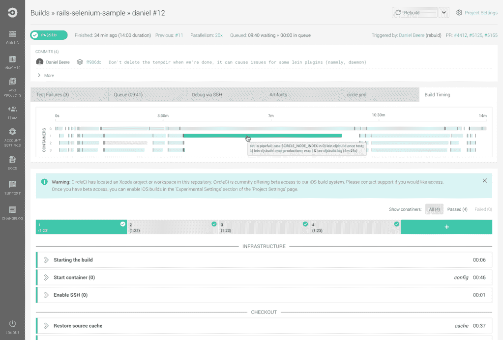
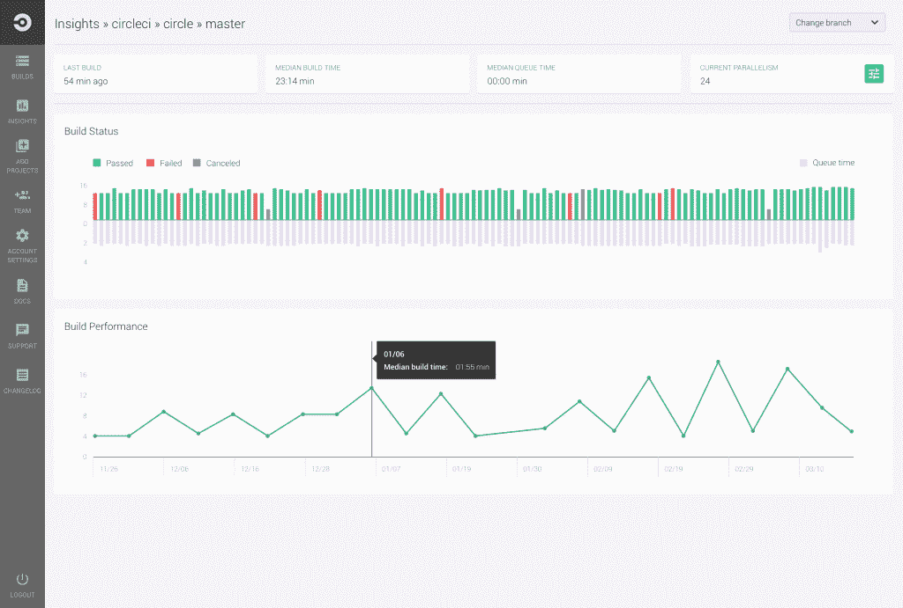
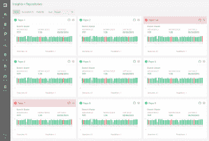

# CircleCI 增加了对 OS X 本地部署的支持

> 原文：<https://thenewstack.io/circleci-adds-support-os-x-premises-deployments/>

开发软件提供商 CircleCi 展示了其去年收购 Distiller 的成果，增加了对 OS X Macintosh 操作系统的支持，并将其称为扩展的[“任意云”部署](http://blog.circleci.com/circleci-enterprise-any-cloud-deployment-and-circleci-for-os-x/)，这意味着其 CircleCI Enterprise 可以在内部和公共云中运行。

“我们发现，人们不只是在真空中构建 iOSCircleCI 的首席执行官 Jim Rose 说:“他们把它作为一个更大的堆栈的一部分，你需要能够在一个界面中构建你的所有软件。“你现在可以用 Linux 和 OS X 做到这一点。我们有能够做到这一点的客户:为客户端和后端构建。”

罗斯表示，该公司在 2015 年的大部分时间里都在测试 Distiller，该公司专注于加快 iOS 移动开发。

“我们在移动领域的持续投资[意味着]你可以开始做一些本机代码签名，并[有能力]将其推广给测试人员。在 iOS 开发中，应用商店是持续交付的对立面。你必须把一些东西推送到应用商店，然后等上四五天才能获得批准，”他说。

“移动端有很多需求，需要能够使用像 [Crashlytics](https://try.crashlytics.com/) 或 [TestFlight](https://developer.apple.com/testflight/) 或 HockeyApp 这样的服务向测试人员群体推出新版本，所以这是完全融入服务的东西。同样，你可以通过 Heroku 为 Linux 版本设定一个部署目标，如果你想把它推给某一组测试人员，你可以这样做。”

与此同时，12 月宣布的 CircleCI Enterprise 将直接向开发人员提供构建配置、构建容量供应和并行设置的功能，将 DevOps 团队从手动管理插件和服务器容量等复杂配置中解放出来。它允许团队在任何私有云或数据中心上构建、测试和部署，包括对 AWS、Google Cloud Engine、Microsoft Azure 和 VMware 的支持。

工程师可以在他或她的家庭仪表板上看到什么，以了解哪些测试通过或失败。

Rose 是 Distiller 的创始人之一，已经在 CircleCI 担任了大约五个月的首席执行官。他说，该公司认为有两大投资领域:

“我们看到每个人的构建越来越复杂，所以我们需要作为一个平台和服务来尽可能地为人们提供透明的构建。手机肯定是其中的一部分。你不再只有移动应用程序；你有人工智能应用程序以及网站和移动应用程序。因此，随着客户平台的成长，我们希望构建我们的平台来支持他们，”他说。

“Circle 真正开始于四年前，它帮助我称之为‘酷孩子’的初创公司构建单页网络应用，这些应用托管在 GitHub 上，构建在 CircleCI 上，并通过 Heroku 推送。但是，随着我们的客户越来越多，他们在我们的平台上构建的东西和他们正在构建的堆栈的范围继续以相当惊人的速度扩展。

“我们需要走在前面，建立一个平台来支持这一点，同时为开发者提供工具，让他们能够看到管道，这真的很难。有像 Jenkins 这样的工具，你可以在任何给定的时间为堆栈的不同部分运行多个主机，或者你有一个只构建 iOS 或只构建 Android 的服务，它不构建后端。它不能让开发团队看到所有的细节，”他说。

CircleCI Insights 允许您查看一段时间内的构建历史。

随着这些构建变得越来越复杂，该公司也越来越有兴趣将其转移到防火墙后面，无论是出于安全原因还是因为定制构建需要在自己的特定环境中运行。

CircleCI 与 GitHub 或 GitHub Enterprise 集成，支持的语言包括 Java、Ruby/Rails、Python、Node.js、PHP、Haskell 和 Scala。它支持一系列客户，包括 Manheim、Shopify、Cisco、Sony 和 Trunk Club。它在 2014 年 12 月增加了对 Docker 容器的支持[。](https://circleci.com/integrations/docker/)

随着 CloudBees、Codeship、Drone.io、Semaphore、Travis CI、Shippable 以及惠普和其他知名供应商的竞争，持续集成/持续交付领域变得越来越拥挤。

罗斯称 most 是公司不得不拼凑的“一堆小点解决方案”，他认为自己最大的竞争对手是[詹金斯](https://jenkins-ci.org/)和[特拉维斯 CI](https://travis-ci.org/) ，两者都已经支持 OS X

他说，CircleCI 的与众不同之处在于，它让开发人员能够通过代码本身来管理构建资源和依赖性，而不是像使用 Jenkins 那样依赖于系统管理员的配置，并且不需要像使用 Travis 那样了解最新的开源工具。

<svg xmlns:xlink="http://www.w3.org/1999/xlink" viewBox="0 0 68 31" version="1.1"><title>Group</title> <desc>Created with Sketch.</desc></svg>