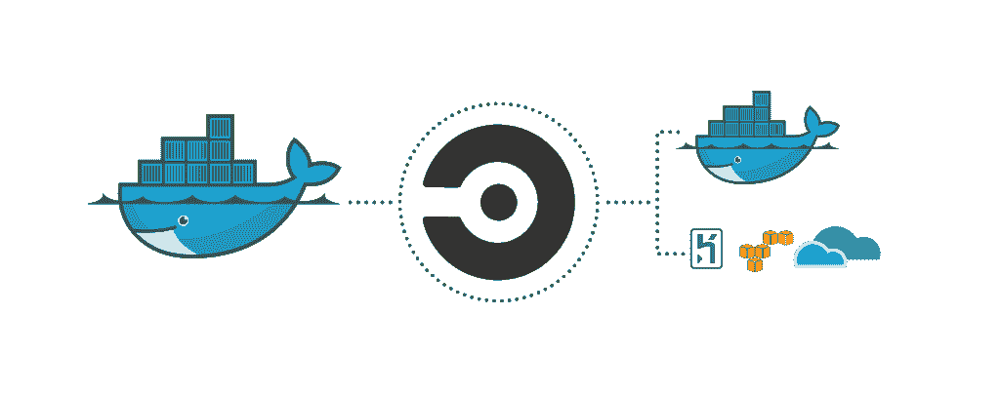

# CircleCI 将构建、测试和部署服务封装为独立的组件

> 原文：<https://thenewstack.io/circleci-containerizes-build-test-deploy-services-separate-components/>

持续集成和交付平台提供商 [CircleCI](https://circleci.com/) 公布了其最受欢迎的功能之一——软件开发的构建、测试和部署阶段的分离。

“以前，我们支持将乔布斯作为一个整体来构建。CircleCI 首席执行官[吉姆·罗斯](https://www.linkedin.com/in/jimdotrose/)说:“现在你可以将所有这些工作分解成组件工作，这很好，尤其是当你的客户从更单一的方法转向微服务和基于容器的环境，在这些环境中，你有许多服务被整合在一起。

[工作流程](https://circleci.com/blog/introducing-workflows-on-circleci-2-0/)，这是 CircleCI 平台更新后的新功能，旨在帮助客户根据自己的需求分解和映射这些流程。

CircleCI 版刚刚发布了私人测试版，本质上是对其构建执行引擎的重建，目的是提供原生 Docker 支持。它提供了旋转容器的能力，将您的构建放入其中，然后将有效负载移动到下一个环境中。工作流是一种工具，它允许客户进行粒度控制来编排这些容器。

Rose 说，通过这种组合，它已经能够将客户构建时间减少 60%到 80%。

当测试失败时，不必完全重新开始构建，工作流允许开发人员准确地指定每个作业何时、是否以及如何运行。它支持顺序和并行作业，以及扇出、扇入、故障重启和分支级配置。

罗斯说，有些人的申请渠道变得相当复杂。

“你会看到这样的例子，人们已经从一个单一的整体发展到数百个微服务，你最终将围绕测试和交付的挑战从单元测试推开，这变成了集成测试的问题。因此，你要测试的不是一个项目的稳定性，而是多个项目的交集，这可能会变得相当复杂，”他说。

目标是提高速度。

他说，在转向微服务的过程中，需要 20、30 或 40 分钟的测试可以减少到几秒钟或一分钟。然而，复杂性来自于拥有太多的服务。因此，开发人员试图找到一个合适的媒介来将这些服务组合在一起，这样他们就可以在不连续的批次中进行测试。

他说，因此，CircleCI 需要能够支持一系列方法，因为客户处于该范围的每一点。

“工作流就是为此而设计的，它创造了灵活性，而不会对客户采用的方法固执己见。我们发现，当我们对客户*应该*采取的方法过于固执己见时，我们通常会受到伤害，因为每个人的构建、测试和部署流程都是独特的。这对他们来说是正确的，”他说。
T3

CircleCI 支持 MacOS 和任何构建在 Linux 上的语言，包括 C++，Javascript，。NET、PHP、Python 和 Ruby。Windows 支持在它的路线图上。

2.0 版还提供了灵活的资源分配、用于提高性能的扩展缓存选项、定制构建环境以及通过 SSH 或本地构建进行调试的能力。

“我们试图提供的北极星是生产力……试图保留开发人员的时间——花更少的时间等待构建，花更多的时间实际构建东西，”Rose 说。

它的下一个重点将是支持使用共享依赖、共享库和开源以及第三方 API 调用的项目。

“已经很少使用定制代码了。因此，您需要协调这些部分，以便能够交付应用程序。这最终会加速开发过程，因为你不必为那些已经被理解和做过的事情重新发明轮子，”他说。

“然而，另一方面，你不再能控制你的代码。我们总是会遇到这样的客户，他们的构建崩溃并不是因为他们做了什么，而是他们的依赖图内部发生了变化，”Rose 补充道。“因为几十万个构建是在 Circle 平台上完成的，所以我们可以在一次几百个构建的背景下看到这些变化。我们希望向我们的客户提供这种洞察力，这样他们就可以提高工作效率，减少对这种依赖关系图脆弱性的担忧。”

通过 Pixabay 的特征图像。

<svg xmlns:xlink="http://www.w3.org/1999/xlink" viewBox="0 0 68 31" version="1.1"><title>Group</title> <desc>Created with Sketch.</desc></svg>