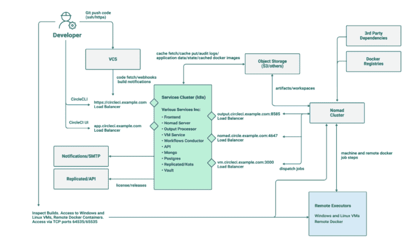

# CircleCI 将 CI/CD 平台扩展到云之外

> 原文：<https://thenewstack.io/circleci-extends-ci-cd-platform-beyond-the-cloud/>

[CircleCI](https://circleci.com/?utm_content=inline-mention) 的 CI/CD 平台的自托管客户将很快获得云客户现在享受的相同功能。其中包括管道、CircleCI 的 orb(基于 YAML 的可重复使用的配置文件)、预定工作流和其他功能。

“当我们想到现代软件开发时，我们可能会默认这项工作发生在公共云中的假设。CircleCI 高级产品经理 [Nathan Fish](https://www.linkedin.com/in/nathanwfish/) 说:“但是，出于合规或控制的原因，有一大群公司和开发者需要在防火墙后工作——在私有云、裸机或他们碰巧运行基础设施的任何地方。“传统上，对于这组开发人员来说，现代的、可扩展的、超高性能的 CI/CD 没有太多选择。”

随着 CI/CD 平台的第 3 版发布，CircleCI 还扩展了安全性和合规性支持，并添加了新功能。

其想法是通过在防火墙内运行的 CI/CD 生产管道来帮助满足 DevOps 的需求，使其能够与 Kubernetes 集群一起工作，同时利用 CircleCI 企业平台的云功能。

Server 3.x 建立在 Kubernetes 的可伸缩性之上，“因此客户可以在自己的计算机上运行高性能、灵活的 CI/CD 管道，”Fish 说。他说，CircleCI Server 3.x 的功能现在“带来了我们云的所有最新功能”。Fish 说，未来的增强功能，如“用于 macOS 构建的 runner、可观察性仪表板、洞察和设置工作流，将在未来的版本中向客户提供”。

Fish 说，除了在 Server 3.x 中添加管道和 orb 等功能外，“最大的更新是能够在自己的 Kubernetes 集群中运行 3.x”。“这在可扩展性和高可用性方面为客户带来了巨大的好处，”Fish 说。

在 CircleCI 现有产品中，server 3.x 旨在满足对软件开发和操作流程的数据合规性要求特别严格的客户的大规模需求。

“虽然我们的大多数客户使用我们的云产品，但使用 Server 3.x 的客户往往是高度监管行业的大企业，比如医疗保健、金融服务和政府，”Fish 说。“这些团队正在做重要的工作，我们认为他们应该获得尽可能最好的开发工具和体验，不管他们的监管约束如何。”

CircleCI 还介绍了 server 3.x 将提供的以下功能:

*   **企业级安全性:** Server 3.x 通过对 CircleCI 安装的端到端控制，使客户能够达到最严格的安全性、合规性和法规要求。客户可以在自己的控制平面中托管 CircleCI 服务和应用，以便将所有数据保存在专用网络中。
*   **维护和监控:**监控选项有 Grafana、Prometheus、Loki 等工具。
*   **增强的集成选项:**集成到现有基础设施中，如 Datadog、Splunk 和 ELK stack。

<svg xmlns:xlink="http://www.w3.org/1999/xlink" viewBox="0 0 68 31" version="1.1"><title>Group</title> <desc>Created with Sketch.</desc></svg>