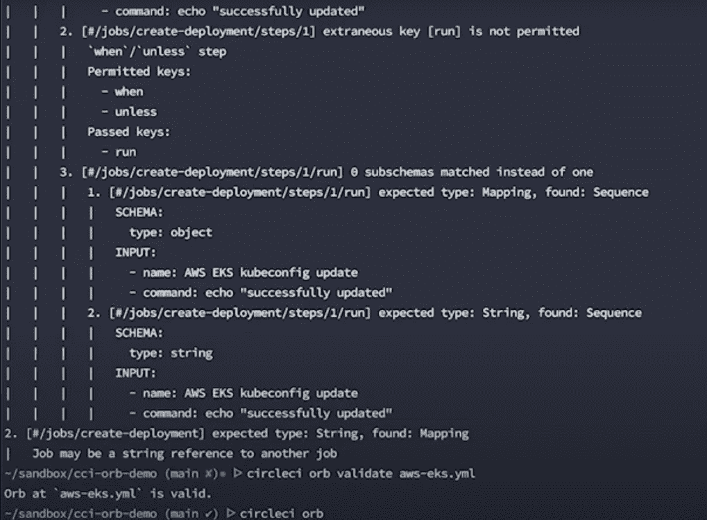
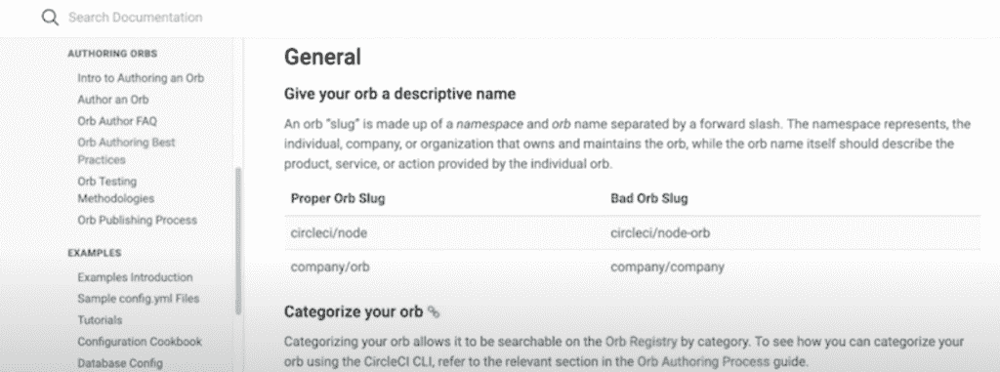

# CircleCI 为“Orb”可重用配置文件提供了一个私有选项

> 原文：<https://thenewstack.io/circleci-offers-a-private-option-for-orb-reusable-configuration-files/>

两年前，CircleCI 推出了 [orbs](https://circleci.com/orbs/) ，这是一种基于 YAML 的可重用配置文件，旨在帮助开发人员自动化重复的过程，加快项目设置，并简化与第三方工具的 CI/CD 集成。CircleCI 首席执行官吉姆·罗斯告诉新的 Stack，CircleCI 现在为开发人员提供创建私有 orb 的能力，允许团队在他们的组织内专门共享配置。

“私有 orb 为开发人员提供了更多的隐私、效率和跨团队的协作，”Rose 告诉 New Stack。这对于在医疗保健、金融和其他具有高治理和法规遵从性标准的行业中工作的团队尤其有用

orb 隐私的这一方面还旨在帮助适应日益远程和分布式的开发运维团队，这些团队需要私下协作和共享资源。私有 orb 提供的特定附加安全特性包括环境变量、多上下文和管理控制。

Rose 说:“尽管到目前为止，成千上万的开发人员已经享受了我们开源 orb 的体验，但我们在大型组织中的许多客户需要一种方法来标准化和私下共享他们的 orb 实例。“这些组织通常有许多必须单独管理的回购，因此能够标准化配置并在项目间私下共享将有助于这些组织更有效地管理它们。

根据 CircleCI 的统计数据，现有 2000 多个 orb，近 1800 万个 orb 已集成到 CI/CD 管道中。

Rose 说，私有 orb 替代方案也旨在帮助 DevOps 团队更高效，“在微服务组织重用的数量稳步增长的时候”。私有 orb 将使用相同的模板一致地自动化流程，而不是每次需要时都必须手动集成这些服务

通过二级索引的搜索功能，开发人员通常使用 CircleCI 来访问所有可用的 CircleCI、合作伙伴和社区创作的公共 orb，并使用 [orb registry](https://mailtrack.io/trace/link/775288e36d9d2596bb869c87d0858a3c6d8f9da5?url=https%3A%2F%2Fcircleci.com%2Fdeveloper%2Forbs&userId=5048943&signature=504ec671a63ccec8) 。Rose 解释说，用户可以通过这种方式利用搜索栏来命名他们正在寻找的特定 orb，例如 Docker 代表部署，Ruby 代表特定语言 orb。或者，开发人员可以按类别过滤 orb，包括代码分析、构建、工件和安全 orb。

罗斯说:“如果用户想用另一种方法搜索球体，他们只需从 CircleCI 的 [CLI 工具](https://mailtrack.io/trace/link/f27d077c6311bfff7a040acb775386786dc350fe?url=https%3A%2F%2Fcircleci.com%2Fdocs%2F2.0%2Flocal-cli%2F&userId=5048943&signature=0b12ab126955162f)中列出所有可用的球体就可以了。

与公共 orb 一样，组织内的私有 orb 可以通过 CircleCI 的命令行访问进行搜索，而 Rose 表示，用户界面(UI)和前端组件将在“不久的将来”向开发人员提供。

“私人球体将永远只对创建和发布它们的组织可见，”罗斯说。组织中具有读或写权限的用户，如果经过身份验证，将能够查看和管理私有 orb

<svg xmlns:xlink="http://www.w3.org/1999/xlink" viewBox="0 0 68 31" version="1.1"><title>Group</title> <desc>Created with Sketch.</desc></svg>