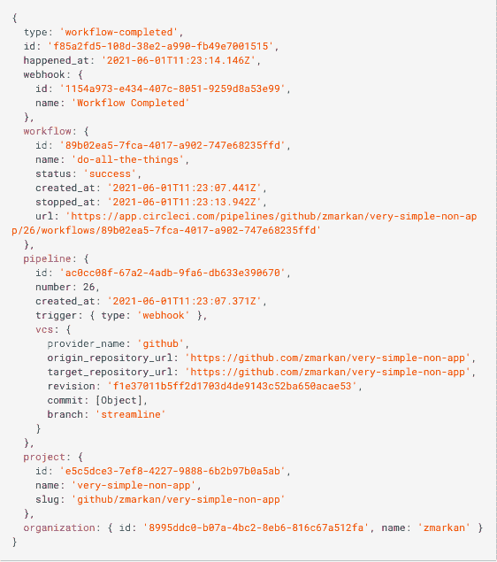

# CircleCI 将 API 转化为推送“Webhooks ”,实现更智能的 CI/CD

> 原文：<https://thenewstack.io/circleci-turns-apis-into-push-webhooks-for-smarter-ci-cd/>

CircleCI 正在扩展其 CI/CD 工具，通过其 [webhooks](https://circleci.com/docs/2.0/webhooks/) 工具为 DevOps 团队提供拉 API 体验，而不是传统的拉。

通过 [webhooks](https://circleci.com/blog/using-circleci-webhooks/) ，API 将预先请求的数据发送到一个端点，其中包含关于如果需要采取什么进一步行动的附加信息。可以使用 webhooks 来创建定制的通知系统，以便在工作完成时发出警报，或者 ping 事件响应工具来发出事件警报，以帮助改善工作流程和响应，[circle ci](https://www.linkedin.com/in/tomtra)的业务发展副总裁汤姆·特拉汉描述道。

Trahan 告诉新的 Stack，可以依靠 webhooks“可视化和分析发生的作业和工作流事件，或者通知事件管理工具管道更新”。例如，开发人员可以将 CircleCI 与诸如 [Airtable](https://blog.airtable.com/introduction-to-airtable-views/) 之类的工具连接起来，以汇总已完成的工作流或作业的数据。“有了 webhooks，客户能够在他们的软件开发管道中创造更多的灵活性，”他说。

An example of a webhook payload.

在包含关于已完成的工作流的信息的 webhook 有效负载中，传递工作流的名称、状态、计时以及相关联的项目、管道、提交和开始管道执行的触发器。

webhooks 与 CircleCI 合作伙伴 [Sumo Logic](https://www.sumologic.com/press-release/sumo-logic-named-a-visionary-in-the-2021-gartner-magic-quadrant-for-security-information-and-event-management-siem/) (云监控提供商)一起从 CircleCI 收集事件，包括工作流和作业完成状态。Trahan 说，这种能力使 Sumo Logic 团队能够更好地跟踪持续集成和部署管道的性能和健康状况。

这个想法也是为了帮助 DevOps 团队更好地了解对应用程序所做的更改，以便在部署软件后最终改进 CI/CD 和操作。

“你最终想要的是一个端到端的过程，允许关于新价值的信息以最快的速度流动，并尽可能确信新价值不会产生意想不到的影响，”特拉汉说。“因此，当我们考虑我们的客户想用管道做什么时，我们会考虑如何在监控和他们所需的一切方面与运营人员生活的下游世界联系起来。”

Trahan 说，为此，webhooks 的创建体现了 CircleCI 进一步扩展其 CI/CD 工具以支持 DevOps 团队的雄心。因此，Webhooks 反映了 CircleCI 提供的支持类型，并将在未来继续提供新的工具和平台版本。

Trahan 说:“这是为了适应[DevOps 团队],它由拥有多个不同系统的多方组成，所有这些都在一个复杂的环境中协调在一起，坦率地说，你需要能够创建这种连接、集成和协调，以确保你可以在它迁移到整个价值链时有效地管理它。”。“通过 webhooks，我们希望最终用户能够尽可能轻松地将 webhooks 与他们的任何系统集成，在内部使用 Datadog、Sumo 或他们自己定制的 dashboard observability 系统，并使用 webhooks 和 API 来获得他们与系统集成所需的一切。”

<svg xmlns:xlink="http://www.w3.org/1999/xlink" viewBox="0 0 68 31" version="1.1"><title>Group</title> <desc>Created with Sketch.</desc></svg>