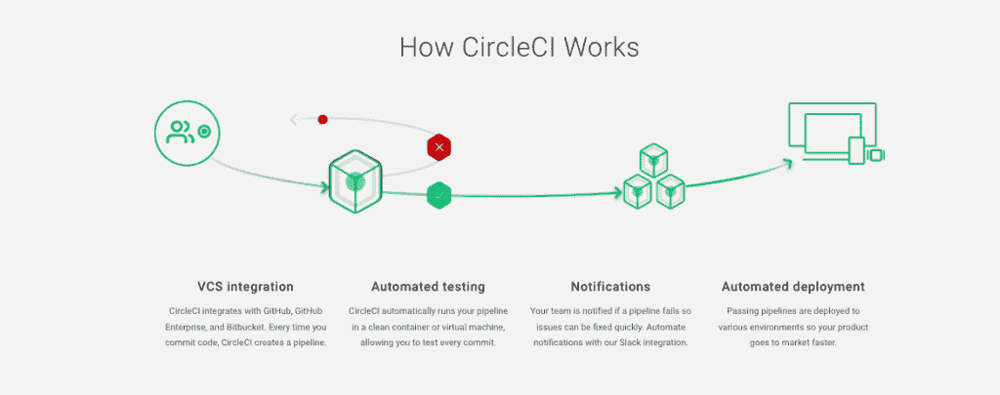

# CircleCI 的企业功能现在是免费的

> 原文：<https://thenewstack.io/circlecis-enterprise-features-are-now-free/>

CircleCI 是一个全面的 CI/CD 平台，因为它为其免费增值版解锁了所有企业功能，所以变得更加易于访问。DevOps 团队现在可以免费使用 CircleCI 的全套企业级配置管道、CircleCI 的 orb(基于 YAML 的可重复使用的配置文件)、计划工作流和其他功能，但用户(每个组织不限数量)必须在每月花费 6，000 分钟的构建时间后开始付费。

在最近与新堆栈的视频会议中，CircleCI 首席执行官 [Jim Rose](https://www.linkedin.com/in/jimdotrose/) 解释了扩展 CI/CD 免费增值功能的举措如何受到 DevOps 团队的开发和部署需求变得日益复杂的影响。在以前的免费版本中，环境的范围——从在 Linux 容器上部署到开发分布式微服务环境——是有限的。Rose 说，不仅管道变得越来越复杂，而且应用程序的类型和这些应用程序的输入也变得“越来越复杂”。

“从免费增值的角度来看，我们的目标是让开发者在一个平台上获得完整的体验，这样他们就可以真正感受到完整的体验，并且能够在不需要向我们付费的情况下发布软件，”他说。“当人们在商业上构建软件时，我们真的只寻求与客户建立商业关系。只有当他们真的在为金钱构建软件，当他们需要商业类型的支持时，客户[升级到企业版]才有意义。我们意识到，这些人真的试图越来越早地开始，并遇到这些非常复杂的问题，他们最大限度地利用了我们的免费增值服务，却无法真正体验 CircleCI 的整体。”

## 更简单的工作

对于开发人员来说，现在可以利用 CircleCI 企业平台的流程抽象。他们的想法是能够创建和提交应用程序代码，而不必学习和管理更多与管道相关的复杂操作任务(其中许多是自动化的)。

通过与 [GitHub](https://github.com/) 、GitHub Enterprise 或 Bitbucket 集成进行版本控制，平台自动创建管道。测试是自动化的，所以每次提交都会被自动测试。当管道出现故障时，会发出警报。CircleCI 还抽象出了对 Jenkins 的使用，从而消除了用 Jenkins 创建 Kubernetes 应用程序所需的陡峭的学习曲线。对于 CD，当发生故障时(如 Slack)会发送通知。当更新和部署出错时，记录和可观察性特性有助于确定修复方法。

“你希望能够做的是快速回滚，回到数据中，收集关于什么破坏了该变化的反馈，并将该反馈反馈给负责该变化的人，这样他们就不会说，‘哦，糟糕，那没用，’”Rose 说。“让我弄清楚是什么出了问题，然后他们可以工作并修复它，推动并再次触发该流程。”

现在免费版本提供的具体工具包括[一套名为“orbs”的包](https://circleci.com/integrations/)，为使用其 CI/CD 软件和服务的组织的部署端带来推荐的护栏和自动化。orb 来自行业中的许多合作伙伴，如允许测试和部署 Salesforce 定制的 Salesforce orb。还有一个 Google CloudRun orb，它允许 CloudRun 无服务器容器在云中运行，而无需考虑底层基础设施。另一个受欢迎的补充将是 Kubernetes orbs，它为运行私有 Kubernetes 集群的组织创建了一个通用基础，可部署到亚马逊 EKS、Azure Kubernetes 服务、谷歌 Kubernetes 引擎和 Red Hat OpenShift。

DevOps 团队还可以将他们喜欢的工具和平台与 CircleCI 集成:

*   客户可以在自己的控制平面中托管 CircleCI 服务和应用，以便将所有数据保存在专用网络中。
*   维护和监控:使用 Grafana、Prometheus、Loki 等工具进行监控。
*   增强的集成选项:集成到现有基础架构中，如 Datadog、Splunk 和 ELK stack。

## 一切都好

通过简化和自动化软件开发所涉及的大部分工作，以及创建部署软件所必需的基础设施，成功地抽象 CI/CD 最终有助于支持满足业务目标。根据麦肯锡&公司最近的研究报告,“一流的工具是开发速度的主要驱动力。拥有强大工具(用于规划、开发…协作以及持续集成和交付)的组织比排名垫底的公司多 65%的创新能力。”无论组织是在为新型计算环境开发应用程序，还是在寻求改善更经典类型应用程序的最终用户体验，使用正确的工具和流程优化 CI/CD 所带来的基本优势都得到了很好的展示。

“每个人都喜欢谈论 Kubernetes、机器学习和人工智能以及其他一切，那里正在发生许多非常有趣和酷的事情——但许多人只是想建立一个提交，并希望它在这个数据中心或云环境中打包和部署，”Rose 告诉 New Stack。“我认为我们已经发现，随着时间的推移，人们开始从自动化的基础水平开始，然后他们走得非常快。过去，客户需要一段时间才能找到他们的海上之旅，然后真正开始自动化所有这些步骤，而现在，这一过程变得更快、更简单。”

<svg xmlns:xlink="http://www.w3.org/1999/xlink" viewBox="0 0 68 31" version="1.1"><title>Group</title> <desc>Created with Sketch.</desc></svg>