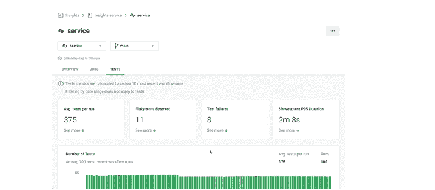
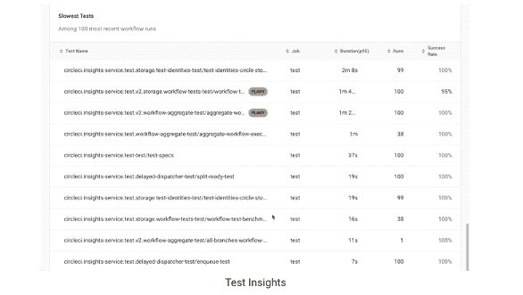

# CircleCI 的测试见解瞄准了“古怪”的测试

> 原文：<https://thenewstack.io/circlecis-test-insights-takes-aim-at-flaky-tests/>

在软件部署之前深入所谓的“脆弱”测试问题的能力是 CircleCI 为其新的[测试洞察](https://circleci.com/docs/2.0/insights-tests/)工具发布的新功能之一，该工具是其持续集成和持续交付(CI/CD)平台的一部分。

该公司表示，尽管过去使用 CircleCI 的 Insights dashboard 进行 CI/CD 分析，以及其他任何测试过程，但用户在开发过程中经常面临测试结果不稳定的困难。这些古怪的结果包括随机的测试失败，没有明显的失败原因。例如，开发人员对相同的代码运行相同的测试，可能莫名其妙地得到五次失败和五次通过。修复这些常见的测试异常通常需要领域知识和专家的专业知识，而不是开发人员来修复，因此减慢了开发过程。

“易变的测试需要时间、金钱和领域知识来修复。CircleCI 产品经理 [Dawit Gebregziabher](https://www.linkedin.com/in/dawit-gebregziabher) 告诉新的堆栈:“新来的人将无法弄清楚发生了什么或识别出问题，然后如果它继续随机失败，他们可能会失去对整个测试套件的信任。“因此，我们带来的是一种快速识别这些测试的方法，然后提供修复它们或从测试套件中删除它们的途径。”

Gebregziabher 说，通过 CircleCI 的 Test Insights 工具提供的片状测试分析功能，该模型可以检测问题测试组件，然后“到达真正了解系统的复杂性和细微差别的点”，以提供测试的可能修复或替换。Gebregziabher 说:“具有不可预测行为的测试通常在测试过程开始之前就被标记出来。”

根据 CircleCI 的数据，失败的工作流平均浪费大约 30 分钟。该公司表示，CircleCI 用户每天可以识别出 4000 多个不稳定的测试，通过消除不稳定的测试失败，他们每天可以节省 2000 多个小时。

CircleCI 提供的其他新功能包括:

*   提高速度。识别运行时间最长、最失败的测试，以便更快速地修复。

*   回顾时期，了解绩效随时间的变化。行为和绩效的变化通过对变化背后的“罪魁祸首”的诊断来确定，以便提高效率。

*   能够利用 CircleCI 的[基准](https://circleci.com/blog/discover-2020-devops-trends-with-circleci-data-report/)数据库中的洞察趋势做出可行的改进。与测试相关的可用数据集包括吞吐量、持续时间、平均恢复时间、成功率和其他指标。

Gebregziabher 说，CircleCI 正在开发的测试和调试工具将继续把可观察性带入测试性能。大约一年前发布 Insights dashboard 后，最受欢迎的功能是测试性能数据。

“现在的趋势是开发人员将他们的代码投入生产，因此，您负责测试您自己的代码，因为开发人员寻求测试优化的机会来提高开发人员的工作效率。因此，我们试图用我们的测试工具来提高管道的效率，”Gebregziabher 说。“我们利用测试元数据，因此无论您使用什么测试工具，我们都会获取结果，然后以简单易懂的方式进行解析、处理和显示。在此之前，人们都是自己做的。”

<svg xmlns:xlink="http://www.w3.org/1999/xlink" viewBox="0 0 68 31" version="1.1"><title>Group</title> <desc>Created with Sketch.</desc></svg>