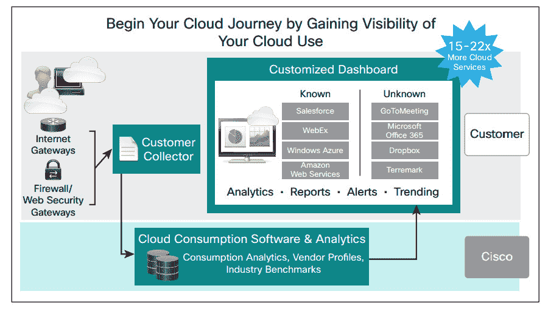

# 思科服务显示员工云消费

> 原文：<https://thenewstack.io/cisco-service-provides-visibility-cloud-consumption/>

经理们是否会因为担心云服务账单被员工随意用完而夜不能寐？如果是这样，思科的一项新服务可能会带来和平。

思科周三宣布了云消费即服务，这是一款 SaaS 产品，旨在帮助 IT 部门掌握员工使用的所有云服务。

“人们已经绕过它很多年了，所以从这个意义上说，这不是新闻，”思科云消费全球负责人 Bob Dimicco 说。“不同的是量级。实际上，这个幅度意味着业务线的员工已经发言了。他们想要一个特定的工具，他们有一个浏览器，他们有一张信用卡，他们将开始使用它。但对它和公司来说，这会带来巨大的风险。”

思科报告称，客户认为他们平均使用 91 种云服务，但使用这种 CCaaS 产品(监控网络流量以识别正在使用的服务)，他们平均使用 1，220 种服务。这个数字每年增长 112%。

思科的发现也反映在其他行业研究中。在 2015 年 Brocade 的一项调查中，83%的首席信息官报告说，他们的公司经历过某种程度的未经授权的云服务供应。在对参加亚马逊网络服务(AWS) re:Invent 的 350 名 IT 专业人员进行的调查中，42%的人表示难以确定他们组织中的云成本和消耗。

据思科称，这项服务有许多好处，包括:

*   **可见性**–It 可以帮助 It 部门了解谁在使用什么，数据去往何处，如何消除冗余服务，以及如何为业务用户提供他们工作所需的最佳工具。
*   **风险和成本:**它可以突出合规性和数据保护问题。例如，它使用行业数据库来确定云提供商是否符合 HIPAA(健康保险便携性和责任法案)，并可以提供所需的合规性认证。
*   **基准测试:**它可以帮助组织为其用户选择合适的服务，并根据同行的使用情况进行基准测试。

思科在订阅的基础上提供这项服务，据说根据业务的规模，每个员工每月将花费大约 1-2 美元。它提供 30 天的免费试用。

“客户说，‘我只需要做一次’，但他们发现行业和他们的用户都在发生变化，”迪米科说。

“你需要这种持续的基础，因为事情每月都在变化。出现了新的应用程序，或者员工开始使用一个应用程序而不是另一个。或者，您决定对一家文件存储提供商进行标准化，并希望确保公司中的每个人都遵守法规。你要逐月查看使用情况，这样在 90 天结束时，你已经帮助每个人开始使用你首选的提供商，一个经过授权的提供商，一个你已经谈妥了最好的合同的提供商，”他说。

该公司认为云服务用户中有两种新兴战略:混合方法和云优先战略。Dimicco 说，通过混合战略，这些服务可以帮助他们了解业务线目前使用的是什么，以便他们可以确定未来想要保留或改变什么。

CityMD 是一家总部位于纽约的提供急诊室服务的组织，它有一个云优先的战略。

“我们有一个流程，要求用户审查一些云服务，但有些服务并不总是通过我们。有了(思科产品)，我们可以准确地了解我们的用户将去哪里，”CityMD 的 IT 副总裁罗伯特·弗洛雷斯库说。

它发现它的用户已经注册了 500 多项服务，而它正式支持的服务只有 15 到 20 项。该公司从去年 11 月开始使用这项服务。

“当我们第一次发现时，我很惊讶那里有这么多东西。现在，我们正在分析他们中的每一个，以了解他们的实际业务案例。他们中的许多人是有效的，我们知道他们，但还有其他人我们不知道，”他说。

“这是一个不断变化的环境。新的云服务不断涌现。这不是你炒了就忘了的事。这是你必须留意的事情。因为我们受 HIPAA 保护，所以我们必须确保这些数据不会泄露给未经授权的云提供商。”

他解释说，如果一名营销人员将一份文件上传到个人 DropBox 账户，因为他或她想在家里处理这份文件，这很容易发生。

“他们不一定知道该文档是否包含 PHI(敏感的个人健康信息),因为那不是他们的职责。这就是为什么这种对传输的可见性对我们很重要。”

与此同时，亚利桑那大学发现一家 IaaS 提供商提供了 950 多种云服务，费用超过 500 万美元，教授和研究生正在使用这些服务，而不是该大学的私有云。迪米科说，它一直在使用思科服务将这些用户转移到其首选的云。

Synergy Research Group 最近报告称，价值 1100 亿美元的云市场(T1)正以每年 28%的速度增长，思科是云基础设施(T4)领域(T5)的 t 2 市场领导者(T3)。

“使用云有一些巨大的潜在经济利益，但用户也很容易上瘾，并直接开始越来越多的云服务。Synergy Research Group 首席分析师兼董事总经理 John Dinsdale 表示:“当使用模式变得分散时，跟踪使用情况和实际支出就变得非常令人头疼。

他说，虽然他不能对这一具体产品发表评论，但“影子 IT 现象是真实存在的，IT 领导者确实需要一些工具来帮助他们更好地管理 IT 资源的使用。”

思科是新堆栈的赞助商。

特征图像通过 Pixabay，license [CC0](https://creativecommons.org/publicdomain/zero/1.0/deed.en) 。

<svg xmlns:xlink="http://www.w3.org/1999/xlink" viewBox="0 0 68 31" version="1.1"><title>Group</title> <desc>Created with Sketch.</desc></svg>