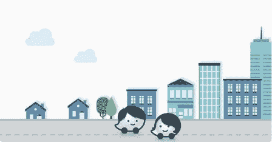

# 交通模式转变，导航应用挑战居民和城市规划者

> 原文：<https://thenewstack.io/city-traffic-planners-vs-driving-navigation-apps/>

虽然谷歌 Waze 等导航应用可能是旅行者的天赐之物，但它们可能会对旅行者途经地区的居民产生一些不良的二阶效应。

《今日美国》(USA Today)在最近的一篇文章中开玩笑说，“称之为规划者对算法”，这篇文章强调了城市交通管理者和通勤辅助应用程序之间隐藏的[斗争。“归根结底，机器人的目的是利用所有可用的道路空间、主干道或乡间小路，”他们解释道。或者正如 Waze 的品牌和全球营销负责人 Julie Mossler 所说，“我们找到开放的道路，将汽车分散在整个网格中。”](http://www.usatoday.com/story/tech/news/2017/03/06/mapping-software-routing-waze-google-traffic-calming-algorithmsi/98588980/)

但这并不总是当地房主所希望的——甚至是城市交通规划者。

一月份，[一家硅谷电视台](http://kron4.com/2017/01/30/fremont-combats-traffic-because-of-navigation-apps/)报道说，“居民和当地企业投诉交通阻碍家长接孩子放学”，并补充说“交通甚至阻止居民离开车道。去年，一个 5 岁的孩子被一个通勤者杀死了。”

该电台描述了弗里蒙特市的应对措施:更多的停车标志，更长的交通信号，更低的速度限制，使路线不那么吸引人——加上入口匝道的计量灯，以及转弯的高峰时间限制。但不幸的是，该市发现他们的新规则没有进入大多数导航应用程序的数据库。

“虽然我们继续在 Waze 上取得进展，但我们在其他交通路由应用上并不成功，”弗里蒙特警察局[在脸书](https://www.facebook.com/FremontPoliceDepartment/posts/1278341398902037)上抱怨道，“我们继续努力接触那些不住在我们城市或不关注我们社交账户的通勤者。”

但据当地新闻报道，他们更愿意教育公众，而不是无休止地开罚单，“公共工程采取了一种独特的方法来教育司机这些转弯限制，方法是添加动态街道标志，上面写着“不要相信你的应用程序……禁止左转”。

《今日美国》采访了诺伊·贝洛索，弗里蒙特的首席运输工程师，他说，“我们只是试图找到一个平衡，消除一些将人们送到我们街道上的时间节约。”

只有一个问题:如果你让一条城市街道变得不那么吸引人，这些应用只会把人们引向另一条街道。华盛顿州运输中心主任说，如果交通就像水一样，“水经常会找到绕过大坝的新路线。”

当然，这不仅仅发生在加州的弗里蒙特。

“弗里蒙特的情况正在美国各地的城镇上演，”《今日美国》报道，“市政规划者刚刚开始理解挑战的范围。”

该报指出，“波士顿蜿蜒的街道，其中一些可以追溯到 17 世纪的牛道，使得这个城市特别容易让司机走捷径和原路来绕过拥堵。”波士顿市的首席信息官 Jascha Franklin-Hodge 认为这仅仅是个开始。当这些小路捷径都自动集成到更多的汽车中，或者成为自动驾驶汽车的标准导航策略时，会发生什么？

与此同时，霍奇承认，“我们不能强迫一个应用程序开发者将公共目标嵌入他们的应用程序，”这一点得到了华盛顿州交通中心主任的回应。他认为 Waze 更感兴趣的是让他们的客户满意(所以他们不会转向其他应用)。但他也认为，今天安静的汽车可能会让司机不太意识到他们在住宅区的行驶速度有多快。

“市政当局意识到机器人总是领先一步甚至 10 步，”今日美国报道。

## 交通邻避

当然，每个故事都有两面性。大约两年前,《洛杉矶时报》刊登了[一篇关于“交通邻避”的专栏文章。制片人兼导演布莱恩·K·罗伯茨写道:“就我而言，只要你没有超速、醉酒或不满 16 岁，你应该可以在一天中的任何时间开车去任何你想去的街道。”“Waze 的创造者不应该受到诋毁，但应该获得诺贝尔和平奖，因为他们分散了交通，减少了碳排放，并保持了全世界司机的理智。”](http://www.latimes.com/opinion/op-ed/la-oe-0505-roberts-waze-critics-20150505-story.html)

但这当然促使了一些[愤怒的回复](http://www.latimes.com/opinion/opinion-la/la-ol-waze-traffic-app-neighborhoods-readers-20150506-story.html)。一位评论者写道:“自从 Waze 出现后，从早上 7 点到 9 点，我家门前的交通连续堵了 20 辆车，在一个停车标志前等候。噪音、刺耳的收音机声、汽车空转的尾气对健康有害…在 Waze 之前，我们有一个平静的住宅。现在我们生活在一条虚拟的高速公路上。”但这不是偶然发生的。根据《纽约客》六月[的一篇文章](http://www.newyorker.com/business/currency/waze-and-the-traffic-panopticon)，Waze 显然一直优先考虑洛杉矶的高速公路而不是小街，直到他们的用户开始吵着要更多的替代路线。

“瓦兹和优步袭击交通规划者如此之快，我们不知道该怎么办，”前纽约市交通协调员萨姆·施瓦茨告诉《今日美国》，他说立法者已经在走廊上讨论了这一问题。“我们需要领先一步，但我们不知道该怎么做。”

《纽约客》还提供了该市管理交通的旧方法——“市中心的一个掩体，在人行道下几层楼的地方，工程师们盯着代表交通的闪烁灯光和街道交叉口的实时摄像头。”

所以很明显事情已经准备好改变了。

根据这篇文章，洛杉矶约有 10%的人口已经在使用 Waze，2015 年 4 月，洛杉矶市长埃里克·加希提宣布，该市将与合作伙伴一起利用 Waze 的数据，承诺“减少拥堵，改善路线，建设更宜居的洛杉矶”。他们不是唯一的合作伙伴。Waze 有一个[“互联公民”项目](https://www.waze.com/ccp)，在这个项目中，its 向各个城市提供它们的交通数据，这些城市反过来又让 Waze 能够访问诸如来自城市道路传感器的数据之类的东西。《纽约客》指出，“Waze 利用的许多公共数据集——包括惠普的报告和洛杉矶的公共工程数据库——已经可供任何人使用，”但将与城市的信息共享正规化可以说会给 Waze 带来额外的影响和可信度，防止政治干预，并为未来更深入的合作打开大门。”

Waze 的增长负责人向《纽约客》表示，城市内部人士对此喜忧参半。“这很令人兴奋，但里面的人也很害怕，因为这看起来工作量太大，或者看起来太不为人知。”但 Waze 喜欢指出，波士顿利用其关于交通堵塞发生地点的数据来调整交通灯的时间，从而减少了 18%的交通堵塞。他们的维基简明扼要地解释了为什么他们认为这是未来的潮流:

“在智能手机、智能汽车和智能家居的时代，难道不是我们开始建设更智能城市的时候了吗？”

<svg xmlns:xlink="http://www.w3.org/1999/xlink" viewBox="0 0 68 31" version="1.1"><title>Group</title> <desc>Created with Sketch.</desc></svg>