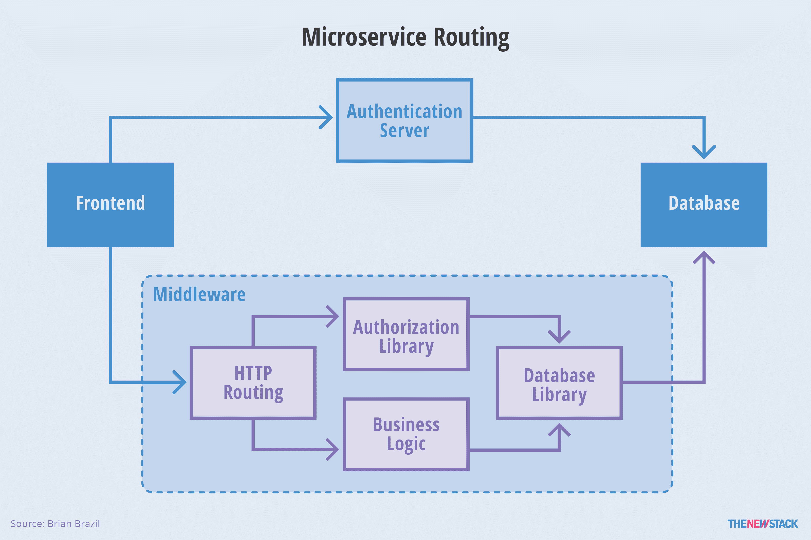
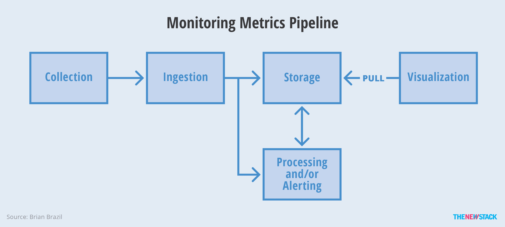
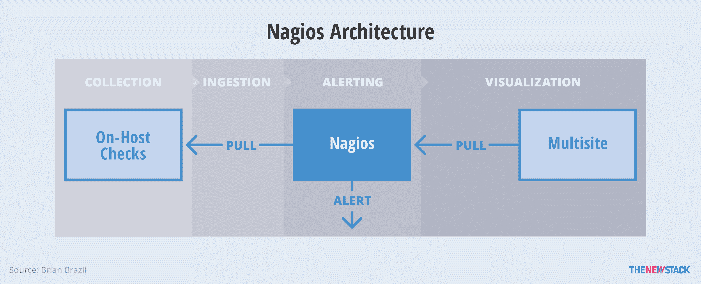
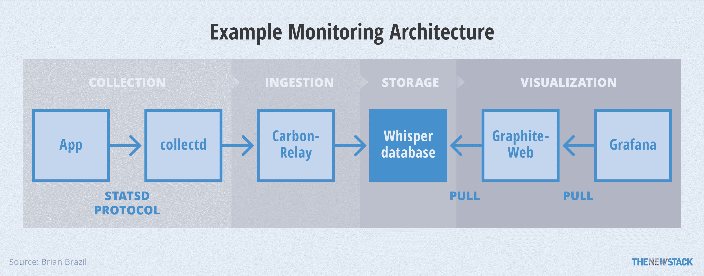
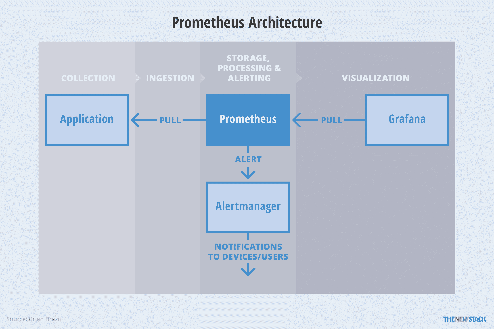
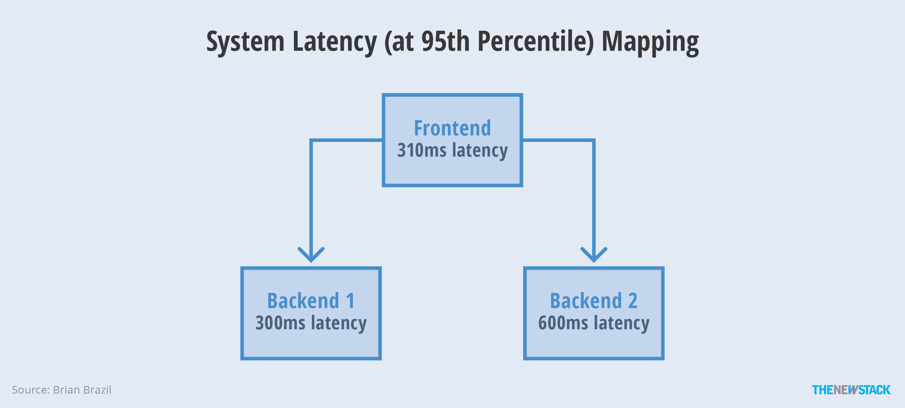

# 集装箱监控的种类

> 原文：<https://thenewstack.io/classes-container-monitoring/>

 [布莱恩巴西

布莱恩巴西是普罗米修斯的核心开发者，也是 Robust Perception 的创始人。他在谷歌等公司拥有 10 多年管理和监控大规模系统的经验。他现在利用自己的技能，通过更好的运营、监控和系统设计方法，帮助组织充分利用他们的系统和员工。](https://www.robustperception.io/) 

在讨论容器监控时，我们需要谈论“监控”这个词在不同行业的用户、开发人员和系统管理员之间，有各种各样的监控实践。在运营、容器和基于云的环境中，监控有四种主要使用情形:

*   知道什么时候出了问题。
*   拥有调试问题的信息。
*   趋势和报告。
*   管道工程。

让我们来看看这些用例中的每一个，以及如何最好地处理每一个障碍。

### 知道什么时候出了问题

警报是监控最关键的部分之一，但一个重要的问题是:什么问题值得在半夜叫醒工程师来查看？为任何危险信号甚至是轻微的麻烦创建警报是很诱人的，但是这很快会导致警报疲劳。

假设您正在运行一组面向用户的微服务，并且您关心请求的延迟。每台机器上的中央处理器(CPU)使用情况是否有助于发出警报？该警报可能会提醒您机器上的 CPU 容量即将耗尽。当后台进程花费的时间比平常稍长时，它还会有误报，以及死锁或没有足够的线程来使用所有 CPU 的误报。

CPU 是问题的潜在原因，高延迟是您试图检测的症状。在[我的警示哲学](https://docs.google.com/document/d/199PqyG3UsyXlwieHaqbGiWVa8eMWi8zzAn0YfcApr8Q/edit#)中，Rob Ewaschuk 指出有许多潜在的原因，很难一一列举。相反，最好对症状保持警惕，因为这导致更少的页面更有可能呈现值得唤醒某人的真正问题。在一个动态的容器环境中，机器仅仅是一个计算基础，对症状而不是原因发出警报从一个好主意变成了必要的。

### 拥有调试问题的信息

您的监控系统现在会提醒您延迟时间很长。现在你做什么？您可以登录到您的每台机器，运行 [top 命令](https://linux.die.net/man/1/top)，检查 syslog 并开始跟踪应用程序日志。但是，这不会让您快速到达任何地方，并且随着您的流量和基础架构的增长，它会失去有效性。您的监控需要为您提供一种系统地处理问题的方法，为您提供缩小问题范围所需的工具。

微服务通常可以被视为一棵树，远程过程调用(RPC)从上到下流动。服务中的高延迟问题通常是由该服务或其后端之一的延迟引起的。不要试图从仪表板上的数百个图表中获得灵感，您可以转到根服务的仪表板，检查其后端过载和延迟的迹象。如果延迟是在后端，您重复这个过程，直到您找到负责的服务。

图 1:微服务中的组件路由。

这一进程可以更进一步。就像你的微服务如何组成一棵树一样，单个微服务内部的子系统、库、中间件也可以表示为一棵树。然后可以应用相同的症状识别技术来进一步缩小问题的范围。为了从这里继续调试，您可能会使用各种工具来深入研究流程内部，调查请求日志中的模式，并跨机器交叉关联请求。

### 趋势和报告

警报和调试往往需要几分钟到几天的时间。趋势和报告关注几周到几年的时间范围。

一个使用良好的监控系统会收集各种信息，从原始硬件利用率和 API 请求计数到高级业务指标。有一些显而易见的使用案例，例如能够满足未来需求的资源调配和容量规划，但除此之外，数据还有许多方式可以帮助做出工程和业务决策。

[cyclone slider id = " ebook-5-赞助商"]

了解请求之间的相似性可能会指出缓存的好处，或者有助于为简单起见而取消缓存。了解每个请求如何使用您有限的资源有助于确定您的定价模式。跨服务和跨机器的统计数据可以帮助您将时间花在最佳的潜在优化上。您的监控系统应该使您能够进行这些分析。

### 探究

当你有一把锤子时，所有的东西看起来都像钉子。

管道不同于其他用例，因为它是从系统 A 到系统 B 获取数据，而不是直接支持响应性决策。例如，可以将每小时的销售数据发送到商业智能仪表板。管道是关于促进管道，而不是从最终结果采取什么行动。不一定是监控；然而，使用您的监控系统将一些数据移动到需要的地方通常很方便。

如果从头开始构建一个定制的解决方案可能需要几周时间，而且使用您的监控系统做同样的事情实际上是免费的，那么为什么不呢？在评估监控系统时，不要只看它的绘图和报警能力，还要看它添加自定义数据源和以后提取捕获数据的难易程度。

## 监控的类别

现在，我们已经了解了监控的一些内容，让我们来讨论一下插入到监控系统中的数据。

大多数监控系统的核心都使用相同的数据:事件。事件是观察点之间发生的所有活动。事件可以是正在执行的指令、正在进行的函数调用、正在路由的请求、正在接收的远程调用过程(RPC)或正在返回的响应。事件有上下文信息，例如什么触发了它们以及它们正在处理什么数据。

我们将看看使用事件的四种不同方式；每种方法都做出不同的权衡，并为您提供不同的系统视图。一个完整的集装箱监控系统将包含每种方法的各个方面。

### 韵律学

指标，有时也称为时间序列，关注的是一段时间内聚合的事件。它们统计每种类型的事件发生的频率、每种类型的事件花费的时间以及该事件类型处理了多少数据。

度量很大程度上不关心事件的上下文。您可以添加上下文，比如按 HTTP 端点划分延迟，但是您需要在每个端点的度量上花费资源。在这种情况下，端点的数量需要相对较少。这限制了分析单个事件发生的能力；然而，作为交换，它允许在单个服务中跟踪数万种事件类型。这意味着您可以深入了解代码在整个应用程序中的执行情况。

我们将更深入地探讨基于指标的监控的组成部分。如果你只习惯于一个或两个系统，你可能不会意识到其中的可能性和权衡。

图 2:收集、存储和可视化指标的架构。

#### 收藏品

收集是将系统状态和事件转换为指标的过程，这些指标稍后可以由监控系统收集。收集可以通过几种方式进行:

1.  **完全在一个过程内。**[普罗米修斯](https://prometheus.io/)和 [Dropwizard](https://github.com/dropwizard/dropwizard) 仪器库就是例子；它们将所有状态保存在进程的内存中。
2.  **通过将来自另一个过程的数据转换成可用的格式。** [collectd](https://collectd.org/) 和[无代理系统爬虫](https://developer.ibm.com/open/agentless-system-crawler/)通过从 [proc 文件系统](http://man7.org/linux/man-pages/man5/proc.5.html)中提取数据来实现这一点。
3.  **通过两个过程协同工作:一个过程捕获事件，另一个过程将它们转换成指标。** [StatsD](https://github.com/etsy/statsd) 就是一个例子，其中每个事件都是通过网络从应用程序发送到 StatsD 的。

#### 摄取

摄取从收集中获取指标，并将它们提供给监控系统。这可能是一个涉及排队系统的多阶段过程，如 [Apache Kafka](https://kafka.apache.org/) ，或者是直接从集合中进行简单的数据传输。在这一点上，推与拉的争论必须提到。这两种方法各有利弊。我们无法在这些页面中涵盖这一争论的范围，但简短的版本是，这两种方法都可以扩展，并且都可以在容器化的环境中工作。

#### 储存；储备

数据一旦被接收，通常会被存储起来。它可能只是最新结果的短期存储，但也可能是任何数量的分钟、小时或天的数据存储。

一旦存储的数据超过了一台机器上的内存容量，就需要在操作和可靠性之间进行权衡，并且根据组织对监控数据的要求也有利弊。将数据保存到磁盘上超过一个进程的生存期意味着要么需要备份，要么愿意在机器出现故障时丢失数据。在多台机器之间传播数据带来了分布式系统的基本挑战。最终得到一个现有数据安全的系统并不困难，但是新数据不能被接收和处理。

#### 处理和报警

如果你不做任何事情，数据就没有多大用处。大多数度量系统提供了一些对摄取的数据进行数学运算的方法，通常还提供了一种向人类发出异常状况警报的方法。这可能在接收数据时发生，也可能作为一个单独的异步过程发生。

不同解决方案之间的处理复杂程度差别很大。一方面， [Graphite](https://graphiteapp.org/) 在没有第三方工具的情况下没有原生处理或报警能力；然而，在绘图时，有基本的聚合和算术是可能的。另一方面，像 Prometheus 或 Sysdig 这样的解决方案不仅具有成熟的处理和警报系统，还具有额外的警报聚合和重复数据删除系统。

#### 形象化

警报到达您的寻呼机是好的，但是对于调试、报告和分析，您希望仪表板可视化该数据。

可视化工具可以分为三类。在低端，您可以在监控系统本身中使用内置的方法来生成特定的图表。在中间，您有内置的仪表板，具有有限的定制或没有定制。这种情况在只为监控一类系统而设计的系统中很常见，在这些系统中，其他人选择了允许您拥有的仪表板。最后，还有完全可定制的仪表板，您可以创建几乎任何您喜欢的东西。

#### 它们是如何结合在一起的

现在，您已经对指标监控系统中涉及的组件有了一个概念，让我们来看看每个组件所做的权衡的一些具体示例。

##### 纳吉奥斯

[Nagios](https://www.nagios.org/) 服务器通常调用主机上的脚本——称为检查——并记录它们是否根据退出代码工作。如果检查失败太多，它会发出警报。可视化通常由单独的内置仪表板提供。它可以从脚本中获取 1KB 的数据，包括指标(称为“性能数据”)，并将其传递给另一个监控系统。

图 Nagios 的度量处理。

Nagios 是为静态设置设计的，静态设置需要重启来加载新的配置。它的处理能力有限，侧重于基于主机的监控，并且只能处理少量指标数据，因此不适合在容器环境中进行监控。然而，它对于基本的黑盒监控仍然有用。

##### 收集，石墨和 Grafana

许多常见的监控堆栈将几个组件组合在一起。一个[集合了](https://collectd.org/)、[石墨](https://graphiteapp.org/)和[格拉夫纳](http://grafana.org/)的组合就是这样一个例子。collectd 是收集器，从内核和第三方应用程序(如 MySQL)中提取数据。要从您自己的应用程序中收集自定义指标，您可以使用 StatsD 协议，该协议将用户数据协议(UDP)数据包发送到 collectd 以收集各个事件。collectd 将指标发送给 [Carbon](https://github.com/graphite-project/carbon) ，后者使用 [Whisper](https://github.com/graphite-project/whisper) 数据库进行存储。最后，石墨和 Grafana 本身都可以用于可视化。

图 4:由 collectd、Graphite、Grafana 组成的示例监控堆栈。

统计数据库的收集方法在规模上有局限性；为了获得性能而选择放弃一些事件并不罕见。每台机器收集的方法在容器化的环境中也有局限性。例如，如果有动态部署的 MySQL 容器，那么每台机器的 collectd 每次都需要更新它的配置。

由于不包括警报，一种方法是让 Nagios 检查您想要的每个警报。Graphite 的存储也很难扩展，这意味着您的警报取决于您的存储是否正常运行。

##### 普罗米修斯

普罗米修斯采取了不同于我们之前例子的方法。尽可能在应用程序内部进行收集。对于不可能的第三方应用程序，不是每台机器有一个收集器，而是每个应用程序有一个导出器。这种方法可能更易于管理，但会增加资源使用量。在像 Kubernetes 这样的集装箱化环境中，出口商将作为主集装箱的边车集装箱进行管理。Prometheus 服务器处理摄取、处理、警报和存储。然而，为了避免将分布式系统捆绑到关键监控中，本地 Prometheus 存储更像是一个缓存。一个独立的非关键分布式存储系统处理长期存储。这种方法为长期数据提供了监控可靠性和耐久性。

图 5:普罗米修斯中的度量处理。

虽然 Prometheus 决定发出何种警报，但它不会向用户发送电子邮件或页面。相反，警报被发送到 Alertmanager，该 manager 对来自多个 Prometheus 服务器的警报进行重复数据删除和聚合，并发送通知。

##### Sysdig 云

前面几节展示了各种开源解决方案是如何构建的。为了便于比较，本节描述了商业解决方案 Sysdig Cloud 的架构。从插装开始，Sysdig Cloud 使用基于主机的内核级收集模型。该工具通过单个收集点捕获应用程序、容器、statsd 和主机指标。它收集事件日志，如 Kubernetes 伸缩、Docker 容器事件和代码推送，以便与指标相关联。每主机代理可以减少监控代理的资源消耗，并且不需要修改应用程序代码。然而，它需要一个特权容器。

图 6:看看 Sysdig 的商业架构。

Sysdig 云存储后端由 Cassandra(指标)、MySQL(事件)和 Redis(服务内代理)的水平可扩展集群组成。基于这些组件的构建提供了高可靠性和可扩展性，可存储多年的数据以进行长期趋势分析和分析。REST API 可以访问所有数据。整个后端可以通过 Sysdig 的云服务使用，或者作为软件部署在私有云中，以实现更高的安全性和隔离性。这种设计使您可以避免运行一个系统进行实时监控，而运行另一个系统进行长期分析或数据保留。

[cyclone slider id = " ebook-5-赞助商"]

除了处理指标数据，Sysdig Cloud 还收集其他类型的数据，包括来自 Kubernetes 和 Docker 容器的事件日志，以及来自 Kubernetes 等 orchestrators 的元数据。这用于丰富指标提供的信息，对于一个指标系统来说，除了指标处理所需要的之外，还有其他的集成，这并不罕见

### 日志

日志，有时称为事件日志，都是关于单个事件的上下文。有多少请求被发送到一个端点？哪些用户正在使用或呼叫端点？

日志与度量做了相反的权衡。随着时间的推移，它们不会进行任何聚合。这限制了他们在带宽和存储成本成为问题之前，每个事件只能跟踪大约 50 到 100 条信息。即使有这种限制，日志通常也允许您找到单个请求中的模式，例如特定用户是否访问了昂贵的代码路径。

区分您正在使用的日志类型很重要，因为它们有各种不同的用途和可靠性要求:

*   **业务和交易日志:**这些是你必须不惜一切代价保护好的日志。与计费相关的任何事情都是业务或事务日志的一个很好的例子。
*   **请求日志:**这些是通过您系统的每个请求的日志。它们通常用于系统的其他部分进行优化和其他处理。失去一些是不好的，但不是世界末日。
*   **应用程序日志:**这些是来自应用程序的关于一般系统状态的日志。例如，它们会指示垃圾收集或其他一些后台任务何时完成。通常，您希望每分钟只有几条这样的日志消息，因为这个想法是人类将直接读取日志。它们通常只在调试时需要。
*   **调试日志:**这些是用于调试的非常详细的日志。由于这些日志非常昂贵，并且只在特殊情况下才需要，因此它们比应用程序日志具有更低的可靠性要求。

下一次有人和你谈论日志时，想想他们谈论的是哪种类型的日志，以便恰当地安排对话。

### 压型

概要分析具有与度量和日志相同的优点。它让您可以看到整个应用程序中单个事件的数据。缺点是这样做的成本很高，所以只能在战术上应用。

例如，日志告诉您一个用户遇到了一个昂贵的代码路径，度量标准让您缩小了哪个子系统可能是罪魁祸首的范围。下一步是分析该子系统，并查看 CPU 在哪些代码行中被占用。

Linux [的剖析工具](http://www.brendangregg.com/Perf/linux_observability_tools.png)有很多种，包括 [eBPF](http://man7.org/linux/man-pages/man2/bpf.2.html) 、 [gdb](https://linux.die.net/man/1/gdb) 、 [iotop](https://linux.die.net/man/1/iotop) 、 [strace](https://linux.die.net/man/1/strace) 、 [tcpdump](https://linux.die.net/man/8/tcpdump) 和 [top](https://linux.die.net/man/1/top) 。还有一些商业选项，比如 Sysdig，它将这些工具的功能整合到一个包中。您可以在持续的基础上使用其中的一些工具，在这种情况下，它将属于度量或日志。

### 分布式跟踪

假设您有一个系统，其前端在第 95 百分位以 310 毫秒的延迟运行。您收到一条警告，称前端 95%的延迟已增加到 510 毫秒！您认为在罪犯后端的 95%延迟中会看到什么？

图 7:一个示例系统的延迟映射。

答案是，您可能会看到与前端相同大小的增长，但也可能不会。等待时间可能没有变化或者甚至减少。这完全取决于延迟的相关性。请记住，第 95 个百分位数实际上丢弃了 95%的数据，因此您不会注意到这 5%之外的变化。

从延迟图中看不出这里发生了什么，这就是分布式跟踪的用武之地。这是一种记录和分析的形式。它在使用容器和微服务的环境中特别有用，这些环境中有大量的服务间通信。

它的工作原理是每个传入的请求都有一个唯一的标识符。当请求通过不同机器上的不同服务时，该信息用标识符记录。然后从日志中将每个请求拼接在一起，以查看每个请求所花费的时间。由于日志记录的成本，有时只能跟踪传入请求的子集。

结果是服务树中的每个后端何时被调用的可视化，允许您看到时间花费在哪里，发出了什么订单请求，以及哪些 RPC 在关键路径上。应用到图 6 中的例子，你会注意到所有的快速请求只到达后端 1，而慢速请求到达两个后端。这将提示您，您需要评估的是与后端 2 通信的逻辑。虽然这是一个简单的例子，但是想象一下，如果没有分布式跟踪，您需要花费多长时间才能弄清楚您有几十个服务。

## 结论

在本文中，我们已经讨论了监控的用例，这将帮助您理解可以通过监控解决的问题。我们学习了使用事件的四种不同方式:度量、日志、分析和分布式跟踪。在分解基于指标的方法时，我们研究了数据是如何收集、摄取、存储、处理、报警和可视化的。

现在，您对监控系统的类型及其解决的问题有了更好的了解，您将能够全面评估许多不同的解决方案。监控系统的设计有多种方法，每种方法都有各自的优缺点。在评估监控解决方案时，首先评估它是否主要基于指标、日志、分析或分布式跟踪。在此基础上，从需要智能人工操作的警报、您需要调试的信息以及与您的系统集成等方面，查看它具有哪些适合您的整体监控策略的功能。

每种解决方案都有其优点和缺点，而且您几乎肯定需要不止一种工具来创建一个全面的容器监控解决方案。

通过 Pixabay 的特征图像。

<svg xmlns:xlink="http://www.w3.org/1999/xlink" viewBox="0 0 68 31" version="1.1"><title>Group</title> <desc>Created with Sketch.</desc></svg>