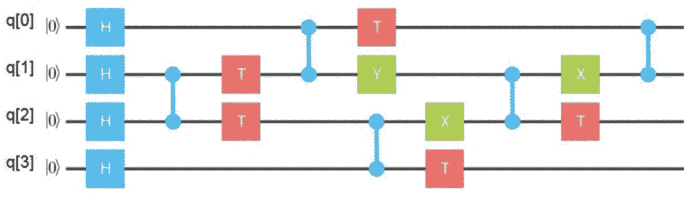
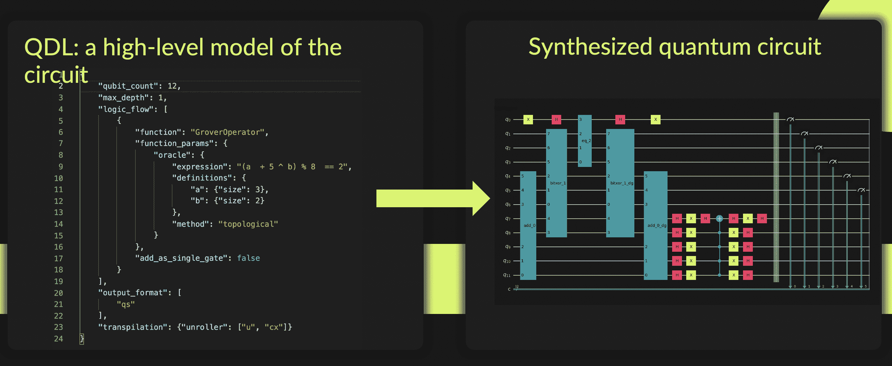
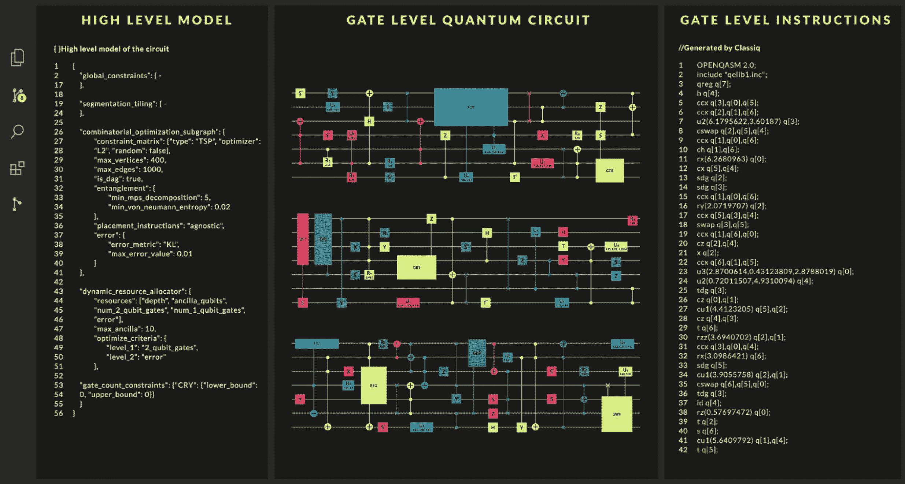

# Classiq 为 Quantum 软件栈带来抽象层

> 原文：<https://thenewstack.io/classiq-brings-abstraction-layer-to-quantum-software-stack/>

软件在量子计算机中是如何工作的，你是如何创造“量子算法”的？这是我向 Nir Minerbi 的开场提问，他是以色列软件公司 [Classiq](https://www.classiq.io/) 的联合创始人兼首席执行官，该公司为量子计算提供软件开发平台。

“量子软件正在以一种将解决你的问题的方式操纵量子状态向量，”Minerbi 回答道。这是通过“将其乘以一个[酉矩阵](https://www.sciencedirect.com/topics/computer-science/unitary-matrix)”来完成的——通俗地说，这意味着使用大量的数学和逻辑。结果是，量子软件开发，在这个时间点上，包括在量子计算机上编程物理状态。该公司将其描述为“有点像电子设计，又有点像汇编语言。”

你现在可能已经猜到了，编写量子软件是非常困难的。正如 Minerbi 所说，关于写一个单位矩阵，“用这种方式思考真的很难，对吗？”开发人员在量子计算方面面临的第二个问题是计算的庞大规模。“在一台 300 量子位的机器上，”Minerbi 解释说，“这个酉矩阵的大小是 2 的 300 次方，比宇宙中的原子数量还要多。”这意味着问题必须被分成更小的工作量(1 或 2 量子位操作)。

## 超越量子电路一层

这就是“量子电路”的用武之地。根据维基百科[的说法，“量子电路是量子计算的模型，类似于经典电路，其中计算是一系列量子门、测量、量子位初始化为已知值以及可能的其他动作。”](https://en.wikipedia.org/wiki/Quantum_circuit)

“所以今天，”Minerbi 说，“这基本上是量子软件栈中的抽象层次。你需要设计这些电路，这些电路是门级的软件。”

为了创造一个量子电路，Classiq 在给我看的一个演示文稿中概述道，“一个人指定哪个‘量子位’(导线)连接到哪个‘门’(方块)。这是用量子汇编语言完成的。”

一个量子电路。

然后电路在量子计算机上运行，这是一个物理过程。“最终，这些门级操作中的每一个都将被编译成物理操作——微波或激光——这将实际应用于物理量子位，”Minerbi 解释道。

Classiq 所做的是在量子计算的当前状态上增加一个抽象层——如前所述，是在门和机器级别。“过去 60 年在经典堆栈中开发的方法和工具，我们将把它们带到量子堆栈中，”Minerbi 说。

为了实现这个抽象层，Classiq 创建了一个可以翻译成量子汇编语言的高级功能模型。因此，作为一名用户，你可以对电路设计建模(通过 Python 或 VSCode ),然后 Classiq 的平台将其转化为实际的电路代码。然后你在一个领先的量子计算处理服务上运行这个代码，比如 Qiskit 或者 Amazon Braket。

从高层模型到量子电路

正如 Classiq 的[平台描述页面](https://www.classiq.io/platform)所指出的，开发人员被鼓励“将内置量子模块与用户定义的模块相结合”，然后“设置限制，如门的数量、电路深度和纠缠度。”所有这些完成后，Classiq 生产了一个可以在 Qiskit、Braket 或另一个平台上使用的量子电路。

但是我问 Minerbi，为什么开发者不应该直接使用 Qiskit 或 Braket 呢？

“基本上 Qiskit 允许你做的，这是非常重要的，是以一种方便的方式设计门级电路，”他回答说。“但这仍然是门级的，因为你需要知道哪些门应该放在哪里，应该使用哪些构件。我们是在此之上的一层——我们在高级建模的功能层，我们的合成引擎正在用 Qiskit 或任何其他语言生成量子电路。”

## Python 开发者如何开始量子计算

为了创建电路的逻辑 Classiq 称之为高级模型——开发人员可以使用该公司的 VSCode 扩展(具有拖放功能)或 Python SDK。

左边是模型(Python 中的)，中间是电路设计，右边是电路代码。

我问 Minerbi，一个熟悉 Python 的 web 开发者在 Classiq 上开始构建量子计算软件有多难？

“所以我们基本上有两种用户，”他回答道。“第一种是量子专家。这些人[…]非常熟悉量子算法，并使用该平台实现了他们用 Qiskit 和其他平台无法实现的最先进的结果。第二种用户是 Python 开发人员或机器学习开发人员等，他们正在使用 Classiq 进入量子计算领域。”

通常，Python 和 ML 开发人员会从一些对量子计算新手有好处的用例开始。一个例子是[格罗弗算法](https://qiskit.org/textbook/ch-algorithms/grover.html)，它经常被用来加速非结构化搜索。密涅比说，这是一个好的开始，“因为它是关于在量子电路中嵌入经典逻辑。”

密涅比补充道:虽然 Python 和 ML 开发人员不一定需要理解量子信息论才能理解像 Grover 这样的算法，但如果他们有代数背景，这确实有所帮助。

由于量子计算仍然是一个非常新的领域，尤其是在软件开发方面，物理学家的数量超过了计算机科学家。然而，这种情况正在发生变化，越来越多的计算机科学家进入这个领域。

“例如，在我们公司，大约有 45 人，”密涅比说。“他们中的一些人是量子信息博士和博士后，另一些人是没有物理背景的计算机科学家——这种结合非常强大。”

## 结论

多年来，经典计算行业增加了抽象层，每一个新层都使得软件开发更容易。它从汇编语言发展到了更高级的语言(比如 Python)，但是我们也在网络世界中看到了这种发展——在 20 世纪 90 年代早期到中期，你需要用“原始”HTML 对网页进行编码，但是现在你可以用任何数量的拖放设计工具来完成。所以很高兴看到量子计算开始加入同样的抽象层次。

不过，很明显，我们还处于定义量子软件堆栈的早期。Classiq 有一些竞争对手。一家名为[地平线量子计算](https://www.horizonquantum.com/technology)的公司正在为量子软件“开发一个完整的编译器堆栈”，像 IBM 和亚马逊这样的大型服务提供商提供他们自己的 SDK。但是 Classiq 的解决方案似乎是迄今为止最引人注目的抽象层之一。

<svg xmlns:xlink="http://www.w3.org/1999/xlink" viewBox="0 0 68 31" version="1.1"><title>Group</title> <desc>Created with Sketch.</desc></svg>