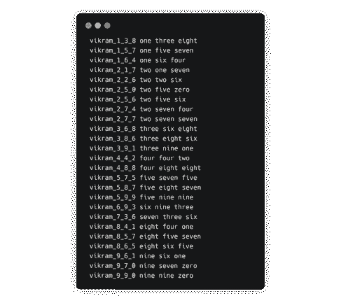

# 干净的数据是有效机器学习的基础

> 原文：<https://thenewstack.io/clean-data-is-the-foundation-of-effective-machine-learning/>

[vik ram Bahl](https://vikrambahl.com)

[vik ram Bahl 在为 web 和移动应用程序设计复杂的后端系统方面拥有丰富的经验。他曾与从种子期创业公司到独角兽公司的各种公司合作，帮助他们解决与数据工程、应用机器学习和云系统架构相关的问题。](https://vikrambahl.com)

数据科学不再只是科技公司的专利；无论您是一家寻求 it 现代化的企业，还是一家试图获得独角兽地位的初创公司，IT 正慢慢成为数据团队的重要组成部分。曾经是数据工程师、BI 团队和数据分析师谈论 SQL 的堡垒，正日益被线性回归和强化学习的话题所渗透。机器学习和人工智能已经为一些公司解决了一些现实世界的商业挑战，这些公司今天正在收获在正确的时间做出正确投资的回报。网飞的推荐引擎、Spotify 的预测分析和谷歌的多语种语音转文本系统都是这一成功最广为人知的例子。

考虑到这一点，首席执行官和首席财务官正在联系他们的首席信息官和工程主管，提出如下问题

1.  X 公司通过加倍投资机器学习发现的隐藏细分市场，收入增加了 10%。我们能否将 AI 应用到我们的产品线中，并取得类似的结果？
2.  我们每月向这家云提供商支付 20，000 美元来存储数据。我们能在这些闲置数据上进行某种人工智能或机器学习，并为董事会赢得胜利，提高公关吗？

数据科学团队在组建时很大程度上考虑到了这一背景。他们被给予一个业务用例以及一个问题陈述，并且被期望为公司交付出色的结果、增加收入以及降低成本

但残酷的现实是，数据工程师和科学家经常花费数周，在某些情况下甚至数月，试图清理、组织和理解客户的商业智能团队交给他们的数据。

资料来源:https://xkcd.com/1838/

数据科学团队表现不佳的原因是多方面的。然而，[经过充分研究的研究](https://arxiv.org/abs/1803.06071)和[认为](https://www.marklogic.com/blog/the-staggering-impact-of-dirty-data/)脏数据会影响机器学习结果，但也会对脏数据的表现以及数据科学团队的表现产生重要影响。(阅读[这篇](https://medium.com/@ODSC/6-reasons-why-data-science-projects-fail-6240bf9326f6)了解数据科学团队失败的六个因素。)

简而言之，在对数据集应用任何算法或技术之前，数据集的质量和一致性是至关重要的。

任何上过计算机科学或编程课的人都熟悉 GIGO 或 Garbage In Garbage Out。同样的原理也适用于机器学习。

数据科学可能是“21 世纪最性感的工作”(基于[哈佛](https://hbr.org/2012/10/data-scientist-the-sexiest-job-of-the-21st-century)进行的一项研究)，但让我们深入挖掘，了解数据科学家在日常工作中实际做了什么。《福布斯》最近的一项研究得出结论，数据科学家花 60%的时间清理和组织数据。这给了数据科学这个充满希望的职业一个全新的视角。

## 典型的机器学习流程

既然我们已经确定工作中的大部分时间都被数据清理所消耗，那么让我们来看看它在整个机器学习流程中的位置。

在高层次上，ML 发生在以下或多或少连续的步骤中(让我们把反馈循环放在一边):

1.  源发现
2.  数据准备和分离
3.  特征抽出
4.  建模
5.  模型训练和调整
6.  预言；预测；预告
7.  模型部署

本文的重点将主要是数据准备和分离。

## 坏数据集的特征

我已经认识到安娜卡列尼娜原则是普遍适用的，也适用于这种情况:“所有好的数据集都是相似的；每个糟糕的数据集都有其自身的糟糕之处。”

这意味着无论是数据集还是用例，总会有一个数据清理步骤。再多的自动化或边缘案例分析也不会把它带走(也许有一天一个在高度不干净和肮脏的数据上训练的 ML 模型会解决这个问题)。

下面展示了一些使数据集“不干净”的常见数据。这些错误的原因通常是由于数据生命周期中某个点的人为错误，但是，有些也可能是机器生成的。

### 不一致的模式

假设您在一个足球协会的数据团队中，该团队要求全国所有足球俱乐部发送该团队球员的详细信息。俱乐部的指导方针是以 csv 文件的形式发送个人信息(没有时间构建 web 界面或 API)。现在，一些俱乐部在文件中创建了列标题(姓名、年龄、出生地等)。然而，一些俱乐部对它的命名不同，遗漏了一列或增加了一些新列(一列用于名，一列用于姓)。因此，作为足球协会的一员，你需要花费额外的时间将数据整合到一个通用的模式中。

### 无关文字

当列的值包含不必要的信息时，就会出现这种情况。一个例子:

*   出生日期一栏中的“2018 年 1 月 12 日”而不是“2018 年 1 月 12 日”

这种情况比您想象的更常见，当它中断数据管道或一整天的数据都没有包含在查询中时，这是一种痛苦，因为 *01/12/2018szuyl* 没有任何意义。

### 缺失数据

这很容易调试，因为只是缺少一些值。科学家通过添加默认值或基于某些假设计算一个值来清理这一点。在下游 ML 模型中，缺失数据的影响可能很大。如果不加检查，它可能导致过度拟合和训练不足的 ML 模型。

### 冗余信息

这是指相同的数据在一个数据集中存在多次(想想 csv/xls 数据集中的重复行或重复的 key:value 文档)。具有冗余数据的数据集可能会导致过度拟合。如今，关系数据库中很少出现重复的行，因为大多数计算机科学课程都阐述了主键不为空并且是唯一的。

但是，并不是所有的信息都是多余的，要看上下文。如果有一个物联网温度传感器每五秒钟传输两个温度记录，那么很可能会有多组数据具有相同的温度值。在计算一段时间内的温度值异常时，这可能不代表重复数据。

### 语境错误

这些是最难纠正的，因为它通常需要数据集本身的“业务”知识或背景知识。一些例子:

*   考虑一下世界上人口最多的城市的白天温度数据集。温度值 320 不可能是摄氏度或华氏度
*   年龄为-46.3 岁
*   地球的轴倾角是 22 度。这是否在可接受的轴向倾斜范围内？

科学家们通常认为对数据进行健全性检查“不是我的工作”

抱歉让你失望了。

### 垃圾值

假设名字列中的记录是*[&# 258](https://www.bbc.com/news/world-us-canada-52557291#:~:text=Elon%20Musk%20and%20singer%20Grimes,her%20followers%20on%20social%20media.)。*这显然需要清理或某种形式的 UTF-8/Unicode 转换(除非是 Elon Musk 的东西)。这通常是数据工程师需要对数据集执行的第一步。如果不加以检查，它可能会在下游的提取、转换和加载(ETL)管道或特性工程脚本中导致一些非常棘手的错误。

## 数据清理正在进行

清理数据所需的工作量与数据集的广度和深度成比例。我将向您介绍一个场景，在这个场景中，我在训练一个简单的 ML 模型时，反复进行了多轮数据清理工作。

目标是建立一个自动语音识别系统，可以识别从 0 到 9 的语音数字。

我们选择了[卡尔迪](https://github.com/kaldi-asr/kaldi)来构建解决方案。实现完美模型需要三个步骤:

1.  收集数据集并创建训练集和测试集
2.  在训练数据集上训练模型
3.  根据测试数据集的预测测试模型的准确性

这看起来很简单，不是吗？

我们已经确定了 1000 多名演讲者，他们需要向我们发送数据进行培训。对每个扬声器的要求是:来自每个扬声器的音频的 25 个 WAV 文件，以 16000Hz 采样。每个音频文件将根据该音频中所说的数字来命名，例如，如果您说“1 2 3”，则该文件应命名为“ *1_2_3.wav* ”。这个命名约定是由 Kaldi 强制执行的，将被视为自动语音识别(ASR)工具包的有效输入。

每个说话者可选地用他们所说的数字创建一个**文本文件**:

同样，这看起来像是在公园散步。但事实并非如此。以下是在真正的 ML 工作开始之前必须解决的一些问题:

1.  错误的文件名
    1.  *1_23.wav* 或 *123.wav* 代替 *1_2_3.wav*

**我们的解决方案:**我们编写了一个 Python 脚本来检查每个文件，验证文件名，并在需要时进行更改(使用了 string.split、string.replace)

1.  错误的编解码器或容器。这属于两种情况
    1.  分机上写着。但是编码是 MP3
    2.  扩展名是. MP3，但编码是 WAV
    3.  我们的解决方案:这有点难解决，我们使用 ffmpeg 来验证我们在这里使用了正确的编解码器。如果是编解码器，我们使用一个 shell 脚本来重新编码。
2.  错误的采样率
    1.  我们期望每个音频文件以 16k Hz 录制(用 Audacity 很容易做到)。然而，我们收到的录音中约有 30-40%是用 44k Hz 录制的。

**我们的解决方案:**我们使用 ffmpeg 和一个脚本将音频下采样到 16k Hz

### 文本文件的修复列表

我们犯了一个错误，把它作为可选文件。我们不应该把这作为一个要求。相反，正确的做法是根据音频文件的名称生成这个文件。我们为参与者提供了这一选项，这样他们在录制音频的过程中会更加严谨。你所说的就是你记录的。

然而，在那个时间点，我们收到了一半参与者的文本文件。对于提交文件的后半部分，需要解决格式方面的挑战，例如

1.  缺少分隔符或分隔符重复\r\n:我们在一行中收到带有 *123789* 而不是 *123 的文件\r\n789。*

你所期望的:

你得到了什么:

我们放弃了修复用户发送的文本文件的方法，因为有太多的边缘情况需要处理。在解决了音频文件的文件命名问题后，决定自动生成文本文件。

## 数据准备

清理数据集后，我们必须做另一个额外的数据准备步骤，以使数据集为机器学习做好准备。这一步没有清理数据集那么痛苦，但在机器学习开始之前，这仍然是另一个障碍。

为什么需要数据准备？简单地说，Kaldi 希望 ASR ML 程序的输入是某种格式的。有了清理后的数据集，我们必须创建以下文本文件:

这些文件都可以使用音频文件和文本文件提供的信息来生成。我们花了一天时间编写 Python 脚本来生成这些文件。

完成后，我们花了整整两天的时间运行 ML 算法定制、模型调优，并将其部署到云中。

以下是一些常用工具的“大喊”:

## 要记住的关键原则

最后的外卖有哪些？这一部分用“技巧和窍门”和“忍者战术”总结了这篇文章简而言之，你可以把这些点作为 TLDR 或幻灯片进行管理。

### 数据质量计划

首先为数据集创建 KPI。为系统中的数据质量设定指导原则。这可确保所有数据仅在遵循一组预定义的规则后才进入您的系统。这个过程从分析当前数据源和入口点开始，到定义系统中的数据工作流(包括未来的任何新数据源)结束。

### 数据标准化

这是一个定性的步骤，首先问一个问题“正确的数据进入我的系统了吗？”如果不重要的数据或不正确的数据未经清理就进入了您的系统，那么当时间可能是获得洞察力的关键因素时，就会导致额外的工作。

存储原始数据很重要。未来的使用案例或法律/合规性需求可能依赖于此。然而，谨慎的做法是将其保存在档案中。对于更多的日常数据需求，应该在数据存储中准备好一层可用的数据。

### 数据有效性

验证数据的准确性对于数据团队成功交付业务成果至关重要。在高层次上，这包括验证数据的来源和验证数据点的准确性。如果您从第三方提供商那里获得每周转储，您需要评估该数据是否可靠，他们如何收集数据，他们采取什么步骤来清理数据，以及他们如何管理对数据的访问。

拥有依赖于数据集的自定义规则来验证数据点是否有意义是至关重要的。如果“年龄”列中的值为负，很可能是不正确的。如果理由是“年龄列中没有负值表示估计死亡年份和今天之间的差值，那么也许该列不应该被称为年龄。”

### 数据卫生

这涉及数据集的端到端卫生，包括修复:

*   不一致的模式
*   无关文字
*   缺失数据
*   冗余信息
*   语境错误
*   垃圾值

是的，但是这些脚本可以高度重用/自动化。

虽然您必须手动编写代码来清理每个数据集，因为它是一个唯一的模式，但总是有自动化的空间。

### 丰富数据

纯粹主义者会认为这是 ETL 步骤的一部分，或者它“依赖于 xyz”但是，通过追加或聚合字段来创建一个更清晰的模式来丰富数据是很有价值的。在《飞轮海》上开专栏，非美国成员都气疯了？只需增加一栏摄氏温度。将姓氏追加到名字，并有一个单独的姓名列。用例取决于您计划如何消费数据。

### 自动化

上面提到的所有要点都需要思考、计划和编码。当模式出现时，将这些过程自动化到系统中是很重要的。可以把它想象成数据的 CI/CD 管道。所有的自动化得到集成，得到测试，而“构建”只不过是一个满足其质量和一致性 KPI 的数据集。

## 结束语

最终，为企业带来最大可见价值的任务是机器学习部分。这就是团队花费如此多的开发时间清理和准备数据的原因。

然而，通过围绕数据清理和准备的系统或流程，为数据科学流程带来严谨性的价值值得一提。一旦这些系统被设计和自动化，数据就有了一条从不干净到干净的路径。永远记住，自动化一次比手工做很多次要好得多。到达那里的过程将是艰巨而痛苦的，但它将为每个人结出甜美的果实。

杰里米·帕金斯在 [Unsplash](https://unsplash.com/?utm_source=unsplash&utm_medium=referral&utm_content=creditCopyText) 上拍摄的照片。

<svg xmlns:xlink="http://www.w3.org/1999/xlink" viewBox="0 0 68 31" version="1.1"><title>Group</title> <desc>Created with Sketch.</desc></svg>