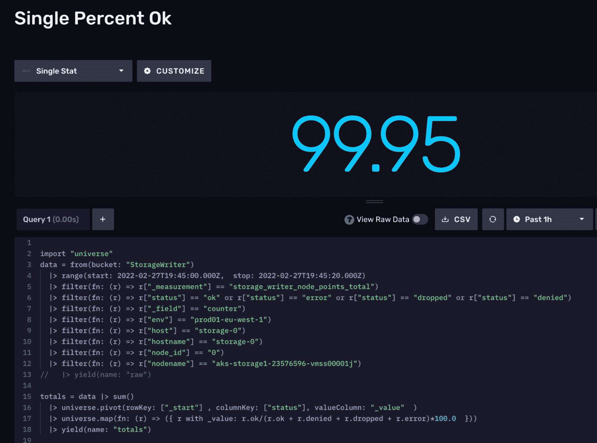
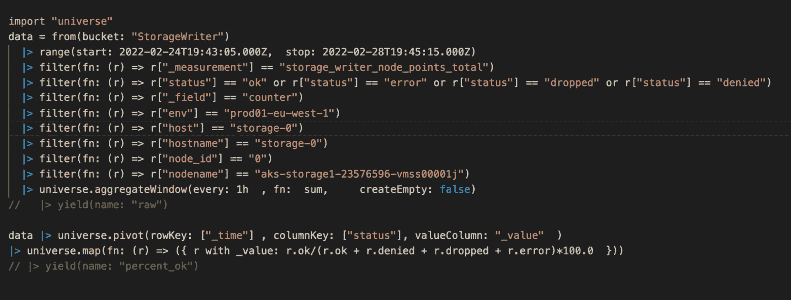

# 使用 InfluxDB 清理和解释时间序列指标

> 原文：<https://thenewstack.io/cleaning-and-interpreting-time-series-metrics-with-influxdb/>

时间序列数据是您想要[分析](https://www.influxdata.com/time-series-analysis-methods/?utm_source=vendor&utm_medium=referral&utm_campaign=2023-02_spnsr-ctn_cleaning-interpreting-metrics_tns)和[监控](https://www.influxdata.com/solutions/application-performance-monitoring-apm/?utm_source=vendor&utm_medium=referral&utm_campaign=2023-02_spnsr-ctn_cleaning-interpreting-metrics_tns)随时间变化的数据。例如，您可能想知道植物一天中的水位，或者它在什么时候接受了多少阳光。这是一个简单但容易理解的例子。显然，在更大的范围内，赌注可能会更高。您可以监控数据中心的服务器基础设施或工厂车间的机器压力。

在这些时候，故障和[实时](https://www.influxdata.com/use-cases/real-time-analytics/?utm_source=vendor&utm_medium=referral&utm_campaign=2023-02_spnsr-ctn_cleaning-interpreting-metrics_tns)反应对于避免紧急情况非常重要。[时间序列数据](https://www.influxdata.com/what-is-time-series-data/?utm_source=vendor&utm_medium=referral&utm_campaign=2023-02_spnsr-ctn_cleaning-interpreting-metrics_tns)通常是指标，通常来自[物联网设备](https://www.influxdata.com/glossary/iot-devices/?utm_source=vendor&utm_medium=referral&utm_campaign=2023-02_spnsr-ctn_cleaning-interpreting-metrics_tns)或服务器基础设施。

指标通常是不断到达的数据，每秒一个值，但有时它可能更随机。原始时间序列指标数据在公开以供更广泛的使用和存储之前，可以受益于清理和规范化。在处理大量时间序列指标时，将其他人可以使用易于理解的标记搜索特定时间范围的数据的方式标准化会很有帮助。有许多类型的时间序列指标，但对于这篇博客文章，我们将重点关注来自我们内部存储引擎的指标，由我们的一位站点可靠性工程师(SREs)提供。

对于本教程，我将使用 [InfluxDB](https://www.influxdata.com/?utm_source=vendor&utm_medium=referral&utm_campaign=2023-02_spnsr-ctn_cleaning-interpreting-metrics_tns) 的时间序列数据平台。InfluxDB 的核心是一个高性能的时间序列数据库，在每秒处理数百万数据时非常有用，但它也附带了数据收集器和脚本语言。这个技术会议的重点是使用 [Flux](https://www.influxdata.com/products/flux/?utm_source=vendor&utm_medium=referral&utm_campaign=2023-02_spnsr-ctn_cleaning-interpreting-metrics_tns) ，一种 InfluxDB 使用的数据处理和查询语言。Flux 拥有 SQL 等查询语言的许多功能，但它还预先构建了分析和数据科学功能。稍后，我们还将使用 Flux 来创建警报和缩减采样任务。在未来，我们还将包括 SQL 集成，这将允许一种新的方式来查询您的数据。

通量已经内置于流入，所以没有必要额外安装。将演示如何通过浏览器和 Visual Studio 利用 Flux 进行数据清理和分析。你可以在这里查看 Visual Studio 扩展[的更多细节。但是您也可以使用命令行或云 UI 来与您的数据进行交互。](https://docs.influxdata.com/influxdb/cloud/tools/flux-vscode/?utm_source=vendor&utm_medium=referral&utm_campaign=2023-02_spnsr-ctn_cleaning-interpreting-metrics_tns)

我们将从一个简单的 Flux 查询开始，以便更熟悉 Flux 是如何编写和工作的。您的存储桶就是您的数据库名称。每个存储桶都可以根据其接受的数据和保留该数据的时间长度进行定制。首先注意 [range()函数](https://docs.influxdata.com/flux/v0.x/stdlib/universe/range/?utm_source=vendor&utm_medium=referral&utm_campaign=2023-02_spnsr-ctn_cleaning-interpreting-metrics_tns)。因为这种语言是针对时间序列的，所以逻辑上我们需要查询某个时间范围内的数据。在本例中，我们的范围是大约 20 秒(从开始和停止时间算起)。您可以选择没有范围，但这将返回您的存储桶中的所有数据。

这是我们测量的数据，称为“节点点数总计”它有一组计数器，每次写入一个指针，计数器就会增加。如果这是一个好点，那么“ok”就会增加；如果它是一个“坏”点，相应的点就会增加。这里我们计算成功写入的总点数。该功能的顶部是向下过滤到我们想要监视的特定节点和主机。我们搜索具有四种状态(正常、拒绝、错误和丢弃)的点。然后，我们旋转数据，并使用 [map()函数](https://docs.influxdata.com/flux/v0.x/stdlib/universe/map/?utm_source=vendor&utm_medium=referral&utm_campaign=2023-02_spnsr-ctn_cleaning-interpreting-metrics_tns)计算符合要求的百分比。`map()`函数生成一个“好的百分比”数字，这将允许您说“所写的 99.98%的点都是好的。”

这是运行查询的结果。如你所见，我们正在可视化结果。

下一个例子将使用一个更大的范围，四天的数据。太多了！我们使用了一个 [aggregateWindow()](https://docs.influxdata.com/flux/v0.x/stdlib/universe/aggregatewindow/?utm_source=vendor&utm_medium=referral&utm_campaign=2023-02_spnsr-ctn_cleaning-interpreting-metrics_tns) ，它将给出我们每小时的值的总和(我们将返回 96 个结果，过去四天的每个小时一个)。这不仅是一个更快的查询，而且如果我们在一个表中查看数据结果，只读取 96 个结果比读取 200 万个结果更容易！

这是绘制的最后一个查询。在这里，我们可以看到在几天的时间里，99.88%的“正常”写入率略有下降。我们的云服务级别协议(SLA)是 99.9%的月可用性。但这是某一天发生小事故的一个例子。总的来说，我们仍然达到了我们的 SLA 目标，但是注意到即使是微小的下降也是好的。这使得我们的 SRE 团队能够在需要时采取行动。

这个跟随通量是我们称之为下采样的简化版本。缩减采样是将原始高精度数据缩减为较低精度集合的过程。我们结合使用 [aggregateWindow()函数](https://docs.influxdata.com/flux/v0.x/stdlib/universe/aggregatewindow/?utm_source=vendor&utm_medium=referral&utm_campaign=2023-02_spnsr-ctn_cleaning-interpreting-metrics_tns)和 [to()函数](https://docs.influxdata.com/flux/v0.x/stdlib/influxdata/influxdb/to/?utm_source=vendor&utm_medium=referral&utm_campaign=2023-02_spnsr-ctn_cleaning-interpreting-metrics_tns)，将下采样数据写入一个新桶。在本例中，我们获取每 10 分钟数据间隔的平均值，并将该数据点存储在一个新的存储桶中。

这有助于解决三个问题:

1.  使得在较小的数据集上运行分析和从历史数据中获得高水平的洞察力变得更加容易。
2.  收集错误的数据。
3.  长期存储较小的数据集，并在保持数据整体形状的同时减小实例的整体大小。

最后，我们将看看数据集上的警报。第一部分是关于筛选我们想要监控的字段。我们特别希望筛选“正常”状态。

我们使用[分位数函数](https://docs.influxdata.com/flux/v0.x/stdlib/experimental/quantile/?utm_source=vendor&utm_medium=referral&utm_campaign=2023-02_spnsr-ctn_cleaning-interpreting-metrics_tns)来确定一个值何时超出第 95 百分位(95p)。我们的分位数压缩中的压缩是在确定 95p 时我们希望数据有多详细。压缩率越大，计算速度越慢。您可以在如何设置分位数函数的文档中找到更多信息。

这段代码检查该值，并将类型和级别设置为“critical”或“info”在此基础上，我们还创建了一个 Slack 消息，如果状态类型为“critical”，该消息将发送一个警报我们这里有一个被调用的 alert 函数，但不需要深入研究它。底线是，您可以使用 Flux 来构建这些警报任务，并在您的数据超出定义的边界或运行正常时接收警报。要了解更多关于使用 Flux 创建警报和通知的信息，请看下面的[文档](https://docs.influxdata.com/influxdb/cloud/monitor-alert/?utm_source=vendor&utm_medium=referral&utm_campaign=2023-02_spnsr-ctn_cleaning-interpreting-metrics_tns)。

这些只是在 InfluxDB 中清理和解释时间序列指标的一些简单功能。我们有大量的 [Flux 文档](https://docs.influxdata.com/flux/v0.x/?utm_source=vendor&utm_medium=referral&utm_campaign=2023-02_spnsr-ctn_cleaning-interpreting-metrics_tns)和例子，你可以根据你的使用案例和需求来参考。我们喜欢看到人们在我们的[开源社区](https://community.influxdata.com/?utm_source=vendor&utm_medium=referral&utm_campaign=2023-02_spnsr-ctn_cleaning-interpreting-metrics_tns)中构建什么，并期待在我们的社区论坛和 Slack 频道中与您联系，看看您构建了哪些令人惊叹的项目！

<svg xmlns:xlink="http://www.w3.org/1999/xlink" viewBox="0 0 68 31" version="1.1"><title>Group</title> <desc>Created with Sketch.</desc></svg>