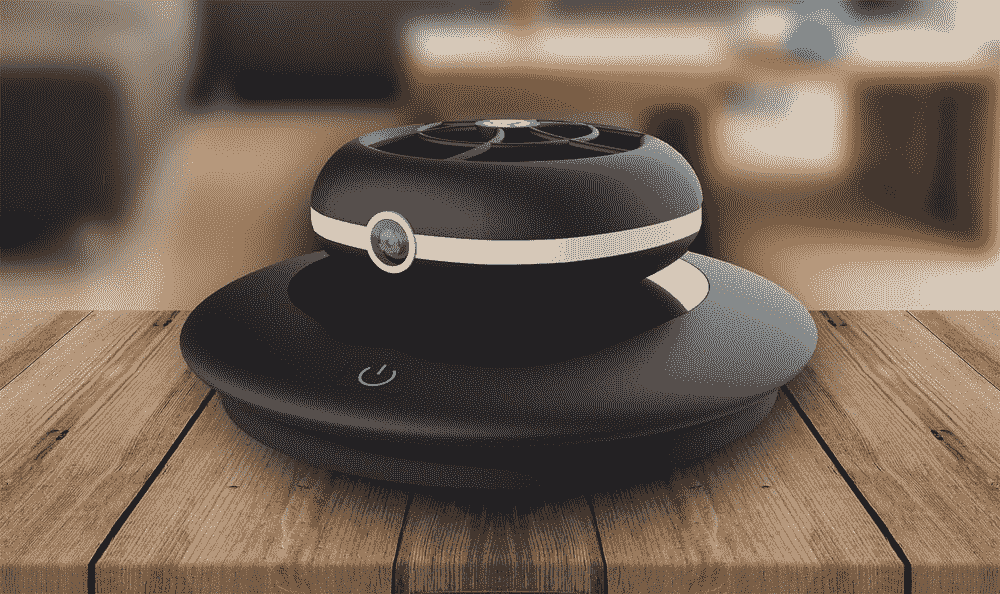

# Cleo 是一款安全的甜甜圈形无人机，可以放在你的口袋里

> 原文：<https://thenewstack.io/cleo-is-a-safety-minded-donut-shaped-drone-that-fits-in-your-pocket/>

我们大多数人可能都熟悉四旋翼无人机，这是市场上最受欢迎的无人机类型，它有四个高速旋转的旋翼，以产生保持这些空中机器飞行所需的升力。人们越来越熟悉的事实是，许多这种多旋翼无人机不太容易飞行，因此当这些高速机器失去控制时，可能会伤害到宠物、儿童甚至毫无防备的婚礼宾客。

围绕多旋翼无人机的这些安全和易用性问题就是为什么加拿大联合创始人和工程师 Omar Eleryan 和 [Cleo Robotics](http://cleorobotics.com/) 的 Simon Czarnota 创造了他们自己的相当聪明的甜甜圈形替代物，将所有快速旋转的组件隐藏在一个圆形外壳中。观看这个迷你甜甜圈的运行:

[https://www.youtube.com/embed/oDR4OZbpiG0?feature=oembed](https://www.youtube.com/embed/oDR4OZbpiG0?feature=oembed)

视频

[https://www.youtube.com/embed/GxZrK8nUfa8?feature=oembed](https://www.youtube.com/embed/GxZrK8nUfa8?feature=oembed)

视频

在去年的消费电子展上首次亮相其涵道无人机设计后，Cleo 的创造者当时对该设备如何驾驶背后的一些更好的技术问题相对沉默(这些显然都是专利信息)。但是在最近的一篇 IEEE Spectrum*的文章中，Eleryan 揭示了这个类似 UFO 的微小机器如何移动的诱人线索:*我们将控制表面引入气流，以改变气流的方向，并产生推力矢量效应**

 **很难从视频或图像中实际看到这些控制表面，但还有其他功能使 Cleo 成为市场上类似产品的一个有吸引力的替代产品。首先，与典型的小型四旋翼无人机相比，它小到足以装进口袋。其次，它由智能手机应用程序控制，无需笨重的控制器和大量的飞行练习。最重要的是，没有暴露的刀片，这意味着操作更安全，甚至可以在室内使用。

除了在这个保护外壳内将两个螺旋桨堆叠在一起之外，还有格栅，如果用户在半空中抓住无人机，它们可以保护用户的手指免受伤害。Cleo 还包括一个可以拍摄高清视频的摄像头和电池，这些都藏在它相对紧凑的包装中，直径为 95 毫米(3.7 英寸)，厚度为 33 毫米(1.3 英寸)，重量为 90 克(3.1 盎司)。Cleo 巧妙的导管设计意味着它比多旋翼飞行器更容易保持稳定性，体积也更小。

根据 Eleryan 的说法，Cleo 的想法是在他和 Czarnota 购买了他们的第一架无人机后产生的。让它飞起来很兴奋，他们带着它去了当地的一个公园，但当他们意识到无人机太大，太吵，很难操纵时，事情变得有点令人毛骨悚然，他们担心无人机可能会伤害公园里的一些孩子。最后，大约十分钟后，无人机停在了一棵树上。

两人对这一初次经历的失望促使他们开发了一种更实用、更易操作、飞行危险性更小的东西。

“Cleo 背后的想法是创造一些非常容易使用，非常实用，非常安全的东西，”Eleryan 说。“我们的目标是创造一种安全实用的无人机，我们可以无缝地融入工作场所和日常生活。这不仅仅是创造一个会飞的东西，也是创造一个真正有用的东西，解决一个真正的问题。”

虽然最初的意图是创造一种可以用作消费级相机无人机的东西，但该公司现在已经将目光放得更高，并计划在明年发布一款用于室内监控和安全目的的版本，而一款更实惠的消费版本将于 2019 年某个时候推出。除了用于监视或拍摄照片和视频，该公司还设想这种紧凑型无人机配备红外摄像机，以便可以部署在搜索和救援任务中。

该团队现在正致力于整合计算机立体视觉(从数字图像中提取三维信息)和 SLAM(同步定位和地图构建)，这使设备能够自主导航和绘制周围环境，所有这些都将与神经网络协同工作。

要了解更多信息，请访问 [Cleo 机器人](http://cleorobotics.com/)。

图片:Cleo 机器人公司

<svg xmlns:xlink="http://www.w3.org/1999/xlink" viewBox="0 0 68 31" version="1.1"><title>Group</title> <desc>Created with Sketch.</desc></svg>**