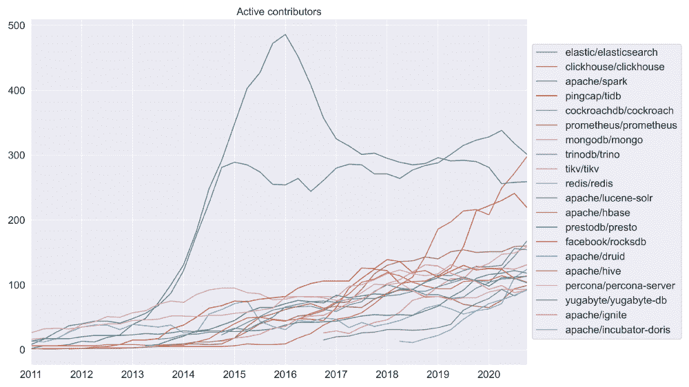

# 在活跃贡献者方面，ClickHouse 已经迅速赶上了其他开源数据库

> 原文：<https://thenewstack.io/clickhouse-rapidly-rivals-other-open-source-databases-in-active-contributors/>

[ClickHouse](https://clickhouse.tech/) 似乎从无到有，与 [Elasticsearch](https://github.com/elastic/elasticsearch) 竞争成为拥有最活跃贡献者的数据库相关开源软件项目。Runa Capital 的[康斯坦丁·维诺格拉多夫](https://www.linkedin.com/in/kvinogradov/)在一篇新的博客文章中继续他正在进行的开源指标工作，这篇文章[分析了](https://medium.com/runacapital/open-source-analysis-and-os-databases-1eb1fe840719) [dbdb.io](http://dbdb.io) 上列出的 735 个数据库中的 358 个数据库的 GitHub 数据。在他的分析中，积极贡献者被定义为在 12 个月内做出承诺的任何人。

ClickHouse 起源于俄罗斯的 [Yandex](https://yandex.com/company/) ，它的商业化正在被[高地](https://altinity.com/)引领。ClickHouse 是面向列的，允许使用 SQL 查询实时生成分析报告。ClickHouse 的人气上升始于 2016 年，恰好是 Apache Spark 的巅峰时期。 [TiDB](https://github.com/pingcap/tidb) 在 2020 年也有超过 200 个活跃贡献者。[cocroach db](https://github.com/cockroachdb/cockroach)、 [Prometheus](https://github.com/prometheus/prometheus) 、 [MongoDB](https://github.com/mongodb/mongo) 和 [TrinoDB](https://github.com/trinodb/trino) 属于第二组竞争者，有 150-170 个活跃贡献者。

怀疑论者会抱怨说，前面提到的一些数据源不再受开源许可证的管理，所以不应该被称为开源。让我们暂时把这个争论放在一边，但是也许最近的一个争论是图表中贡献者减少的部分原因。仔细观察该图可以发现，其他数据库在对其许可证进行类似的更改后，活跃贡献者的数量也有所下降。然而，这些下降是短期的。

有很多开发人员定期提交对项目的变更，这表明人们，可能还有几家公司正在投资一项技术。它不是实际采用的代理，也不意味着开发工作中有深入的社区参与。尽管如此，对数据的评估显示，在新数据管道的关键节点上，有大量开发人员在从事项目工作。

蟑螂实验室和 MongoDB 是新堆栈的赞助商。

通过 Pixabay 的特征图像。

<svg xmlns:xlink="http://www.w3.org/1999/xlink" viewBox="0 0 68 31" version="1.1"><title>Group</title> <desc>Created with Sketch.</desc></svg>