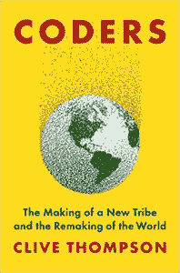

# 《200 名编码员对作家克莱夫·汤普森说了什么

> 原文：<https://thenewstack.io/clive-thompson-on-software-developers-remaking-the-world/>

KubeCon + CloudNativeCon 和 [InfluxData](https://www.influxdata.com/) 赞助了这个播客。

[200 名软件开发人员对“重塑世界”的看法](https://thenewstack.simplecast.com/episodes/what-200-software-developers-had-to-say-about-remaking-the-world)

如果你从事任何级别的软件开发工作，你总是集体努力的一部分，这个集体努力正在对当今社会产生前所未有的影响——不管你是否意识到这一点。有时很容易忘记，在我们生活的许多方面发挥作用的应用和软件的底层基础设施和代码，在某些时候，涉及到世界上某个地方的一个人，他正在经历编写代码的辛劳和痛苦——并享受那些偶尔出现的“啊哈”时刻，这些时刻伴随着创造力的爆发和只是构建东西。

开源运动的势头、由此带来的可负担和可用的平台和工具的激增以及新技术的可用性，包括但不限于原生云、Kubernetes 和微服务平台，当然也发挥了重要作用。

正如作家 [Clive Thompson](https://www.linkedin.com/in/thompsonclive/) 在他的新书“[Coders:The Making a New Tribe and The Remaking The World](https://www.goodreads.com/book/show/40406806-coders)”中解释的那样，软件工程师或程序员正在直接或间接地参与一些对我们今天生活的世界有深远影响的事情。他在最新一集的 [The New Stack Makers](https://thenewstack.io/podcasts/makers) 播客中详细介绍了这本书，该书基于对 200 多名程序员的采访，他还讨论了他的书如何将软件开发置于历史背景中，并解决了当今行业中的一些问题，如性别、种族和性取向偏见，以及对此可以做些什么。

汤普森学到的一件事是，他没有预料到在屏幕前长时间工作会带来普遍的挫败感，甚至是单调乏味的工作。汤普森说:“每个擅长编码的人在令人难以置信的沮丧程度下也很惊人。”"因为编码本身既疯狂又令人沮丧."

汤普森说，事实上，编码与其说是关于编写和开发，不如说是“修复坏掉的东西，包括你刚刚创建的从未工作过或已经坏掉的东西”。

汤普森说:“我实际上把我书中的一章叫做‘持续的失败和喜悦的爆发’，因为那真实地描述了一个程序员的实际流程。”。“我真的很欣赏程序员的顽强和执着。真的很有意思。”

虽然 Kubernetes 和微服务才刚刚开始被采用，但应用于软件开发的人工智能(AI)和机器学习则是更遥远的概念。然而，汤普森表示，将人工智能以及机器学习和神经网络的兴起描述为重要的“编码范式转变”还为时过早。汤普森在书中表示，他试图“揭开并展示一点构建这些现代机器学习系统的过程，以及什么样的人会进入这个领域——因为它将变得更加重要。”

“我们将看到人工智能融入一切，”汤普森说。

然而，矛盾的是，一个应该继续对我们现在和未来的生活产生如此深远影响的行业，在雇用和接受女性以及工作场所中代表性不足的群体方面却出现了倒退。

因为当你想到所有这些在某种程度上使该行业远离(精英管理)和招聘中的纯粹优点的事情时，你必须一点一点地对抗这些(负面)影响。

例如，在软件开发领域性别失衡的情况下，有必要“解决并认真对待许多女性经常得到的这种令人讨厌和敌意的反应，例如，当她们进入这些男性主导的环境时，”汤普森说。“你知道，就像他们说的那样，当‘没有银弹的时候，只有很多铅弹。’"

但是，在实现在雇用女性和代表性不足的群体方面达到可接受的精英标准所需的修正之前，今天的软件开发仍然是一个非常有益和具有挑战性的领域。原因如上所述，包括有机会参与这一具有深远社会影响的持续堆栈开发浪潮。但是，在一天结束的时候，抽签很大程度上仅仅是把事情搞清楚，并让它们与伟大的代码一起工作。

“解决问题真的很有趣，折磨着他们，一旦他们进入那个流动区，他们真的想呆在那里……汤普森说:“你正处于一项将你的能力推向极限的活动中，这很难做到，但做到这一点是非常值得的。”。“我认为另一个原因是，当你在把头撞向墙壁的那段时间之后，终于得到了一些东西，当这个虚拟机，这种生命形式摇摇晃晃地站起来，开始做你让它做的事情时，你会有成就感。那是一种难以置信的深度刺激。”

### 在这个版本中:

[2:03:](https://thenewstack.simplecast.com/episodes/what-200-software-developers-had-to-say-about-remaking-the-world?t=2:03) 我只是想知道你有没有遇到什么他们可能不知道的特殊情况？
[8:34:](https://thenewstack.simplecast.com/episodes/what-200-software-developers-had-to-say-about-remaking-the-world?t=8:34) 当今这个领域的人们正在改变世界，但实际情况是“苦差事”
[12:21:](https://thenewstack.simplecast.com/episodes/what-200-software-developers-had-to-say-about-remaking-the-world?t=12:21) 以编写类似蓝领文化的代码为荣
[19:16:](https://thenewstack.simplecast.com/episodes/what-200-software-developers-had-to-say-about-remaking-the-world?t=19:16) 你会如何用一种对现在的开发人员来说可能并不明显的方式来描述这种矛盾？

<svg xmlns:xlink="http://www.w3.org/1999/xlink" viewBox="0 0 68 31" version="1.1"><title>Group</title> <desc>Created with Sketch.</desc></svg>