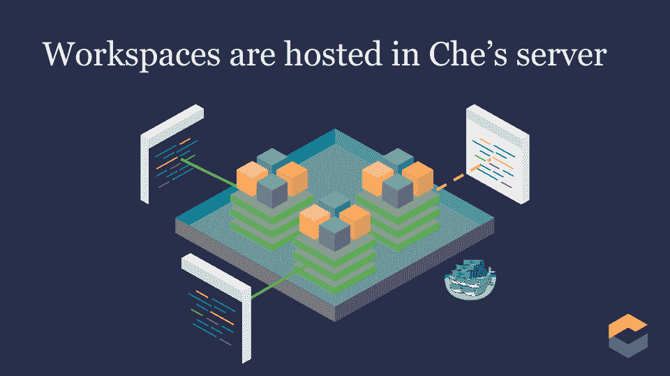
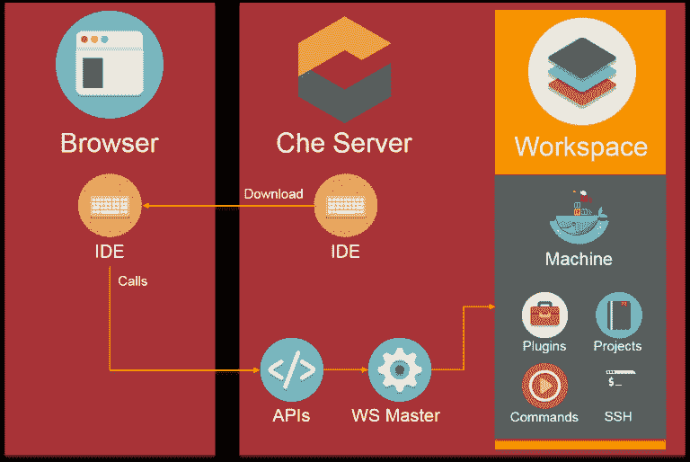
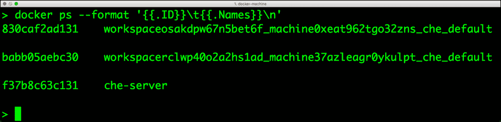
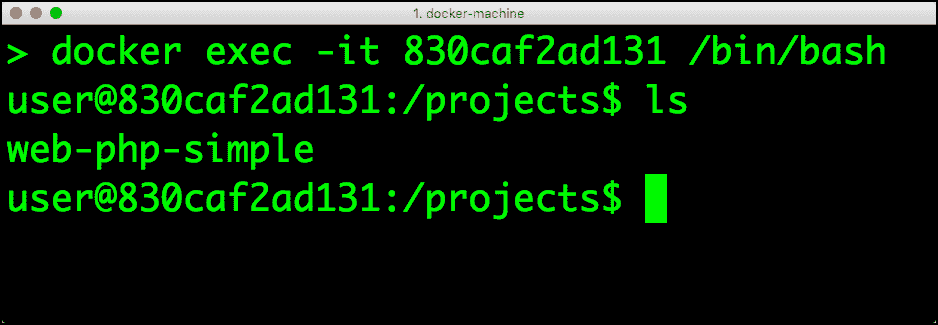
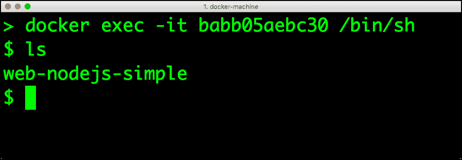

# 近距离观察日蚀车

> 原文：<https://thenewstack.io/close-look-eclipse-che/>

在微服务和云原生应用的时代，软件开发生命周期(SDLC)正在经历一场重大变革。容器与持续集成和部署(CI/CD)的结合使得软件的快速部署变得前所未有。尽管语言、运行时、框架、部署目标都发生了巨大的变化，但是工具并没有发生太大的变化。开发人员仍然依赖于传统的集成开发环境(ide ),如 Visual Studio、Eclipse 和 IntelliJ。虽然它们可能很强大，但它们绝对不是为了利用新兴技术而设计的。

进入 [Eclipse Che](http://eclipse.org/che) ，一个集成开发环境，它将变得像你的代码和应用程序一样可移植。想象一下携带与代码、必需的依赖项和运行时捆绑在一起的 IDE 的力量。这是构建 Eclipse Che 的前提。它符合社会编码和轻量级容器等新兴趋势。Eclipse Che 重新定义了 ide 的设计和构建方式。

Eclipse Che 是运行在 Apache Tomcat 服务器上的 Java 应用程序。浏览器内置集成开发环境是使用谷歌网络工具包(GWT)构建的。Che 的强大之处在于它的软件开发包(SDK)，它具有高度的可扩展性，可以开发新的插件。添加新的语言、框架和运行时就像创建新的插件一样简单。

为了理解 Eclipse Che，我们需要理解它的架构和术语。

通常，ide 与源代码管理系统、构建管道和部署阶段是分离的。当在多语言环境中工作时，这种差距变得非常明显。Eclipse Che 通过将 IDE、项目工件和运行时集成到一个统一的逻辑沙箱(称为工作空间)中来解决这个问题。从技术上讲，它基于三层架构，其中编辑器是前端，管理项目工作流的 API 层充当中间层，负责托管应用程序的运行时充当后端。

> Eclipse Che 工作区最大的优点是它们可以被持久化、版本化、快照化和移植到其他环境中。

开发人员可以将工作区连接到 Github 或 BitBucket 上托管的远程源代码 repo。运行时被打包成 Docker 容器，运行特定的环境，如 Node.js、Python、Java 或 Ruby。由于 Che 支持 SSHing 到容器中安装额外的组件，所以称它为机器。还可以配置多台运行不同运行时的机器，在不同的环境中并行测试代码。

让我们总结一下:Eclipse Che 运行在一个服务器中，该服务器托管一个包含多个项目的工作区，这些项目连接到可以在多台机器上编译和测试的远程存储库。

每台 Che 服务器都可以托管多个工作区，这些工作区被分配给不同的团队和开发人员，他们通过 web 浏览器访问这些工作区。工作区还可以在开发人员之间共享，以便进行并发访问。Che 目前基于最后写入获胜策略来处理同时文件访问。但它将让谷歌文档像并发处理同步编辑。

Eclipse Che 工作区最大的优点是它们可以被持久化、版本化、快照化和移植到其他环境中。开发人员可以在本地的[流浪者](https://thenewstack.io/vagrant-developers-researchers/)环境中开始工作，并随时将整个工作空间转移到 Amazon EC2。

尝试 Eclipse Che 的最佳方式是设置一个本地的游民箱或 Docker 容器。当我在 docker-machine 创建的 Docker 主机上运行它时，我发现每个工作空间都在运行 Che 服务器的同一台主机上的专用容器中启动。每次开发人员创建一个新的工作空间，Che 都会构建新的映像并启动一个容器。

下面的截图显示我正在运行两个工作区——node . js 和 PHP。

在主机上运行 docker ps 命令显示我们正在运行三个容器:Che 服务器、Node.js 工作区和 PHP 工作区。

Eclipse Che 容器

ID 为 *830caf2ad131* 的第一个容器托管 PHP workspace，而第二个容器负责 Node.js 项目。Che 服务器是引导工作区的容器。

Node.js 的 Eclipse Che 工作区

所有支持的运行时的 Dockerfile 定义都可以在 [GitHub](https://github.com/codenvy/dockerfiles) 上找到。按照典型的 Docker 工作流，可以停止、提交容器，并将其作为映像放入注册表，然后可以在其他环境中启动。

作为一个容器化的应用程序，Eclipse Che 可以通过在 Docker Swarm 或 Kubernetes 上运行额外的实例来轻松扩展。在持久存储的支持下，在容器编排引擎上运行的 Che 可以成为整个组织的可靠开发环境。看看 Che 是否可以部署在像 Google Container Engine 或 Amazon EC2 Container Service 这样的 CaaS 平台上会很有趣。

还可以在开发人员工作站上安装远程 Che 工作区。基于超快的基于 [Fuse](https://github.com/libfuse/libfuse) 的挂载和同步机制，开发者可以在任何支持 Docker 的操作系统上执行挂载。这个特性将 Che 模拟为一个桌面 IDE。

Eclipse Che 可以部署在三种模式下:本地、私有云和 SaaS。本地安装包括裸机、虚拟机和容器。它也可以运行在公共云环境中，如 Amazon EC2、Azure VMs 和 Google Compute Engine。Bitnami 是一个受欢迎的开源软件市场，它为 Che 提供了一个[一键式安装程序](https://bitnami.com/stack/eclipse-che)。Che 的商业 SaaS 版以 [Codenvy](https://codenvy.com/) 的形式提供。

除了提供商业版，Codenvy 还是 Eclipse Che 的主要贡献者之一。IBM、Red Hat、Samsung、SAP 和微软是该项目的其他贡献者。在最近的红帽峰会上，红帽展示了 Che 与 OpenShift PaaS 的集成。SAP 选择 Che 作为其 HANA 平台。Che 与三星的嵌入式物联网平台 ARTIK 捆绑在一起。

随着开发人员开始接受微服务和无服务器计算，轻量级、基于云的 ide 成为关键。平台供应商和云提供商将开始公开带有预配置工具和运行时的定制开发环境。Eclipse Che 有可能成为各种 PaaS 和云原生平台的嵌入式 IDE。物联网的兴起也将推动 Che 的采用。开发单芯片系统计算机的原始设备制造商也将开始捆绑 Che。

展望未来，基于云的 IDE 市场将由 Che、Cloud9 和 Visual Studio 主导。随着最近对 Cloud9 的收购，亚马逊正准备将其所有服务与 IDE 集成。微软有为开发者提供尖端工具的历史。Visual Studio 找到通往云计算的道路只是时间问题。其他公共云供应商将采用 Che 来交付定制的工具体验。

开发人员工具市场的颠覆时机已经成熟，Eclipse Che 将从前端和中心引领这一趋势。

<svg xmlns:xlink="http://www.w3.org/1999/xlink" viewBox="0 0 68 31" version="1.1"><title>Group</title> <desc>Created with Sketch.</desc></svg>