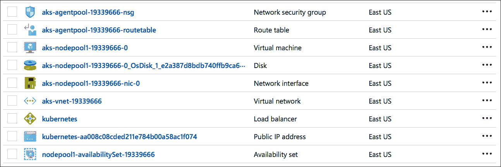

# 进一步了解微软 Azure 的托管 Kubernetes 服务

> 原文：<https://thenewstack.io/closer-look-aks-managed-kubernetes-azure-container-service/>

微软的最初版本 Azure Container Service(T1)及其容器即服务(CaaS)提供了多种编排引擎选择，包括 T2 的 meso sphere DC/操作系统(T3)、Docker Swarm 和 T4 的 Kubernetes(T5)。但是它们都没有得到真正的管理，这意味着客户必须维护环境，包括修补、升级、扩展和管理群集。在许多方面，微软只是自动化了容器编排工具的初始设置和配置，而没有真正管理后期部署阶段。

在宣布 ACS 的初始版本几年后，[微软](https://azure.microsoft.com/en-us/?v=17.14)已经加入了云提供商的行列，提供托管的 Kubernetes 服务。谷歌是第一个发布谷歌 Kubernetes 引擎的公司[(GKE)，随后是 IBM 的云容器服务](https://cloud.google.com/kubernetes-engine)[(T11)。微软成为第三家提供托管 Kubernetes 即服务的主要云提供商。它还将 Azure Container Service 更名为 AKS，以突出 Kubernetes 的包容性。](https://www.ibm.com/cloud/container-service)

除了品牌之外，自最初版本的 ACS 以来，Azure CaaS 产品的核心架构发生了变化。在早期版本中，客户可以看到 Kubernetes 主服务器和节点。他们必须提到群集中包含的主服务器的数量。部署完成后，管理员可以通过 SSH 进入其中一个主节点来控制部署。有了 Azure 上的托管 Kubernetes，微软不再公开主服务器。由于 Azure 管理多租户主服务器，它们对客户部署完全不可见。客户最终在订阅中看到的只是运行其容器化工作负载的一组节点。

Kubernetes 中的节点不像主服务器那样重要。他们大多是无状态和动态的。主服务器与 etcd 服务器耦合，以暴露 Kubernetes 的控制平面。主服务器负责公开 API、做出调度决策、监控集群的健康状况、维护所需的配置状态以及许多其他关键任务。通过将主服务器的管理委托给微软，客户将能够专注于工作负载，而不是维护 Kubernetes 集群基础设施。

## 部署集群

在我们探索这个架构之前，让我们在 AKS 中提供一个单节点管理的 Kubernetes 集群。运行以下命令将会创建一个集群。假设您拥有有效的 Microsoft Azure 订阅。

```
$  az provider register  -n  Microsoft.ContainerService

$  az group create  --name myResourceGroup  --location eastus

$  az aks create  --resource-group myResourceGroup  --name myK8sCluster  --node-count  1  --generate-ssh-keys

```

几分钟后，使用以下命令检查集群可用性

现在，我们可以下载 [kubectl](https://kubernetes.io/docs/reference/kubectl/overview/) 客户端来访问集群。

```
$  az aks install-cli

$  az aks get-credentials  --resource-group myResourceGroup  --name myK8sCluster

$  kubectl version

$  kubectl cluster-info

```


上面的屏幕截图确认了集群已经启动并正在运行。

## AKS 集群的幕后

微软已经做了很多事情来确保 CaaS 产品与 Azure 紧密集成。首先，它扩展了**微软。微软的 ContainerService** Azure 资源管理器(ARM)提供者。container service/managed clusters 支持托管的 Kubernetes，将传统的 ACS 引擎与 AKS 区分开来。这个新的 ARM 提供者公开了配置 Kubernetes 版本、许多工作节点和集群管理配置文件的属性。在新的部署模型中，客户不能定义主节点的数量。这个决定是由 AKS 控制平面在幕后做出的。


上面的截图显示了 AKS 创建的唯一资源。这反映了微软的例子。container service/managed clustersARM 提供程序。

etcd 集群作为整个基础设施的唯一真实来源，由 SSD 以及自动备份和高可用性配置提供支持。安全 TLS 配置由 Azure KeyVault 提供支持。Azure Active Directory 提供了对 RBAC 的支持。

除了拥有被管理的集群资源的资源组之外，AKS 还创建另一个资源组来提供属于集群的相关资产。



这一切都始于 Azure Compute 创建一个新的可用性集，确保一起启动的同构虚拟机可以作为一个单元进行有效管理。这个可用性集位于虚拟网络(VNet)中，虚拟网络充当节点的网络边界。虚拟网络有一个路由表，虚拟网卡，网络安全组(NSG)与之相关联。NSG 规则通过细粒度的入口和出口规则定义了虚拟网络的安全策略。


因为我们启动了一个只有一个节点的集群，所以我们看到池中只有一个虚拟机。它配有一个 30GB 大小的标准硬盘。AKS 集群中的每个节点运行 Ubuntu 16.04 LTS。

一旦部署了集群，客户就可以像对待其他 Kubernetes 部署一样对待它。CLI 已更新，可启用 AKS 管理。

当 Kubernetes 服务类型被定义为负载平衡器时，AKS 与 Azure 网络堆栈协商创建第 4 层负载平衡器。一个公共 IP 地址被分配给负载平衡器，通过它服务被公开。

一个简单的 **kubectl get svc** 命令显示该服务属于负载平衡器类型。


AKS 创建的第 4 层负载平衡器的公共 IP 地址也证实了这一点。


使用 LoadBalancer 类型创建附加服务会导致单独的公共 IP 地址指向同一个 Azure 负载平衡器。在其他云平台中，每个新的 Kubernetes 服务都通过专用的第 4 层负载平衡器公开。将多个公共 IP 地址指向同一个负载平衡器的模式对客户来说更加高效和经济。


上面的截图解释了 Azure 如何管理 Kubernetes 服务和负载平衡器 IP 之间的映射。

除了与其他 Azure 构建模块的紧密集成，AKS 还可以轻松地将持久性引入 Kubernetes 工作负载。客户可以创建一个 Azure 文件共享，并将其作为一个卷安装在 pod 中。这种机制通过将持久层转移到外部托管服务来增加有状态 pod 的持久性。

客户可以通过配置 [Azure Log Analytics](https://azure.microsoft.com/en-us/services/log-analytics/) 服务来集成容器监控。Operations Management Suite 代理作为守护集部署在集群中。在每个节点上安排 OMS 代理 pod 将日志发送到分析服务。配置完成后，这种集成提供了对 Kubernetes 集群和容器化工作负载的正确见解。


微软有望在增加对 Windows 容器的支持后使 AKS 普遍可用。在创建群集期间，客户将能够在 Linux 节点和 Windows 节点之间进行选择。最终，AKS 可能支持可以运行 Linux 和 Windows 的异构 Kubernetes 集群配置。这种模式将使客户能够混合搭配部署 Linux 和 Windows 容器作为单个工作负载。这一功能可能成为微软 Azure 的一个关键差异化因素。

虽然在公开预览中，AKS 是一个运行容器化工作负载的优雅平台。微软的 Azure 计算团队已经确保了与其他服务的正确集成。

<svg xmlns:xlink="http://www.w3.org/1999/xlink" viewBox="0 0 68 31" version="1.1"><title>Group</title> <desc>Created with Sketch.</desc></svg>