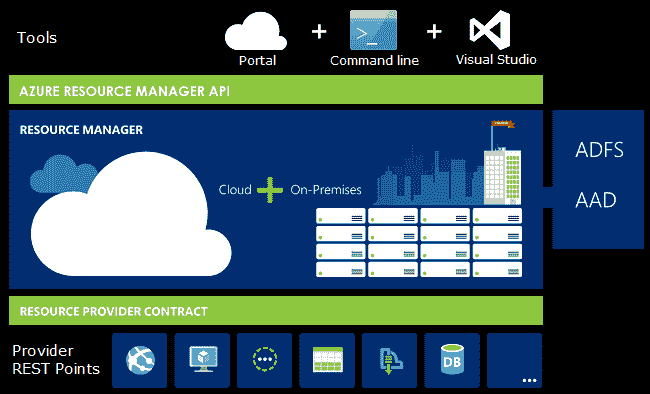
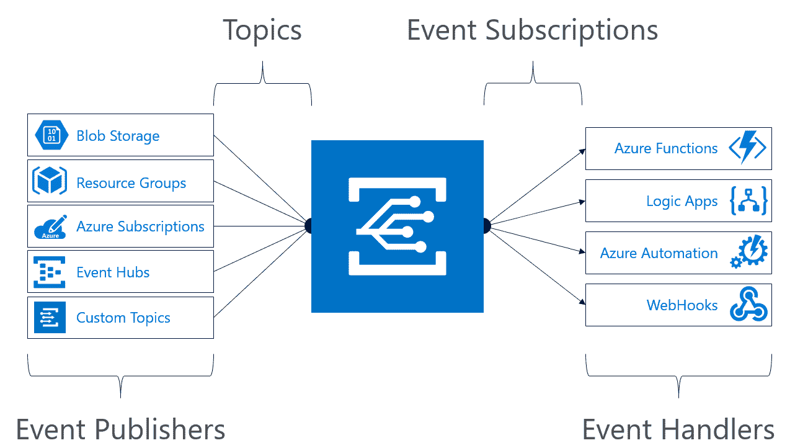

# 仔细看看微软的 Azure 事件网格

> 原文：<https://thenewstack.io/closer-look-azure-event-grid/>

在 8 月的最后一周，微软[发布了](https://thenewstack.io/event-grid-microsoft-provides-missing-half-serverless-computing-azure/)Azure Event Grid 的预览版，这项服务有可能成为[微软云基础设施](https://azure.microsoft.com/en-us/?v=17.14)的消息基础。

Azure Event Grid 以多种形式帮助微软及其客户。首先，Azure 没有亚马逊简单通知服务的直接竞争对手。第二，现有的服务如 [Azure Queue](https://docs.microsoft.com/en-us/azure/storage/queues/storage-dotnet-how-to-use-queues) 和 [Service Bus](https://azure.microsoft.com/en-us/services/service-bus/) 是为不同的用例设计的。它们早于无服务器计算的出现。微软利用这个机会发布了比 SNS 更好的东西，以及为当代[微服务](/category/microservices/)和[无服务器](/category/serverless/)应用设计的消息服务。

云越来越成为事件驱动的。当平均 CPU 利用率超过 60%时，将触发自动扩展事件，向扩展集添加新的虚拟机。当运行状况检查连续五次失败时，负载平衡器将引发一个事件，然后停止向虚拟机发送流量。当在 Microsoft Cosmos DB 中操作文档时，会触发一个 change feed 事件。这些示例事件仅代表云中发生的事件的一小部分。几乎每个通过门户、API 和 CLI 发起的操作都会触发一个事件。如果开发人员接触到这些事件和元数据，他们就可以获得对资源生命周期的细粒度控制。

Azure Event Grid 旨在解决这种情况，使开发人员能够访问云基础设施生成的事件。

除了云生成的事件，Azure Event Grid 还可以用于定制事件。它可以充当连接自定义事件源和目标的管道。例如，开发人员可以使用 Azure Event Grid 触发一个自定义事件来通知购物车已在电子商务门户中签出。独立的目标可以使用该事件来处理该事件。

使用 Azure Event Grid 作为通用事件和消息基础设施的能力为 Azure 开发人员开辟了一条新的途径，使他们能够开发基于容器和微服务的当代应用程序。在完全依赖于事件驱动执行的无服务器计算环境中，这是非常有价值的。

## 近距离观察

从表面上看，Azure Event Grid 很像亚马逊 SNS。但是事件消费者接收消息的方式不同。Azure Event Grid 和 SNS 都支持与一个主题相关联的多个消费者。但是不同于 SNS 本质上把消息转储给每个订阅者，Azure Event Grid 消费者可以订阅过滤后的主题。这种机制确保只有符合特定标准的事件才会被发送到目标。

Azure Event Grid 屹立在由 Azure Resource Groups 奠定的坚实基础之上。几年前，Microsoft Azure 从传统的供应模式转变为资源提供商模式。每个 Azure 服务都被公开为资源提供者，负责处理供应和调度工作流。例如，虚拟机由一家名为**微软的资源提供商处理。计算/虚拟机器**，而存储由 Microsoft.Storage/storageAccounts**处理**。每个资源提供者都是一个自治服务，负责执行特定于所请求资源的相关操作。

这些资源的生命周期、它们的关联和依赖关系是由 Azure Resource Manager 编排的。一个声明整个堆栈的 JSON 文件被提交给 [Azure 资源管理器](https://docs.microsoft.com/en-us/azure/azure-resource-manager/)，它将整个部署视为一个原子单元，同时提供声明的工作负载。

Azure 事件网格是由 Azure 资源管理器支持的一级公民。它可以和其他提供者一起包含在 JSON 模板中。但是 Azure Event Grid 和 Azure Resource Manager 更有趣的是 Azure Event Grid 成为 Azure Resource Manager 传递资源提供者提出的事件的渠道的方式。

核心事件基础设施已经内置到 Azure 资源管理器中，现在通过 Azure Event Grid 优雅地公开。这实际上意味着，每个资源提供者都成为发布者，在资源的生命周期中触发各种事件。

比如**微软。Compute/virtualMachines** 可以在每次创建、停止、运行和终止虚拟机时发布事件。开发人员可以订阅这些主题，以便在每次发布与 VM 生命周期相关的事件时获得通知。如前所述，他们可以决定过滤主题，只接收重要的事件。例如，可以只订阅 VM 终止事件，而不是资源提供者发布的所有事件。

【T2

在预览期间，Azure Event Grid 与一些关键的微软服务相集成，如 [Azure Service Fabric](https://docs.microsoft.com/en-us/azure/service-fabric/service-fabric-cluster-nodetypes) 、 [Azure Blob Storage](https://azure.microsoft.com/en-us/services/storage/blobs/?&WT.srch=1&WT.mc_id=AID559320_SEM_S1CStrpA) 、资源组和 [Event Hubs](https://azure.microsoft.com/en-us/services/event-hubs/) 。Azure Event Grid 的真正强大之处在于它能够支持几乎所有的资源提供者，包括由 Azure Stack 支持的公共云和私有云中的资源提供者。

Azure Event Grid 的一个主要用例是在 [Azure 容器服务](https://azure.microsoft.com/en-us/services/container-service/) (ACS)和 [Azure 容器实例](https://azure.microsoft.com/en-us/services/container-instances/) (ACI)中运行的容器的服务内通信。作为容器部署的每个微服务都可以发布到由多个其他容器使用的主题。这代表了消息传递的扇出模式。类似地，多个容器可以发布到由一个容器消费的同一个主题，以便进一步处理。这就是所谓的扇入模式，在这种模式下，多个消息聚集在一个端点。

[Azure Functions](https://azure.microsoft.com/en-us/services/functions/) 和 [Azure Automation](https://azure.microsoft.com/en-us/services/automation/) 是理想的订户。事件可以触发 Azure 自动化环境中定义的 runbook。对于调用第三方 web 服务等自定义任务，开发人员可以编写和编码在 Azure 函数中运行的代码片段。

对于需要额外配置的操作，在 Azure 函数中运行可能不太理想，我们可以调用 Azure 容器实例。该实例可以访问代码和配置，以执行复杂的工作流。一旦执行完成，Azure 容器实例实例将自动关闭。这个场景利用了 Azure 容器实例中托管的短期流程和按执行付费的计费模型。

微软已经先行一步，将 Azure Event Grid 与 Azure Logic Apps 整合在一起，这是一个创建无服务器应用程序的设计环境。这种集成使得无需编写任何代码就可以执行操作。

Azure 事件网格最强大的消费者是一个定制的 [WebHook](https://webhooks.pbworks.com/w/page/13385124/FrontPage) 。事件可以将有效负载发送到 WebHook 进行自定义处理。这种集成使开发人员能够创建超越基本事件处理的复杂工作流。

在即将发表的一篇文章中，我将向您介绍创建基于 WebHook 基础设施的定制 HTTP 侦听器的步骤。监听器将在您的机器上运行，以创建上传到 Azure 存储的每个 blob 的备份。本教程将让我们有机会剖析 Azure 事件网格架构，并学习事件处理程序的准系统实现。

因为 Blob Storage 并没有作为发行商公开发布，所以请[为预览版注册](https://docs.microsoft.com/en-us/azure/storage/blobs/storage-blob-event-overview)。

请继续关注我计划在本系列中介绍的 Azure Event Grid 教程。

<svg xmlns:xlink="http://www.w3.org/1999/xlink" viewBox="0 0 68 31" version="1.1"><title>Group</title> <desc>Created with Sketch.</desc></svg>