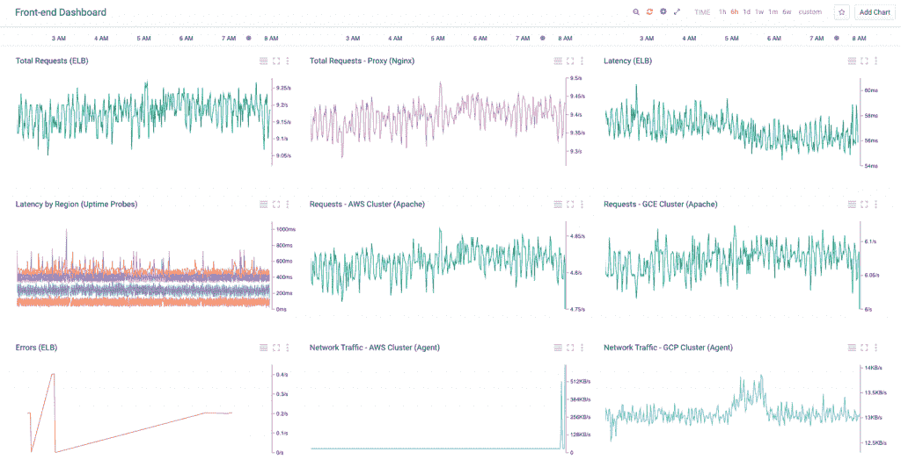

# 深入了解 Google Stackdriver

> 原文：<https://thenewstack.io/closer-look-google-stackdriver/>

上个月在 GCP Next 大会上，谷歌宣布了 Stackdriver 云监控和日志服务的公测版。它被设计成一个跨越亚马逊网络服务和谷歌云平台的混合监控服务。

[Stackdriver](http://www.stackdriver.com/) 由 VMware 前员工丹·贝尔彻和伊西·阿泽里于 2013 年在波士顿创立。它是作为 AWS 和 Rackspace 的统一监控引擎而创建的。在很短的时间内，Stackdriver 设法从企业市场和托管服务提供商那里获得了客户。这项服务有一个光滑的用户界面，以其与各种工作负载的集成而闻名。

在 2012 年推出 Compute Engine 后，谷歌迅速增加了运营团队所需的新基础设施服务。为了给其云平台增加监控功能，谷歌[于 2014 年 5 月收购了](https://cloudplatform.googleblog.com/2014/05/welcome-stackdriver-to-google-cloud-platform.html) Stackdriver。一年后，它作为针对计算引擎、应用引擎、云发布/订阅和云 SQL 的谷歌云监控服务的预览版浮出水面。不出所料，谷歌顺手放弃了对 AWS 的支持。像大多数 GCP 服务一样，云监控有自己的一套 API。

谷歌没有宣布这项服务的全面上市，而是在 GCP Next 发布了 Stackdriver，这让所有人都大吃一惊。这项服务不仅获得了它原来的名字，还获得了对 AWS 的支持。随着企业采用多云策略，Google 意识到需要为其监控服务提供跨云支持。谷歌的产品营销团队希望强调跨云能力。他们决定保留原来的名字 Stackdriver，而不是 Google Cloud Monitoring，这与 GCP 的品牌密切相关。虽然对 Rackspace cloud 的支持已经取消，但 GCP 的演讲者接下来提到，监控部署在其他云中的基础设施是可能的。

Stackdriver 可以监控混合环境

在过去的两年中，谷歌在其云平台中增加了多种与 DevOps 相关的功能。云日志记录、云跟踪、云调试等服务与 App Engine 集成在一起，使开发人员和 [DevOps 团队](https://thenewstack.io/tns-research-devops-factions-software-development-world/)能够对部署进行分析和故障排除。随着 Stackdriver 的发布，Google 整合了监控、日志、跟踪和调试服务。Google Stackdriver 现在已经成为 Google 云平台上所有 DevOps 服务的一站式商店。

让我们仔细看看 Stackdriver 的特性。

## 监视

堆栈驱动程序监控是该服务的关键功能之一。客户可以创建控制面板来跟踪与虚拟机及其部署的服务相关的各种指标。它还支持通过电子邮件、SMS、PagerDuty 和 HipChat 发送警报。该服务还可以跟踪来自其他 GCP 服务(如发布/订阅和云 SQL)的指标。

尽管 Stackdriver 支持默认指标，如 CPU 利用率、磁盘 I/O、内存利用率、网络流量和正常运行时间，但它需要在每个虚拟机中安装一个代理来监控特定于工作负载的指标。部署在 GCP 或 AWS 上的任何具有出站互联网访问权限的虚拟机都可以通过代理报告指标。还有额外的插件用于监控常见的开源服务器，比如 MongoDB、Apache、Nginx、Elasticsearch 等等。

Stackdriver 提供谷歌云和 AWS 的统计数据。

该服务还支持与仪表板和警报集成的自定义指标。应用程序可以通过 Stackdriver API 轻松发送自定义指标。

Stackdriver 监控基于 [collectd](https://collectd.org/) ，一个收集系统性能指标的开源软件。

虽然不如 Amazon CloudWatch 成熟，但 Stackdriver Monitoring 提供了监控虚拟机、GCP 资源所需的核心功能。

它对自定义指标的支持使客户能够配置高级场景。

## 记录

Stackdriver 日志记录旨在收集和存储部署在 Google 云平台和 Amazon Web Services 中的工作负载的日志。该服务可以从计算引擎、应用引擎、EC2 和谷歌云审计日志中收集日志。

基于 [Fluentd](http://www.fluentd.org/) ，Stackdriver 日志依赖于安装在每个虚拟机中的 [google-fluentd 日志代理](https://cloud.google.com/logging/docs/agent/)。可以在 Stackdriver 日志查看器中查看从多个源传输的日志。应用程序也可以使用日志 API 以编程方式发送日志。

Stackdriver 日志记录的强大功能之一是将日志导出到外部服务，如 Google 云存储桶、Google BigQuery 数据集、Google Cloud 发布/订阅主题或这三种服务的任意组合。这通过移动到廉价的 Google 云存储桶来实现日志的长期保留。可以搜索和分析导出到 BigQuery 的日志。Cloud Pub/Sub 可用于将日志导出到第三方服务或 REST 端点。

为了便于集成，Google 提供了多种语言的 SDK，包括 Go、Java、JavaScript、.NET、PHP、Python 等。

## 错误报告

Stackdriver 错误报告是一种在一个中心位置聚集、存储和显示错误的服务。它可以显示时间图表、事件、受影响的用户数、第一次和最后一次看到的日期，以及清除的异常堆栈跟踪。该服务支持部署在应用引擎和计算引擎中的应用。

堆栈驱动程序错误报告。

像 Stackdriver 的其他服务一样，错误报告也依赖于 [google-fluentd 日志代理](https://cloud.google.com/logging/docs/agent/)。该服务支持 Java、Python、JavaScript、PHP 和 Go。安装代理后，需要安装特定语言的插件和模块。

客户可以将服务配置为在出现新错误时发送电子邮件。错误也可以通过 REST API 来检索。

## 排除故障

Stackdriver Debugger 以前被称为 Cloud Debugger，它允许开发人员检查部署在 App Engine 或 Compute Engine 中的 Java、Python 或 Go 应用程序的代码状态。谷歌声称这项服务不会干扰应用程序的性能。无需显式添加日志记录语句就可以查看应用程序的状态。

这项服务有一个附带条件——它只适用于那些源代码存储在[谷歌云资源仓库](https://cloud.google.com/source-repositories/docs/)、Github 或 Bitbucket 中的应用程序。开发人员需要配置一个连接到云存储库的本地 git repo。

将应用程序与 Stackdriver 集成的开发人员需要安装支持语言的代理。它可以捕获和检查应用程序中的调用堆栈和局部变量。

源代码中特定位置的局部变量和调用堆栈可以作为快照捕获，这适用于应用程序的所有运行实例。这些快照可以通过 URL 与其他团队成员共享。

## 描摹

Stackdriver 的最后一个特性是针对部署在 App Engine 中的应用的分布式跟踪系统。它从应用程序收集延迟数据，并近乎实时地显示在控制台中。该服务可用于调查影响应用程序性能的延迟。它可以跟踪对应用引擎 URIs 的请求的延迟数据，以及对数据存储、URL 获取和 Memcache 等应用引擎服务的往返 RPC 调用的附加数据。

随着微服务架构成为主流，该服务可用于执行延迟相关问题的根本原因分析。

可以启用在 App Engine 上运行的现有应用程序进行跟踪。在服务收集到足够的数据后，可以创建一个定制的分析报告。该报告显示了应用程序发出的每个请求的总延迟。
Stackdriver 是谷歌对亚马逊 CloudWatch 和 CloudTrail 的回答。该服务有潜力成为谷歌云平台中部署的应用和工作负载的核心 DevOps 平台。

在 GCP 没有投资的 AWS 客户可能不喜欢这项服务。但是对于多云和混合部署，Google Stackdriver 是一个可行的监控选项。

<svg xmlns:xlink="http://www.w3.org/1999/xlink" viewBox="0 0 68 31" version="1.1"><title>Group</title> <desc>Created with Sketch.</desc></svg>