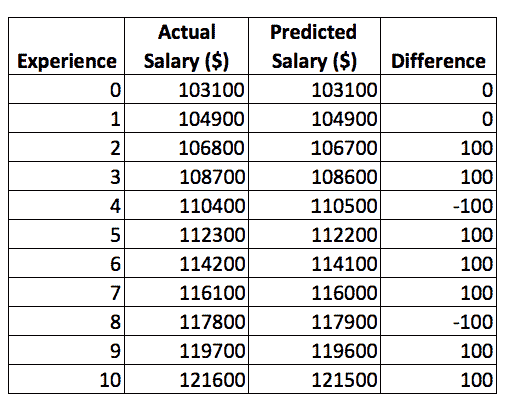
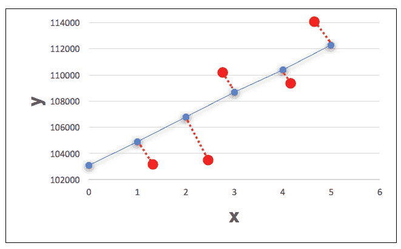
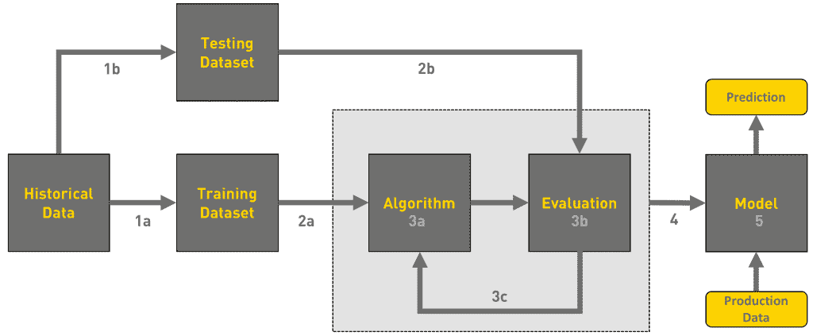

# 仔细看看机器学习的“学习”方面

> 原文：<https://thenewstack.io/closer-look-learning-aspect-machine-learning/>

这篇文章是一系列文章中的最新一篇，名为“机器学习不是魔法”，涵盖了如何开始机器学习，使用熟悉的工具，如 Excel，Python，Jupyter 笔记本以及 Azure 和 Amazon Web Services 的云服务。请每周五回来查看未来的文章。

当你开始学习机器学习算法时，通过 Excel 学习公式是一个很好的主意。它会让你彻底理解算法背后的概念。但是，为了发展可重复的机器学习模型，使其能够处理新的数据点，我们必须使用成熟的框架和工具。一旦你熟悉了这些概念，你就可以开始使用更高级的库，比如 Python 中的 [NumPy](http://www.numpy.org) 和 [Scikit-learn](http://scikit-learn.org/stable/) 。在本教程接下来的部分中，我将带您通过基于堆栈溢出工资计算器的相同用例来配置和使用 Python。

在本教程的最后一期中，我通过 Microsoft Excel 介绍了线性回归的概念。我们使用 LINEST 函数来验证我们的假设，并使用它来预测超出原始数据集限制的值的工资。

在这一部分中，我们将了解如何简化线性回归以提高准确度和精确度。在这个过程中，我们将探索[机器学习](/category/machine-learning/)的“学习”组件。

现在我们已经对线性回归有了基本的了解，接下来让我们更深入的了解一下机器学习的学习部分。

如果像微软 Excel 这样的工具可以做 ML，那还有什么好炒作的？如果 ML 只是将正确的算法应用于数据，那么学习和训练方面在哪里呢？让我们试着得到一个答案。

记住，与实际工资相比，我们的预测是正负 100 美元。虽然这在简单的情况下可能没有多大关系，但在复杂的数据集中，这种差异可能会有很大的不同，从而使预测不准确甚至几乎无用。

实际工资和预测工资之间的差异。

机器学习的目标是将现有数据与线性回归等预定义算法相结合，以最小化实际值和预测值之间的差距。在我们的场景中，基于 10 行，我们假设工资增加了 1800 美元。但是如果栈溢出对于有 10 年以上经验的开发者来说报酬更高呢？如果在经历了 10 年后，它每年增加 2200 美元，我们的假设就乱了套。我们的公式将 1800 美元视为增量，当我们输入任何高于 10 的值时，它将破坏算法。这种情况强调了对额外数据的需求。对于 ML 来说，数据越多，精度越好。这是公共云提供商吸引客户将其数据带到各自平台的原因之一。

现在，让我们假设我们可以获得反映 0 到 30 年工资水平的数据。这足以让我们理解 10 年、20 年和 30 年之间的工资差异。

在上图中，红点代表预测，红色虚线代表差距。那么，我们如何着手最小化实际值和预测值之间的差异呢？

有了额外的数据，我们就有可能得出 y 轴截距和斜率的不同组合。通过不断比较算法的输出(预测)和实际值，我们有可能找到误差最小的 y 轴截距和斜率的最佳组合。换句话说，我们需要不断尝试方程 **y = a + bx** 中 ***a*** 和 ***b*** *的不同值，直到我们能够将预测值拟合成一条接近实际值的直线。*

有多种技术，如[平均绝对误差(MAE)](https://en.wikipedia.org/wiki/Mean_squared_error) 和[均方根偏差(RMSD)](https://en.wikipedia.org/wiki/Root-mean-square_deviation) 来确定预测值与实际值的接近程度。像[随机梯度下降](https://en.wikipedia.org/wiki/Stochastic_gradient_descent)和[非线性共轭梯度](https://en.wikipedia.org/wiki/Nonlinear_conjugate_gradient_method)这样的先进技术被应用于复杂和大型数据集，以最小化预测中的误差。这些技术也被称为成本函数，因为它们试图减少使用算法的成本。

因为我的目标是帮助你揭开机器学习的神秘面纱，所以我不想解释这些技术中涉及的复杂数学。

从这次讨论中，你可以学到的关键是，ML 在同一个数据集上使用各种技术，直到实际值和预测值之间的差距几乎为零。因此，当我们获取一个大型数据集，对其应用一个数学公式，并多次迭代以最小化误差时，它会导致训练一个算法。该过程导致算法从现有数据中“学习”,最终获得 y 轴截距(a)和斜率(b)的精确值。

一旦这两个值被导出，我们就可以开始将经验证的公式 y = a + bx 应用于任何数据点。应用于生产数据的具有最精确参数(线性回归的 a 和 b)的最终公式称为 ML 模型。这是一个经过测试和信任的等式，包含了来自训练过程的所有常数。由于参数是基于历史数据进行调整的，现在可以处理可能在已知值之外的数据点了。

但是一个 ML 算法如何知道它已经达到了期望的精度水平呢？为此，我们将数据集分为两部分—训练数据和测试数据。通常的做法是将数据集的 75%用于训练，剩下的 25%用于测试。数据集的第一部分用于推导推论和相关性，而较小的部分用于比较结果。当训练数据的预测接近测试数据时，模型就可以处理看不见的数据点了。衡量模型准确性的众多机制之一是确定系数[c](https://en.wikipedia.org/wiki/Coefficient_of_determination)T2。在不涉及数学的情况下，决定系数给模型分配一个分数，通常在 0 和 1 之间。如果模型得分为 0.20，这意味着只有 20%是可预测的。目标显然是得到一个更接近 1.0 的值，这表示更好的置信度。

因此，ML 程序的目标是减少实际值和预测值之间的差异。寻找特征之间的相关性并使用它来增加模型的准确性的过程是 ML 的训练部分。

下图解释了机器学习中涉及的典型工作流程:

机器学习工作流程。

*   **步骤 1a** :将原始数据集的主要部分数据分割成一个子集进行训练。
*   **步骤 1b** :数据集的较小部分被考虑用于测试。
*   **步骤 2a** :将训练数据集传递给类似线性回归的 ML 算法。
*   **步骤 2b** :测试数据集被填充，并为评估做好准备。
*   **步骤 3a** :将算法应用于训练数据集中的每个数据点。
*   **步骤 3b** :然后将参数应用于测试数据集，以比较结果。
*   **步骤 3c** :重复这个过程，直到算法生成与测试数据非常匹配的值。
*   **第 4 步**:最终的模型是用为给定数据集调整的一组正确的参数进化出来的。
*   **步骤 5** :在生产中使用模型，根据新的数据点进行预测。

正如我们所看到的，机器学习的关键是基于第三步中发生的事情。一旦选择了正确的算法，就要用测试数据反复调整它，以达到准确的预测。这个过程代表了机器学习的“学习”部分。学习到的算法转换成可用于生产数据的模型。

除了线性回归，还有许多其他流行的监督机器学习算法，包括逻辑回归，朴素贝叶斯分类器算法，K 均值聚类算法，K 最近邻，支持向量机算法，Apriori 算法，人工神经网络和随机森林。

每种算法都设计用于预测或分类数据。例如，逻辑回归用于找出导致真或假的布尔值。正如我们所见，线性回归用于预测是一个数字的情况。其他算法如支持向量机和 K 最近邻用于分类。不管算法如何，目标都是使用现有数据找到精确的参数来发展最终的模型。

既然我已经介绍了很多内容，现在我们就来简单回顾一下这些没有术语的概念:

**机器学习:**基于现有数据构建逻辑的能力，无需显式编程。

**监督机器学习**:基于现有结构和一组已知值对数据进行预测或分类的过程。

**算法:**用于数据预测、分类或分组的数学或统计公式。在 ML 的上下文中，它是应用于现有数据集的公式。

**成本函数:**用于衡量和最小化实际值和预测值之间的差异的函数。

**决定系数:**介于 0 和 1 之间的数值，用于量化算法的准确度。该值越高，精度越好。

**模型:**经过全面训练和测试的算法，可用于该算法使用的原始数据集之外的新数据点。

在本系列的下一部分，我将触及数学在机器学习中的重要性。你将了解数学和统计学的哪些主题对于在数据科学领域建立职业生涯至关重要。敬请关注。

通过 Pixabay 的特征图像。

<svg xmlns:xlink="http://www.w3.org/1999/xlink" viewBox="0 0 68 31" version="1.1"><title>Group</title> <desc>Created with Sketch.</desc></svg>