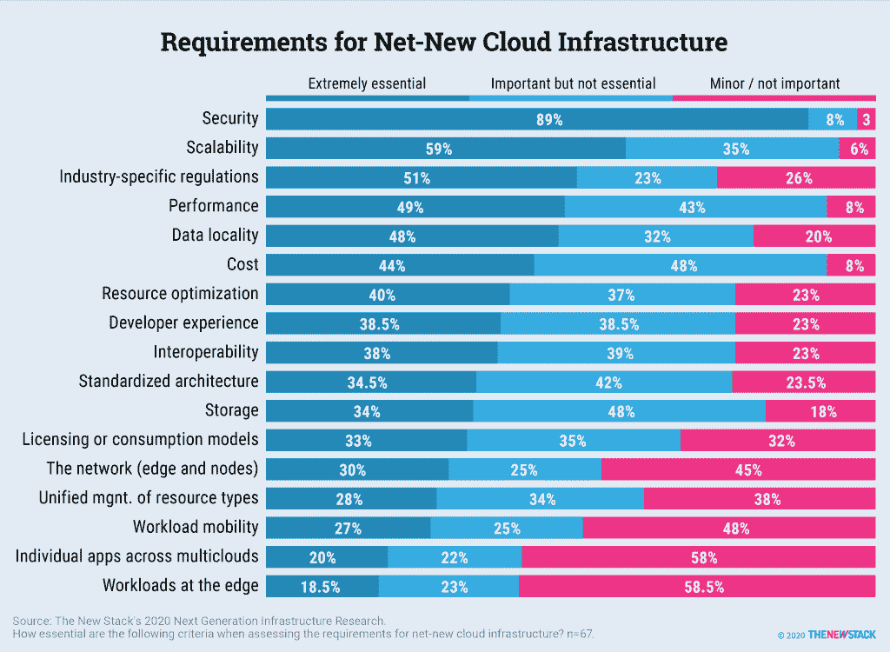
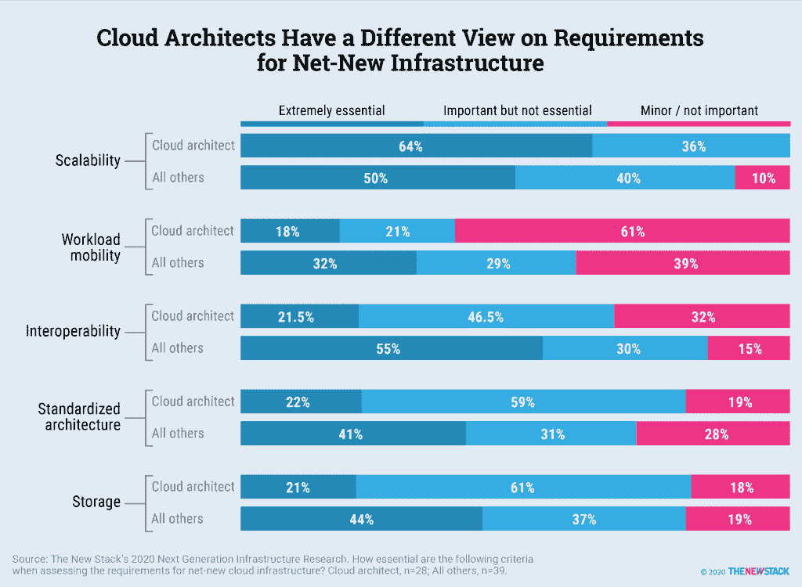

# 云架构师:边缘、多云和工作负载可移植性不是首要任务

> 原文：<https://thenewstack.io/cloud-architects-edge-multicloud-and-workload-portability-not-top-priorities/>

希望添加新的云基础设施的组织不认为在边缘运行工作负载是一项基本要求。跨多个云(“多云”)运行单个应用程序也是如此。

相反，根据 New Stack 的下一代基础设施即服务研究中的受访者的说法，安全性、可扩展性、成本和性能是评估全新云基础设施时最重要的标准，该研究包括 2020 年 8 月和 9 月进行的调查和深入访谈。

就像更广泛的 IT 社区一样，我们交谈过的人认为人工智能、数据管理工作负载和云基础设施正在对长期 IT 需求产生影响。然而，就影响 IT 决策者未来五年组织计划的因素而言，集成开发环境(ide)、持续集成和部署(CI/CD)以及测试等应用程序开发工作负载最常被提及。

最能讨论其组织当前和未来 IT 需求的受访者是首席技术管理人员或云架构师。这些工作角色代表了超过三分之二的 67 名受访者，他们评价了[评估和选择云基础设施](https://thenewstack.io/kubernetes-and-the-next-step-for-evolutionary-architecture/)时 17 项标准的重要性。59%的人认为在边缘运行工作负载根本不重要，或者最多是次要考虑事项，这反映了边缘计算用例的实际采用率相当低的事实。

至少基于一个定义，多云也不重要。是的，公司同时使用私有云和公共云，云定期在多个数据中心运行。尽管微服务、无服务器和基于事件的架构使它们更易于部署，但相对而言，很少有单个应用程序定期同时跨多个云使用服务。事实上，当被问及这些标准时，58%的人不认为这是一个重要的要求，而只有 20%的人认为这是必不可少的。工作负载可移植性更为重要，但只有 27%的人认为这是必不可少的。

换句话说，如果有足够的时间，决策者并不特别担心[可移植性](https://thenewstack.io/kubernetes-portability-must-have-or-shiny-object-syndrome/)和从一个云提供商到另一个云提供商的工作负载迁移。

与跨多个云运行应用程序相比，互操作性被视为重要或基本要求的可能性是前者的两倍。互操作性还处理硬件兼容性，确保基于公共开源项目的服务可以相互协作。定义业务和开发人员相关的自动化过程如何相互操作，似乎也是需要与更多以 IT 为中心的需求一起考虑的事情。

这项研究特别关注云架构师。与其他技术专家相比，这个团队对可伸缩性需求更感兴趣。另一方面，与接受调查的首席技术官和其他技术高管决策者相比，云架构师认为存储、标准化架构和互操作性在选择新的云基础架构时至关重要的可能性只有一半。由于他们的工作角色，设计和集成云平台的人明白在兼容性的世界里没有黑白之分。当来自云提供商的售前工程师或解决方案架构师淡化互操作性问题时，不要感到惊讶。可能有变通办法。与此同时，我们与之交谈的人继续表达对通用开源项目和标准化工作的兴趣，这些项目和工作可以减少对任何一两家商业云提供商的依赖。

通过 Pixabay 的特色图片。

<svg xmlns:xlink="http://www.w3.org/1999/xlink" viewBox="0 0 68 31" version="1.1"><title>Group</title> <desc>Created with Sketch.</desc></svg>