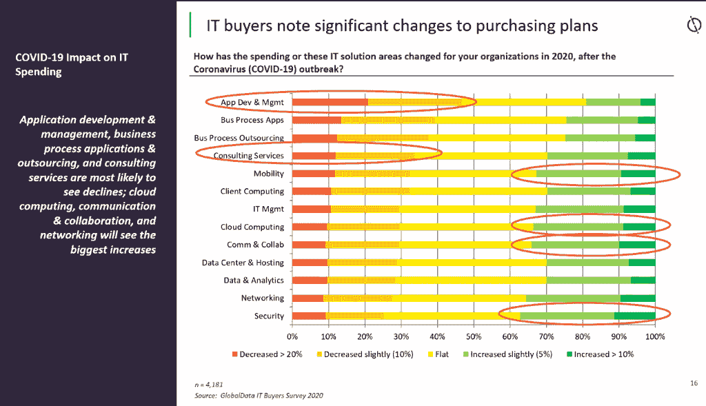

# 云计算 2020:从应对到整合

> 原文：<https://thenewstack.io/cloud-computing-2020-from-coping-to-consolidating/>

*2020 年的影响将继续影响云服务的发展，并在 2021 年被采用，这看起来将是一个后果与业务照常混合的一年。*

在疫情早期，推特上流传着一个笑话，认为新冠肺炎而不是首席执行官或首席技术官推动了数字化转型。几个月内云就以通常的速度普及了几年，而且[云和网络容量都保持得很好](https://thenewstack.io/the-network-impact-of-the-global-covid-19-pandemic/)，尽管 Q1 的供应链问题意味着大型云服务不得不将他们的一些服务器采购[推迟到春季和夏季](https://www.platformonomics.com/2020/10/pandemic-capex-q3-2020-update/)。

组织迅速转向云服务和 SaaS，特别是当他们在获取和部署硬件以增加其 VPN 容量时遇到困难。使用云应用程序网关意味着，即使只有在防火墙内部才可用的本地托管应用程序也可以远程访问；这也将增加单点登录、MFA 和机器人流程自动化的采用，机器人流程自动化可以对传统应用程序进行屏幕抓取，以将其包含在协调的工作流中。能够放弃 VPN 的首席信息官中，很少有人有兴趣再转回来。

云服务还决定对容量进行优先排序，并推迟一些计划的更新、功能推出和弃用。延长支持生命周期给管理员和开发人员带来了一些压力，尽管随着 Kubernetes 等技术的成熟，这种情况已经发生了；从 [Kubernetes 1.19 开始](https://kubernetes.io/docs/setup/release/version-skew-policy/)的官方支持生命周期现在是一年补丁而不是九个月。

## 云支出持续增长

随着在家工作继续成为至少是科技公司的常态，许多以异常快的速度向云迁移的组织在今年剩下的时间里所做的事情是回去确保他们做对了事情。这包括合规、治理和安全；在急于确保每个人都可以访问他们保持工作所需的服务、应用程序和数据之后，又出现了限制只有本应有权访问的人才能访问的努力。

尽管 GlobalData IT 购买者调查中的许多首席信息官预计收入会因为新冠肺炎而下降，但大多数 IT 预算并没有下降:他们在应用程序开发和管理以及咨询服务上的支出减少了，但在移动性、安全性、通信和协作上的支出增加了，尤其是在云上。59%的高级企业领导人[告诉 CCS Insights](https://www.ccsinsight.com/events/ccs-insight-predictions-2021-and-beyond/) 他们将在 2021 年增加 IT 支出，41%的人表示公共云是他们的首要 IT 优先事项。

这并不意味着技术投资将在 2021 年恢复正常。IT 买家告诉 GlobalData，他们在 2021 年的优先事项将是提高业务流程的运营效率，削减成本和提高自动化程度，尽管他们仍然对人工智能和物联网感兴趣。长期战略计划仍然很重要，但短期的云服务战术方法可能会占主导地位，直到更清楚后 COVID 世界可能会是什么样子，而不是目前的共存。

虽然消费者云服务都提供较少的云存储，随着 Google Drive 最终削减，甚至 Docker Hub 都无法继续托管开发人员没有花时间优化的数千个版本的臃肿容器映像，但大多数企业将使用大量的云存储，包括基础设施和文件共享。在[Spiceworks 2020 年及以后的存储趋势](https://www.spiceworks.com/marketing/reports/storage-trends-in-2020-and-beyond/)调查中，39%的组织已经使用云存储基础架构服务，另有 20%的组织将在 2022 年前采用它。这意味着人们对数据库迁移选项更感兴趣，无论是云提供商和合作伙伴提供的服务，还是像 Flyway 这样的[开放核心选项。](https://github.com/flyway/flyway)

如果管理员或开发人员粗心大意，这也意味着云服务上暴露的数据会更多。随着 Azure 市场份额的增加，预计将会看到来自安全性差的 Azure 存储帐户的数据泄露，我们已经习惯于从不安全的 S3 桶中看到这种情况。

此外，GitHub 每个月都会在公开回购中检查到数百万个可能的 API 证书和秘密(每周仅公开回购中就有多达 900 个 GitHub API 密钥)。GitHub 正在开发用于处理机密的 API 和工具，以创建正则表达式来检测您的组织中使用的特定凭据模式，这样您就可以让任何检测到机密的提交无法保护它们。

旭日网络安全管理软件产品供应链攻击可能会把注意力集中在软件供应链和依赖关系的现存问题上。根据 2020 年八月的[状态，JavaScript 回购通常有大量的可传递依赖关系(调用其他组件和框架的调用组件):通常每个回购有 683 个(相比之下，Ruby 有 68 个，Python 有 19 个)，其中任何一个都可能有安全漏洞。](https://octoverse.github.com/#securing-software)

期待主要的云服务引入服务来帮助您审查那些开源依赖，承诺让您保持开源的敏捷性而没有安全担忧——或者提供更多他们自己的、经过审查的项目，这些项目可能会也可能不会做出上游贡献。其中一些产品非常有用，但是也要小心安全剧场。

## **混合优势**

4G 已经开始将电信转向网络功能虚拟化和运行在行业标准硬件而非固定功能设备上的软件定义网络，这有助于即使在需求高峰期也能保持网络稳定性。5G 与现有 4G 基础设施的部署有助于提高带宽和容量，但智能 5G 网络支持运行本地云服务的边缘计算的变革效果将不会被看到，除非对独立 5G 进行更多的基础设施投资。其中一些将是工业环境中的专用 5G 网络，边缘计算托管图像识别和预测分析等云服务，使用 Azure Private Edge Zones 和 Amazon Web Services Wavelength Zones 等混合选项，这是我们很可能在 2021 年看到最先进的移动边缘使用的地方。

超大规模云的巨型区域不会消失，但它们正在被微型区域加入，其中一些区域与移动运营商位于同一位置，还有世界上越来越多的国家的区域。数据主权和监管治理问题将继续对工作负载的运行和数据的驻留产生影响，无论是英国是否会设法从欧盟获得数据充足性决定以允许个人数据在初始协议结束后自由流动的问题，还是美国国内的监管问题或中国技术提供商的棘手问题。

从公共云到混合和边缘计算的连续计算将使云的定义在一段时间内变得更加模糊；来自 LF Edge 工作组的开放词汇表将有助于准确说明不同上下文中的边缘。

现在，AWS 已经加入 Azure 和谷歌的行列，开始拥抱混合云，越来越多的云服务将在内部提供，无论是在像公共云一样运行的专用硬件上，还是使用容器编排在更异构的硬件上提供云服务。Azure Stack HCI 是一个有趣的例子。它最初被称为 Windows Server 软件，在经过认证的超融合硬件上定义和提供，现在它是 Windows Server 的一个版本，仍然可以部署和管理，但不需要许可证，因为你通过 Azure 购买它作为服务，自动获取更新和新功能，并使用它来运行其他云服务，如 Azure Kubernetes 服务。

AWS 的[对 Arm 实例的热情](https://thenewstack.io/aws-graviton-marks-the-emergence-of-arm-for-cloud-native-workloads/)降低了 20%的运行成本，同时提高了 CPU 密集型工作负载的性能，这种热情也延伸到了边缘和混合计算，Arm 正在为边缘和数据中心服务器以及网络工作负载推介 Neoverse 处理器。这意味着更多的云服务将在 Arm 上运行；这对于使用云服务的开发人员来说会有所不同，云服务允许他们指定实例类型，但通常是不可见的，除非有需要更新的项目依赖关系。

云提供商将继续承诺降低其服务的碳足迹，尽管目前随着可再生能源建设和上网进程的放缓，大部分碳足迹最初将通过抵消来实现。即使是从太阳能和水力发电获得电力的数据中心，在未来几年内也会有柴油发电机作为备用。更先进和雄心勃勃的云提供商也将致力于数据中心用水的影响。

看起来似乎已经有了几乎所有东西的云服务——从检查人工智能系统到数据偏差到运行卫星地面站——但很可能会有一系列服务来做更多的事情。其中一些将用于新兴的垂直云，如 IBM 金融服务云和 Azure 健康云。其他人将把熟悉的 DevOps 范例扩展到新的工作负载；Cloudflare Pages 现在将 JAMstack 与无服务器工作器集成在一起，将前端和后端开发结合到一个看起来像用于 web 发布的 CI/CD 的东西中，无论它是静态网站还是动态应用程序。(以 Cloudflare 的规模，这可能比类似的方法更有吸引力，比如使用 WebAssembly 在服务器或浏览器上运行 C#应用程序的 [Blazor](https://dotnet.microsoft.com/apps/aspnet/web-apps/blazor) 。)

2020 年的远程工作不仅仅意味着使用团队、Zoom 和云虚拟桌面来弥补在 Q1 购买新电脑的困难(2020 年 1 月至 3 月，Azure 上的 Windows 虚拟桌面使用量增加了两倍，传闻中的云 PC 服务预计将于 2021 年推出，以按需提供云桌面和应用，而没有配置和管理 Azure 基础设施的复杂性，这可能会同样受欢迎)。

这还意味着高管们通过云通信服务，通过 HoloLens 等 AR 耳机来监控新工厂和工厂的建设。期待云服务的更多采用，这些云服务为制造和物流以外的领域提供语音界面、物联网管理和机器人技术，无论是能够对会议室设置说出命令而不是触摸按钮，对传感器读数的自动响应，还是在银行拿起一袋袋硬币的[机械臂](https://arxiv.org/abs/2012.01356)。(随着人们逐渐习惯这些系统，预计它们也会像视频会议一样令人讨厌。)

许多关于 2021 年将是机器学习和人工智能年的预测忽略了已经有多少机器学习和人工智能的部署，以及围绕隐私和偏见出现的问题，谷歌无意中提供了一个研究这些问题有多困难的实物课程。

通过实施人工智能和机器学习来获得“先行者”优势将越来越难，因为每个人都会使用它；但并不是每个组织都会有效地使用它，适当地保护它，或者理解数据科学基础知识的重要性，如模型版本和数据血统。一个根据 2019 年消费者习惯训练的模型不会很好地为计划在 2021 年旅行的人推荐优惠。强化学习通过与环境互动而更接近实时学习，它将进一步从研究实验室走向现实世界，商业云服务将它用于个性化、[异常检测和预测性维护](https://techcommunity.microsoft.com/t5/azure-ai/introducing-metrics-advisor-a-new-cognitive-service/ba-p/1668025)。

2021 年还可能会看到 Kubernetes 等成熟云技术的一些重大发展的开始，其中 WebAssembly 可能会成为一个新的沙箱，它具有强大的安全模型，启动速度极快，并且在非常小的 RAM 量中运行(因为它是一个具有本机编程范式的二进制文件，而不是一个完整的环境)。用 WebAssembly 替换容器可以将 Kubernetes(或其他分布式应用系统)放在最小的设备上，但也可以使用 GPU 和 trusted enclaves 等硬件资源，将性能与强大的安全性结合起来。

将当前风险资本对 WebAssembly 的兴趣转化为功能性技术需要一些行业和开源社区的合作。这也需要一个地方来进行这种合作——就像相当非正式的字节码联盟转变成一个适当的基础(我们在背景中被告知这可能会在 2021 年初发生)。

通过 Pixabay 的特征图像。

<svg xmlns:xlink="http://www.w3.org/1999/xlink" viewBox="0 0 68 31" version="1.1"><title>Group</title> <desc>Created with Sketch.</desc></svg>