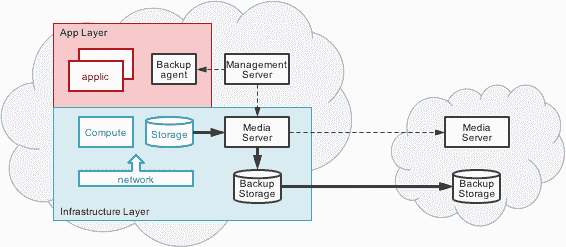

# 对于云数据存储，控制平面胜过数据平面

> 原文：<https://thenewstack.io/cloud-control-plane-trumps-data-plane/>

杜赞奇·萨卡尔

Prasenjit 是 Datos IO 的联合创始人兼首席技术官。Prasenjit 专注于大数据、分布式系统和文件系统，定义并领导了行业颠覆，交付了存储和系统产品，并领导产品开发组织交付下一代解决方案，同时为 IBM 创造了数百万美元的收入。

控制平面和数据平面的概念一直存在于数据保护领域，尽管在存储集成数据保护解决方案中通常被称为“管理和策略层”，而不是“媒体服务器层”。

虽然这种备份解决方案很好地解决了传统数据中心备份到磁带并最终备份到磁盘的问题，但该解决方案并不容易转化为分布式多云解决方案。在这种情况下，数据保护解决方案需要云规模、多提供商集成，并明确分离控制、数据移动和多层数据存储。

这种分离不仅提供了控制和数据级别的独立扩展，还为供应商或云提供商的独立性创造了机会。此外，数据平面服务的分离允许该解决方案利用云存储本机提供的数据移动、数据复制和存储优化方面的所有当前和未来创新。

让我们探讨一下传统数据保护体系结构的固有缺点，然后展示一下以控制平面为中心的方法对于多云环境的备份和恢复以及数据管理的明显优势。

传统上，存储集成数据保护解决方案侧重于控制和优化媒体服务器中的数据移动和数据持久性。这样做是为了优化流吞吐量、网络带宽利用率和线内重复数据消除。

这种解决方案的重点是在出现逻辑错误或物理服务器故障时，最大限度地减少应用程序“停机”时间。由于保护和恢复只是数据块卷或文件系统的存储级备份的一项功能，因此在存储基础架构层采用端到端解决方案是有意义的。

备份性能由介质服务器到存储设备的连接和 I/O 吞吐量决定。然后，扩展变成了添加更多媒体服务器和相关辅助存储来处理更多更大的数据流的功能。

云时代的多种因素也会降低存储集成数据保护和数据管理解决方案的有效性。在许多情况下，云提供商(在公共和私有实例中)对事实上的文件和对象存储标准背后的存储基础架构进行抽象和虚拟化。这使得建立用于保护目的的通用数据模型和数据移动接口变得更加困难。

## 阴云密布的前景

那么，存储集成数据保护解决方案如何在云环境中克服这些限制呢？

为了将保护数据副本从数据源移动或复制到目标保护存储，供应商通常必须在云中提供一个介质服务器实例。媒体服务器模型没有利用云存储提供商的存储功能，也没有针对这些功能进行优化(包括重复数据删除、复制、存储分发等)。).此外，媒体服务器后面的备份映像是专有格式的，如果没有媒体服务器的另一个实例，则不能容易地用于恢复远程恢复环境中的应用实例。

分布式控制平面架构避免了集成控制平面和数据平面的问题，同时提供了跨多个云进行扩展的关键优势。

如下所示，用于数据保护的分布式控制平面可以跨越多个不同的云环境和混合部署。集中维护和控制保护配置、策略和工作流。云环境内或跨云环境的数据复制独立于控制平面发生和扩展。

通过不提供数据平面功能，控制平面架构可以利用云提供商存储服务的功能和独立扩展。数据平面抽象的另一个好处是新应用程序和持久性服务的可扩展性。无需对控制平面进行重大更改，就可以在数据平面中支持新的应用程序或持久性模型，同时利用其特定的扩展模型。

我们自己的 Datos IO CODR 架构在很大程度上遵循了上述架构，并具有一些显著的额外优势。该体系结构利用当前和下一代数据库内部复制功能来提取可在标准文件或对象存储中持久保存的保护拷贝。除此之外，Datos IO RecoverX 还提供了业界首创的语义重复数据消除流程，该流程可对数据进行自省，以实现最高的存储效率。

出于恢复目的，CODR 引擎通过对每个快照进行深度索引来支持配置无关的恢复。将数据并行复制到适当的恢复节点允许进行惰性数据库刷新，以完成应用程序级恢复。

如开头所述，客户的云计算之旅需要一种全新的数据保护、数据恢复和数据管理方法。Datos IO 的控制平面架构提供了围绕多云、多供应商支持的关键优势，包括保护和恢复存储的独立扩展、应用感知，因此创建了跨多云的应用和运营移动性。

通过 Pixabay 的特征图像。

<svg xmlns:xlink="http://www.w3.org/1999/xlink" viewBox="0 0 68 31" version="1.1"><title>Group</title> <desc>Created with Sketch.</desc></svg>