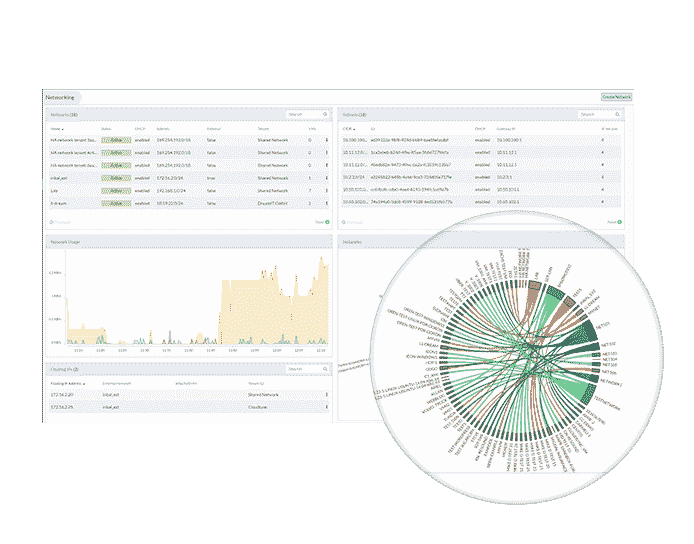

# Stratoscale 将 OpenStack 云打包到 USB 驱动器中

> 原文：<https://thenewstack.io/cloud-delivered-usb/>

想要将您的 IT 迁移到云，但是没有一个稳定的工程师来完成繁重的工作？或者您已经使用了 AWS 并希望获得更多控制权，但您的公司并没有在 IT 技能方面进行深入投资？您是运行多种云的 74%全球企业中的一员吗？

没问题， [Ronen Kofman](https://www.linkedin.com/in/ronenkofman) ， [Stratoscale](http://www.stratoscale.com/) 产品副总裁在最近的一次采访中说。插上这个 USB 就行了。

等等，什么？？

Stratoscale USB 保存一个可以安装在主服务器上的镜像。基于 OpenStack、Docker 容器和基于内核的虚拟机管理程序(KVM)，Stratoscale 软件堆栈可以将自身复制到集群中的其他服务器。然后，管理员可以通过内置的策略引擎控制工作负载。

周二，Stratoscale [宣布](http://www.stratoscale.com/blog/news-and-events/what-is-new-in-stratoscale-v2/)发布 Symphony V2，这扩展了他们的 USB 云产品的功能。

Maislos 解释说，Symphony 属于许多人所说的“超融合”领域，这通常被认为是服务器和存储之间的融合，“我们已经进入了下一个阶段——将一切都放在软件中，以便 Symphony 可以在任何硬件元素上运行。”

Symphony V2 将 50 多种系统服务集成到其云基础架构中，包括云管理、虚拟网络、存储和虚拟化服务，所有这些都整合在单个横向扩展堆栈中。

该公司于 2013 年成立，专注于让云变得可访问。考夫曼说，随着行业的进步和新软件的出现，Stratoscale 评估了每一项新技术，并酌情将其纳入。例如，OpenStack 在他们开始时是全新的，现在是 Symphony stack 中的一个构建块。

同温层网络接口

Stratoscale 最初面向 IT 资源有限但需要提供终端市场体验的中小型企业。最近，该公司已经扩展到包括各种规模的企业，这些企业希望为其老化的 VMware 基础架构增添新的活力，或者希望推出多个内部云。Symphony 版本 2 支持 VMware 和 Hyper-V 工作负载。

通过提供考夫曼所谓的“收缩包装解决方案”，云可以由一个普通的 IT 用户来部署和管理。考夫曼解释说，虽然可以通过 OpenStack 访问云，但该软件需要大量开发，需要大量工程师来部署和维护，因此只有像美国电话电报公司这样有人力和资源部署它的大公司才能真正访问。

“我们想解决私有云问题，但没有工程资源，”他说。

## Stratoscale 完成了这项工作，所以您不必这样做

Stratoscale 创始人兼首席执行官 Ariel Maislos 表示:“伴随着 iPhone 长大的人希望软件简单、易用、美观。用户界面提供点击式控制，简化分析、导航和管理功能。

“每个页面和每个屏幕都经过深思熟虑，易于使用——就像 iPhone 因为认真开发而易于使用一样，”考夫曼说。

Stratoscale 全球销售副总裁 [Patrick Guay](https://www.linkedin.com/in/patrickguay) 在[网上研讨会](https://stratoscale.wistia.com/medias/wx9q1c4edu?mkt_tok=eyJpIjoiWmpBMVpERm1OelEzWm1ZNSIsInQiOiJyTERwUjM5dUJcL21uSVh3U205cStqVGd4VG01dzhvamx4WnRiOUduSHJPaW1pQ3F1bkhmempkTkVPN1ozYWd5MFc2dkw1Ung5VEdlWkhJblBDU2FhYWJtcHZublpKdGFPSDF3cGJyTFdWcTQ9In0%3D)上表示，Stratoscale 的 USB 云是硬件不可知的。“硬件无关”意味着只要您的所有软件都在 x86 服务器上运行，就不需要新的硬件。

过去，服务器是构建 IT 系统的基础。Guay 说，新模型是一个智能基础设施，以集群为测量单位。

Guay 说，系统中的一切都是通过“单一窗格玻璃”访问的，它将所有元素作为一个实体进行管理。点击式 Symphony UI 允许用户查看整个堆栈的活动和报告。集群范围的资源管理在所有节点上自动运行，可以支持在同一基础架构上运行的虚拟化工作负载和容器。

“现代数据中心需要一种更具可编程性的方法，因此我们提供了丰富的 API 集，并完全支持 OpenStack APIs，允许现有的调度程序和管理工具与我们的工具无缝集成，”他说。"

根据 Guay 的说法，这意味着可以使用现有的最佳基础设施来部署应用程序，并且可以使用相同的硬件来同时运行虚拟机和 Docker 容器。

Stratoscale 创建了一个利用所有固态和旋转磁盘空间的统一存储池，确保工作负载在离数据存储位置最近的地方运行。这将运行精简资源调配，减少复制，并加快响应时间。

Maislos 说，Symphony 版本 2 的新功能是支持云环境中的传统存储基础设施。现在，您可以通过云轻松访问传统数据存储。

Symphony 内置了多站点数据保护，采用了为 webscale 环境创建的横向扩展架构原则。保护策略是可配置的，虚拟机和存储卷的备份和数据恢复也是如此。

Kofman 说:“归根结底，我们的目标是让私有云轻松运行。这是人们真正喜欢的东西。”

Docker 是新堆栈的赞助商。

特征图像:T.C. Currie。

<svg xmlns:xlink="http://www.w3.org/1999/xlink" viewBox="0 0 68 31" version="1.1"><title>Group</title> <desc>Created with Sketch.</desc></svg>