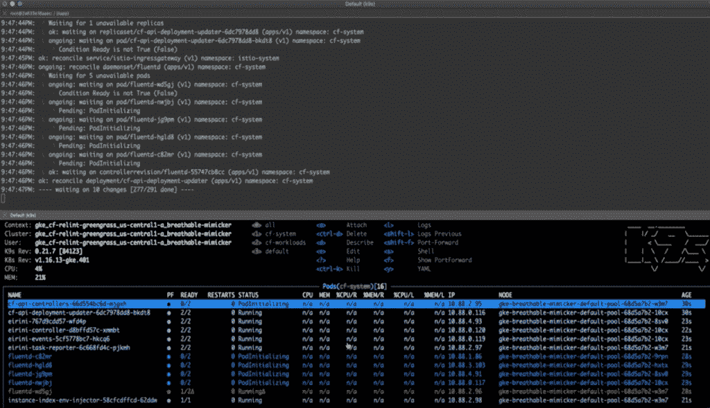

# Cloud Foundry 旨在为 Kubernetes 带来“cf 推送”的便利

> 原文：<https://thenewstack.io/cloud-foundry-aims-to-bring-the-ease-of-cf-push-to-kubernetes/>

Cloud Foundry 开源平台即服务软件背后的人继续追求与 Kubernetes 的紧密集成，更新他们的两个基于 Kubernetes 的核心发行版，以改善开发人员的体验。

在本周举行的 2020 年欧洲云铸造峰会的新闻和分析师小组会议上，云铸造执行董事 [Chip Childers](https://www.linkedin.com/in/chipchilders) 表示:“很明显，我们有了一个方向:我们的新北极星将带来全球数十万开发人员使用的开发人员体验——云铸造推送体验——并将其提供给与 Kubernetes 合作并希望更好地支持其组织中的定制软件开发的任何人。”

因此，Cloud Foundry Foundation 的虚拟峰会反映了该组织对 Kubernetes 的重视，并强化了其降低开发人员团队为云原生环境创建应用程序的门槛的使命。与此同时，Cloud Foundry 当然保持了其对 CI/CD 的一贯承诺，不同之处在于 Kubernetes 的应用程序开发仍然是重点。为此，Cloud Foundry 在峰会期间宣布了对其项目的改进，简而言之，这些改进旨在促进开发人员在 Kubernetes 上运行应用程序的体验。其中两个是第一个生产就绪版本的 [Cf-for-k8s (v1.0)](https://github.com/cloudfoundry/cf-for-k8s) ，这是一个 Kubernetes-native 的 Cloud Foundry 发行版，以及 [KubeCF v2.5](https://www.prnewswire.com/news-releases/cloud-foundry-ecosystem-coalesces-around-kubernetes-with-significant-project-updates-announced-by-cloud-foundry-foundation-301156521.html) ，这是一个更面向 VM 的 Kubernetes 的 Cloud Foundry 开源发行版，打包为 Helm chart。

例如，对于已经在 EKS 等 Kubernetes 平台上成功部署且对 Cloud Foundry 不甚了解的中小型组织来说，这些公告显示了开发人员如何避免花费大量时间在 Kubernetes 上配置部署基础架构。

“开发者不应该花太多时间配置代码来运行应用程序管道，Cloud Foundry 解决了这个问题，”Childers 说。“Cloud Foundry 融入了最佳实践。”

例如，使用 Cf-for-k8s，开发人员只需花几分钟时间“启动并运行基础设施，并与托管的 Kubernetes 集群集成”，就可以减少对基础设施的关注

在本周峰会期间的一次演示中，VMware Cloud Foundry volume services 负责人[保罗·沃伦](https://www.linkedin.com/in/paul-warren-7720704/)展示了如何在不到 10 分钟的时间内用一台笔记本电脑启动一个集群。这反映了他在[谷歌云平台(GCP)](https://cloud.google.com/) 上的经历，他说“一个合理规模的集群通常需要 5 到 10 分钟”。在演示中，Cf-for-k8s 存储库被“Git 克隆”:

Cloud Foundry 还介绍了最近添加到 cf-for-k8s v1.0 中的新功能:

*   加密的“飞行中”通信。
*   支持 cf bind-service、cf marketplace 和其他与 Open Service Broker API 相关的命令。
*   支持开发者框架包括 Java，Node，Go 和。网芯。
*   云控制器 API (CAPI)进行了重构，使用容器注册表作为其数据存储。

随着 KubeCF v2.5 的发布，Cloud Foundry 也对 KubeCF 进行了改进。基于已存在多年的 Cloud Foundry 架构，KubeCF v2.5“采取了一种几乎是桥接的方法，将 Cloud Foundry 引入 Kubernetes，”Childers 说。KubeCF 最初是为虚拟机(VM)环境创建的，因此现在适合于容器和 Kubernetes 集群。

Cloud Foundry 传达了 KubeCF v2.5 提供的以下新功能:

*   生产就绪 [Eirini](https://github.com/cloudfoundry-incubator/eirini) ，在认证 Cloud Foundry 的商业发行版中受支持，具有更好的稳定性和与 Diego 更接近的功能对等性。
*   迭戈集装箱到集装箱网络和多集群应用程序调度。
*   其他改进和[错误修复](https://github.com/cloudfoundry-incubator/kubecf/releases)。

对于 Eirini ，Childers 说:“我们已经在过去的几次峰会上讨论过这个问题，项目社区认为 Eirini 集成现在已经为生产用例做好了准备。“所以，这是一次非常重要的发布。”

Childers 说，Cf-for-k8s v1.0 和 KubeCf v2.5 也代表了“技术社区的主要里程碑，因为它旨在实现将 CF 的开发体验引入 Kubernetes 集群的共同愿景”。“这一事件，这些发布，是社区可以翻过这一页的时刻。当有人问，‘什么是云铸造？’这是 Kubernetes 的开发者体验——这就是这些版本所反映的。"

Cloud Foundry Foundation 是新堆栈的赞助商。

<svg xmlns:xlink="http://www.w3.org/1999/xlink" viewBox="0 0 68 31" version="1.1"><title>Group</title> <desc>Created with Sketch.</desc></svg>