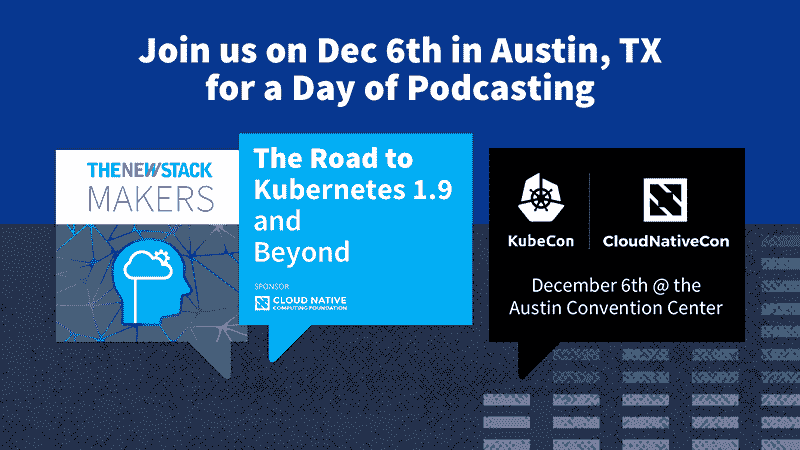

# Cloud Foundry 如何帮助开发人员在平衡安全性的同时实现灵活性

> 原文：<https://thenewstack.io/cloud-foundry-helps-developers-embrace-flexibility-balancing-security/>

[Cloud Foundry 如何帮助开发人员在平衡安全性的同时拥抱灵活性](https://thenewstack.simplecast.com/episodes/how-cloud-foundry-helps-developers-embrace-flexibility-while-balancing-security)

对于一些企业来说，软件开发、安全性和操作的交叉很难跨越。像 [Cloud Foundry](https://www.cloudfoundry.org/) 这样的平台旨在帮助组织弥合差距，同时仍然关注安全性。

Snyk 首席执行官兼联合创始人 [Guy Podjarny](https://twitter.com/guypod) 在与 TNS 创始人 Alex Williams 讨论今天的《新堆栈制造商》时，谈到了 Cloud Foundry 在 Cloud Foundry 容器运行时看到的架构决策以及 Cloud Foundry 对 BOSH 平台的持续关注。

“我认为拥有一些灵活性是有好处的。在一天结束时，如果你谈论授权团队和组织为他们的工作选择正确的工具，那么你想要授权他们。今天，在 PaaS 模型和容器之间的这个决定是一个决定，每个都有利弊。我喜欢平台即服务的自以为是的方面，因为他们仍然可以将控制和约束嵌入到系统中，以确保他们做得正确。”

[https://www.youtube.com/embed/h1Mfyffv3IQ?feature=oembed](https://www.youtube.com/embed/h1Mfyffv3IQ?feature=oembed)

视频

### 在这个版本中:

[1:05:](https://thenewstack.simplecast.com/episodes/how-cloud-foundry-helps-developers-embrace-flexibility-while-balancing-security?t=1:05)Snyk 介绍。
[2:44:](https://thenewstack.simplecast.com/episodes/how-cloud-foundry-helps-developers-embrace-flexibility-while-balancing-security?t=2:44) Podjarny 对我们从 Cloud Foundry 看到的架构决策的想法。
[6:54:](https://thenewstack.simplecast.com/episodes/how-cloud-foundry-helps-developers-embrace-flexibility-while-balancing-security?t=6:54) 探讨术语“开发安全运营”及其如何应用于 Cloud Foundry 等平台。
[15:12:](https://thenewstack.simplecast.com/episodes/how-cloud-foundry-helps-developers-embrace-flexibility-while-balancing-security?t=15:12) 探索在管理 Kubernetes 时应该创建什么样的抽象层次。
[17:07:](https://thenewstack.simplecast.com/episodes/how-cloud-foundry-helps-developers-embrace-flexibility-while-balancing-security?t=17:07) 参加欧洲云铸造峰会的人员和组织类型。
[20:06:](https://thenewstack.simplecast.com/episodes/how-cloud-foundry-helps-developers-embrace-flexibility-while-balancing-security?t=20:06) 与其他社区的比较和关联，以及云铸造社区的独特之处。

[Cloud Foundry](https://www.cloudfoundry.org/) 是新堆栈的赞助商。

<svg xmlns:xlink="http://www.w3.org/1999/xlink" viewBox="0 0 68 31" version="1.1"><title>Group</title> <desc>Created with Sketch.</desc></svg>