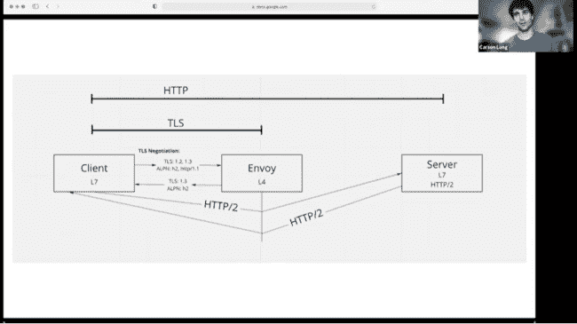

# Cloud Foundry HTTP 2 项目因 GoLang 的冷漠而受挫

> 原文：<https://thenewstack.io/cloud-foundry-http-2-support-thwarted-by-golang-indifference/>

一个将 [HTTP/2](https://thenewstack.io/take-advantage-http2-speed-web-sites-apps/) 引入 [CloudFoundry](https://www.cloudfoundry.org/?utm_content=inline-mention) 应用程序开发平台的[项目](https://github.com/cloudfoundry/routing-release/issues/200)遇到了一个障碍，因为 Go 语言的管理员没有以足够快的速度响应请求，以支持 HTTP/2 over TCP“升级流”过程。

结果，Cloud Foundry[Go Router](https://github.com/cloudfoundry/gorouter)reverse proxy 删除了让 CF 应用程序知道它可以发送和接收 HTTP/2 流量的报头。这种能力可以被编码，完全绕过 Go 语言库，但是项目团队不想承担支持这种潜在的广泛使用的功能的责任。

在本月早些时候举行的今年的虚拟[云铸造峰会](https://www.cloudfoundry.org/events/summit/)上，[VMware Tanzu](https://github.com/ctlong)、该公司的 Kubernetes 发行版[的软件工程师 Carson Long](https://www.youtube.com/watch?v=F3zNus2qnWo&amp;list=PLhuMOCWn4P9iNtNmzrKzMgic8RbJyMKB8&amp;index=7) 谈到了这一挑战。

## 捆绑销售速度更快

HTTP/2 于 2015 年[推出，旨在加快网络流量](https://thenewstack.io/take-advantage-http2-speed-web-sites-apps/)，已经成为开发者最需要的功能之一(与 gRPC 并列[)。它通过将流量分解成二进制编码的帧来加速 web 流量，然后可以在一个 TCP 连接中多路复用这些帧。大约 45%的顶级网站支持 HTTP/2，所有主流浏览器也是如此。](https://thenewstack.io/grpc-lean-mean-communication-protocol-microservices/)

Long 是将 HTTP/2 引入 Cloud Foundry 的团队的一员。这涉及到确保 HTTP/2 在每一步都得到支持，包括负载平衡器(考虑到负载平衡器的多样性，这一点非常困难)，以及 Cloud Foundry Go 路由器本身(增加了两行代码)。

但是，最困难的兼容性变化是检查构建在 Cloud Foundry 上的终端应用程序是否能够识别 HTTP/2 流量。HTTP/2 依赖于 [mTLS 进行加密](https://thenewstack.io/mutual-tls-microservices-encryption-for-service-mesh/)，加密在 Cloud Foundry 中不是由应用程序本身终止，而是由[特使代理](https://thenewstack.io/the-envoy-proxy-finds-a-home-at-the-cncf-amazon-web-services/)终止。这意味着特使还直接与传输层安全(TLS)应用层协议协商( [ALPN](https://datatracker.ietf.org/doc/html/rfc7301) )进行对话，以确定 HTTP/2 是否可以使用。

当它终止 mTLS 时，Envoy 使用另一个协议，HTTP/2 over TCP ( [H2C](https://httpd.apache.org/docs/2.4/howto/http2.html#:~:text=h2c%20is%20HTTP%2F2%20over,in%20the%20official%20documentation%20section.) )将数据包有效载荷(现在是纯文本)发送给应用程序。

“我们很快遇到的问题是，我们如何确定服务器或应用程序是否真的接受 HTTP/2。在这种情况下没有办法知道，所以很明显我们不能每次都转发 HTTP/2。一个只接受 HTTP/1 的应用程序只会丢弃 HTTP/2 数据包，而客户端永远不会发现。

好消息是，H2C 提供了一个升级流程，在这个流程中，通过一些额外的头，应用程序被询问是否接受 HTTP/2。如果给出肯定的响应，则可以发送 HTTP/2 数据包。

然而，该团队遇到了一个问题，因为 Go 标准库不支持 H2C 升级流程。他们[在 GitHub 中提出了](https://github.com/golang/go/issues/45785)请求，龙说。“我们几乎没有得到 GoLang 团队的回应，”龙说。“这并不令人鼓舞，而且几乎停止了这种升级流程。”

五月份提交的这个问题目前被 GoLang 维护者标记为“正在调查中”。

在这个问题解决之前，开发团队会考虑许多不同的选择。

他们编写了一个“健康检查”，这是一个独立的 H2C 进程，将运行一次来确定应用程序是否支持 HTTP/2，如果支持，将继续发送 HTTP/2 数据包。另一种选择是让应用程序自己提醒 Go 路由器，它可以通过清单条目接受 HTTP/2 流量。第三种选择，也是目前正在实施的一种，是设置“[路由目的地](https://github.com/cloudfoundry/routing-release/issues/200)”以在 Go 路由器和 CF 应用程序之间进行通信。

与此同时，该团队已经编写了自己的 HTTP/2 检测代码(内部称为“H2 棒极了”)作为原型，在演示结束后的演示中进行了长时间的演示。

[https://www.youtube.com/embed/F3zNus2qnWo?list=PLhuMOCWn4P9iNtNmzrKzMgic8RbJyMKB8](https://www.youtube.com/embed/F3zNus2qnWo?list=PLhuMOCWn4P9iNtNmzrKzMgic8RbJyMKB8)

视频

<svg xmlns:xlink="http://www.w3.org/1999/xlink" viewBox="0 0 68 31" version="1.1"><title>Group</title> <desc>Created with Sketch.</desc></svg>