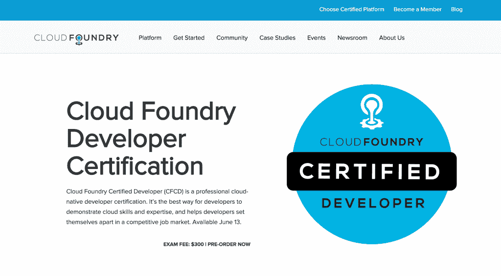

# Cloud Foundry 推出开发人员培训和认证计划

> 原文：<https://thenewstack.io/cloud-foundry-launches-developer-training-certification-program/>

在当前的就业市场上，成为一名软件开发人员就像是在你自己的生日聚会上成为生日男孩或女孩:你是聚会的中心，每个人都想给你礼物。鉴于目前仅在美国就有 50 万个技术岗位空缺——这一数字预计在未来十年将增长到 100 多万个——就业市场只会继续狂欢。

世界各地的企业都需要更多熟练的开发人员。但是，随着越来越多的公司将运营转移到云，他们也需要这些员工拥有坚实的、可展示的云技能和专业知识。为了应对即将到来的开发人员严重短缺，[云铸造基金会](https://www.cloudfoundry.org/)刚刚宣布了一项云原生开发人员认证计划，即“云铸造认证开发人员”计划。

认证项目将与 [Linux 基金会](https://www.linuxfoundation.org/)合作交付，该基金会负责培训和认证的开源软件开发者比世界上任何组织都多。该计划首先通过 [edX](https://www.edx.org/) 平台提供免费的大规模开放在线课程(MOOC ),介绍材料——该课程将于 5 月初上线。简介之后是自定进度的“面向开发人员的云铸造”课程，该课程将涵盖 cert 测试细节，费用为 500 美元。认证考试本身需要四个小时才能完成，可以花 300 美元在线参加。(课程和考试基础设施都是由 Linux 基金会提供的)。任何通过基于绩效的评估的人都将获得官方的 Cloud Foundry 认证开发者文凭。

Cloud Foundry 首席执行官 Abby Kearns 在 3 月 29 日宣布该计划之前表示,“该计划帮助负担过重的开发人员，他们在增加的工作量和更短的生产时间之间进退两难，这是一种提升技能和跟上新行业实践的有效方法。她补充说，该培训旨在提供“构建运行在 Cloud Foundry 上的软件的动手实践经验”，同时允许开发人员在如何响应公司内部和客户要求方面有更多的自由。

认证考试的候选人应该有构建在 Cloud Foundry 上运行的软件的实践经验。考试涵盖的主题包括:

*   云铸造基础。
*   云原生架构原则。
*   Cloud Foundry 上的故障排除应用程序。
*   云原生应用安全性。
*   在 Cloud Foundry 中使用服务。
*   云铸造的应用管理。
*   Cloud Foundry 中的容器管理。
*   能够修改简单的 Java，Node.js 和 Ruby 应用程序。

卡恩斯说，这是一个庞大的清单，但即使对那些相对较新的技术人员来说，也是完全可行的。虽然有经验的开发人员可以直接参加复习课程和认证考试，但 Cloud Foundry 为那些仍处于软件职业生涯早期的人提供支持。新人可以从免费的 intro MOOC 开始，然后在 Cloud Foundry 平台和连续交付方法学方面获得一些实际操作经验，然后再参加考试。

“我遇到了一个开发人员，他是实习生，最近是学生，他正在使用 Cloud Foundry，但还没有完全掌握它，”Kearns 报告说。“他说我们网站上的培训材料在他起床跑步时证明非常有用。”

全球超过 12 家领先的技术、教育和系统集成组织(包括 EngineerBetter、IBM、Pivotal、Resilient Scale、SAP 和 Swisscom)将为其员工提供培训，以获得云铸造开发者认证。卡恩斯说，更多的公司渴望通过认证，作为知识和能力的行业基准。

她说，认证计划在一定程度上是由 2016 年 11 月 Cloud Foundry 调查的结果推动的，该调查询问了全球 900 名 IT 员工。该报告显示，由于非科技公司雇佣内部开发人员的需求持续上升，合格云开发人员的供需缺口正在扩大。离散(即云)技术的需求最大，超过了对精通某些特定语言的移动应用程序开发人员和编码人员的第二和第三名需求。

卡恩斯说，在这两种情况下，“公司表示培训是解决技能短缺的首选解决方案，超过 60%的公司声称培训现有员工比雇佣新人才和外包更好。”

财富 100 强医疗保健公司 [Express Scripts](http://lab.express-scripts.com/) 的工程和云战略总监 Brian Gregory 对此深表赞同。他说:“Cloud Foundry 认证开发者计划将为社区带来巨大的价值。他继续说，在 Express Scripts 迁移到 Cloud Foundry 后，公司看到了“生产力和业务成果的大幅提升。”事实上，以至于他们不能足够快地雇佣开发人员——事实上，他们目前的目标是雇佣 1000 名新的开发人员。

Gregory 说:“了解一名开发人员获得了 Cloud Foundry 认证可以简化我们的招聘流程，并有助于确保我们带来合格的候选人。

其他公司，包括一些真正的巨头公司，在采用云铸造技术后，也享受了类似的加速增长曲线。例如，Cloud Foundry Foundation 报告称，Comcast 将其应用程序的上市时间缩短了 75%。HCSC 是一家由客户拥有的大型健康保险公司，它能够将应用程序开发周期缩短一个数量级。“我们花了 15 个月的时间用老方法开发了一个移动应用；新方法花了 14 周，”一名 HCSC 工程团队经理向基金会报告。

因此，最终，Cloud Foundry 认证开发人员身份对雇主和开发人员都具有重要价值。基于技能的认证虽然不容易获得，但表明软件开发人员可以跳上船直接开始工作。公司可以验证求职者是否拥有跨任何发行版的实际云计算平台。(证书覆盖 2017 个认证平台，包括[华为 FusionStage](http://e.huawei.com/us/solutions/technical/cloud-computing) 、 [IBM Bluemix Cloud Foundry](https://www.ibm.com/cloud-computing/bluemix/) 、 [Pivotal Cloud Foundry](https://pivotal.io/platform) 、 [SAP 云平台](https://cloudplatform.sap.com/index.html)和 [Swisscom 应用云](https://www.swisscom.ch/en/business/enterprise/offer/cloud-data-center-services/paas/application-cloud.html))。培训材料也可以获得许可，允许 Cloud Foundry Foundation 成员通过他们自己的员工和客户培训渠道提供内容。

卡恩斯将开源和云模型给商业带来的变化与前几个世纪铁路和国家公路基础设施带来的前所未有的增长进行了比较。

Kearns 说:“正如这些项目改变了这个国家一样，一般来说，云，特别是云铸造，正在改变企业，进而改变整个行业。”“开发者现在是这种变化的主要引擎。”

Cloud Foundry 开发人员认证考试将于 6 月 13 日开始在线提供。该考试还将于 6 月 13 日至 15 日在硅谷举行的云计算铸造峰会上进行。报名参加会议时注册现场认证的人员将获得折扣。捆绑和批量定价购买可享受折扣。如需了解该系列产品的详细信息，请访问[认证主页](https://www.cloudfoundry.org/training/)。

[云铸造基金会](https://www.cloudfoundry.org/)是新堆栈的赞助商。

<svg xmlns:xlink="http://www.w3.org/1999/xlink" viewBox="0 0 68 31" version="1.1"><title>Group</title> <desc>Created with Sketch.</desc></svg>