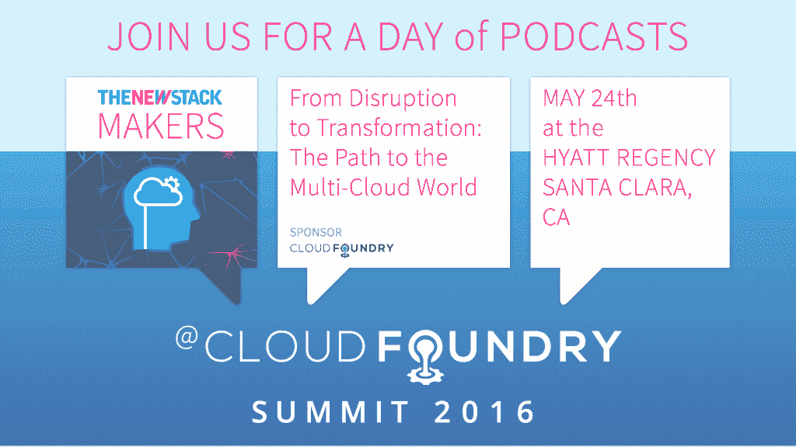

# 透视 Cloud Foundry 的过去、现在和未来

> 原文：<https://thenewstack.io/cloud-foundry-past-present/>

Cloud Foundry 已经迅速成为大规模开发应用程序的事实上的解决方案之一。随着公司继续采用多平台方法进行开发， [Cloud Foundry](https://www.cloudfoundry.org/) 为开发人员提供了一个平台，他们可以在此基础上构建应用，而无需在谷歌云平台、微软 Azure 或亚马逊 AWS 上部署应用时重新创建轮子。

在本期 [The New Stack Makers](/tag/the-new-stack-makers/) 播客中，您将听到 Cloud Foundry 在多云应用开发方法、容器方面的一些核心价值，以及 Cloud Foundry 希望如何帮助改善 OpenStack 和开源社区。New Stack 创始人 Alex Williams 和执行主编 Joab Jackson 采访了云铸造技术副总裁 [Chip Childers](https://twitter.com/chipchilders) 和云铸造行业战略副总裁 [Abby Kearns](https://twitter.com/ab415) ，听听他们的想法。

[OpenStack Austin:访谈——芯片儿童&艾比·卡恩斯，云代工厂](https://thenewstack.simplecast.com/episodes/openstack-austin-interview-chip-childers-abby-kearns-cloud-foundry)

这段对话也可以在 YouTube 上[收听。](https://youtu.be/F2lWbZueIYA)

毫不迟疑地，Childers 提供了对 Cloud Foundry 过去和未来的深刻见解。

“Cloud Foundry 在 Docker 之前就有容器，它们是平台的一个特性。我们真的很兴奋，当行业赶上来，商业活动开始发生时，我们已经看到人们如何看待运行数据中心和应用程序的许多架构变化，标准化过程开始变得有价值，”Childers 说。

Cloud Foundry 的 [Warden](https://github.com/cloudfoundry/warden/tree/master/warden) 最初利用 [LXC](https://linuxcontainers.org/lxc/introduction/) (Linux 容器)的力量来驱动其后端，尽管它后来创建了一个基于 C 的工具来过渡到远离 LXC。除此之外，Childers 继续强调了 Cloud Foundry 在容器方面的未来利益，指出该公司正在实施 RunC 作为其平台的一部分。

卡恩斯强调了通过诸如 [RunC](https://runc.io/) 等入职工具实现标准化的需求，并指出随着技术的不断进步，公司的需求也将随之变化。如果在使用容器或堆栈的任何部分时没有一个可靠的标准化形式，开发人员可能会发现自己面临重大问题。

Kearns 在 13 分钟的演讲中解释道:“随着越来越多的组织建立和实施管道，在应用程序开发方面取得了显著的速度，他们的需求在两年后将会非常不同，因为他们将需要不同的东西。

虽然一些 PaaS 提供商可能会受到闪亮对象综合症的影响，但 Cloud Foundry 试图将重点放在整个社区以及如何最好地改善其不断增长的生态系统上。“这是关于了解其他社区，并与他们进行对话。谈论想法和要求，以及如何在生态系统中最好地解决这些问题。我们正在与建造 RunC 的工程师合作，我们对与 CNCF 在其他领域的合作充满希望，”Childers 说。

Childers 接着强调了 Cloud Foundry 回馈社区的领域，包括该公司对其与[云原生计算基金会](https://thenewstack.io/cloud-native-computing-foundation-seeks-clarity-world-container-confusion/)的合作保持乐观，其加入 RunC，以及即将于 2016 年 5 月 23 日至 25 日在加州圣克拉拉和 9 月 26 日至 28 日在德国法兰克福举行的[云铸造峰会。](https://www.cloudfoundry.org/events/)

对于那些参加圣克拉拉峰会的人来说，请到新的 Stack 展台参观，并加入我们 5 月 24 日全天的播客活动:

Cloud Foundry 和 Docker 是新堆栈的赞助商。

特征图像(从左至右):亚历克斯威廉姆斯，约阿布杰克逊，芯片 Chip Childers，艾比卡恩斯。

<svg xmlns:xlink="http://www.w3.org/1999/xlink" viewBox="0 0 68 31" version="1.1"><title>Group</title> <desc>Created with Sketch.</desc></svg>