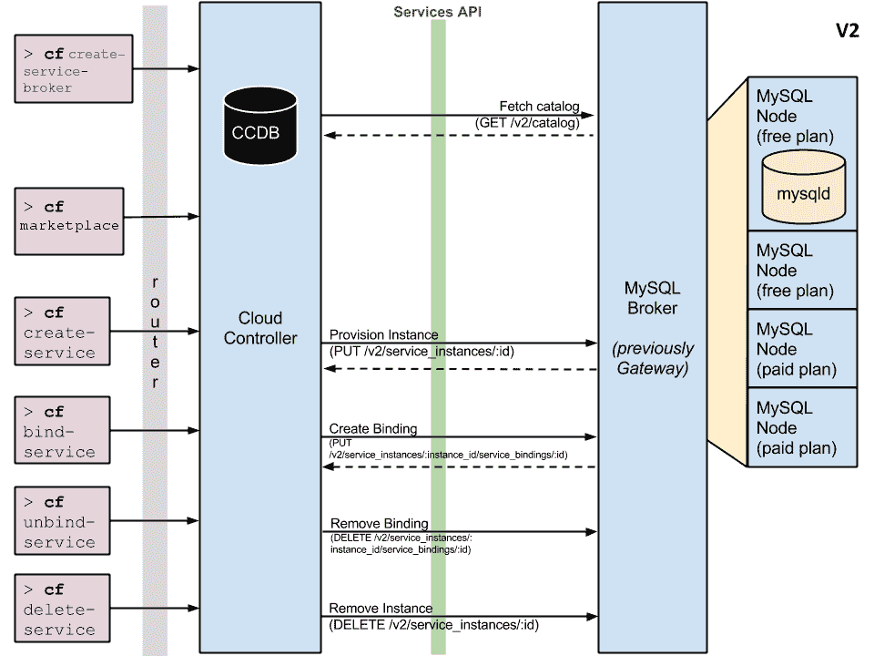
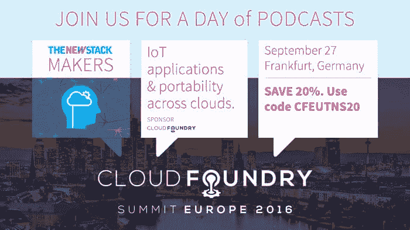

# Cloud Foundry 在 Kubernetes 和开源平台中的服务代理 API 角色

> 原文：<https://thenewstack.io/cloud-foundrys-service-broker-api-role-in-kubernetes-and-open-source-platforms/>

[Chip Childers](https://www.cloudfoundry.org/)

[Chip Childers 是云铸造基金会的技术副总裁。在来基金会之前，Chip 是 CumuLogic 的产品战略副总裁。他在服务提供商行业担任工程领导职务超过 15 年，包括与 SunGard Availability Services 和 Qwest Solutions 合作。他是分布式管理任务组的董事会成员，也是 Apache 软件基金会的成员。](https://www.cloudfoundry.org/)

那些密切关注 Kubernetes 社区工作的人可能已经注意到，一个新的特别兴趣小组(SIG)已经成立[，以将对 Cloud Foundry Service Broker 功能的支持引入该平台](https://groups.google.com/forum/m/#!topic/kubernetes-dev/Q1MrqYhsOxM)。

您可能不知道的是*云铸造社区一直在努力帮助实现这一点。*

是的，你没看错。

那么[Cloud Foundry Service Broker API](https://github.com/openservicebrokerapi/servicebroker/blob/v2.12/spec.md)到底是什么？可以把它看作一个清晰的抽象，它允许“服务”公开一个功能目录，以及创建、使用和删除这些服务的能力。为了让这个有意义，单词“服务”需要更多的定义。我们认为服务是应用程序获得各种功能所依赖的任何软件或系统，无论是作为外部依赖项还是提供给应用程序的平台级功能。

## Cloud Foundry 的服务代理 API

这个想法最初是在 2011 年 VMware 开源 Cloud Foundry 时提出的。当时，有五种“固定”服务提供给部署到 Cloud Foundry 的开发人员:MySQL、PostgreSQL、RabbitMQ、MongoDB 和 Redis。开发人员的体验保持在一组简单的操作上:创建、绑定、解除绑定和删除。这种简单明了的抽象被证明对于将应用部署到 Cloud Foundry 的开发人员非常有效，但是内部实现并不像团队希望的那样清晰。

2013 年，Cloud Foundry 内的 service broker API 实现被完全重写。API 的 2.0 版本解决了最初方法中观察到的许多实现问题，转变为清晰的“客户机/服务器”模型。从这一点开始，Cloud Foundry 云控制器(Cloud Foundry 控制平面的大脑)就是 API 的客户端。单个服务变成了服务器端的实现。这使得服务既可以完全独立于 Cloud Foundry 平台实现，也可以在平台内部实现。

随着 v2 API 的不断发展，功能上最大的飞跃之一是添加了一个[异步服务供应工作流](http://docs.cloudfoundry.org/services/api.html#asynchronous-operations)。在添加异步功能之前，服务代理需要在很短的时间内完成新服务实例的供应，否则用户会面临收到超时错误的风险。

【T2

虽然 Cloud Foundry 中服务的最初用例仅限于为应用程序提供对数据库和消息队列实例的访问，但 v2 API 的引入和快速发展已经带来了大量新的真实用例。Cloud Foundry 社区很快开始为从基于云的服务(例如 orchestrate.io)到遗留系统 API 桥的所有东西创建 service broker 实现。

service broker API 还被证明有助于向应用程序添加平台层功能，最好的例子是向 Cloud Foundry 添加了[路由服务](https://docs.cloudfoundry.org/services/route-services.html)。我们甚至已经开始看到像谷歌和微软这样的大型云提供商通过 API 公开他们的本地平台功能。这种不断增长的服务提供商生态系统已经迅速成为考虑采用 Cloud Foundry 等平台的组织的主要吸引力之一。

## 这与 CNCF 和库伯内特有什么关系？

今年早些时候，我们注意到一些有趣的事情。像 [Deis](http://deis.io/) 这样的项目开始考虑公开采用 Cloud Foundry Service Broker API。我们发现自己在围绕其他平台如何能够更有效地与 Cloud Foundry 集成的多次非正式对话中。我们知道正在出现一个帮助整个行业的机会。

在过去的六个月里，[云铸造基金会](https://www.cloudfoundry.org/)和来自 Pivotal 的云铸造项目负责人一直在与来自 Google、Engine Yard 和 Red Hat 等组织的团队密切合作，以及与在[云本地计算基金会](https://www.cncf.io/)和云铸造基金会从事项目的工程师合作的几个组织。像 IBM、富士通等公司都积极参与其中。这些努力打着两个基金会之间非正式“工作组”的幌子。你在 Kubernetes 社区看到的是，这种努力开始在物质方面结出果实。

在 Cloud Foundry 社区中，我们相信我们正在开源平台领域玩[正和游戏](https://www.linux.com/news/everyone-wins-open-source-software)。帮助一个人的，帮助所有人。我们真诚的愿望是，通过提供 Cloud Foundry Service Broker API 作为行业标准，我们可以帮助每个人显著增加集成机会。最终，我们的共同使命是通过创建软件和平台来更快更好地交付应用，从而推动行业发展。

[云本地计算基金会](https://www.cncf.io/)和[云铸造基金会](https://www.cloudfoundry.org/)是新堆栈的赞助商。

通过 Pixabay 的特征图像。

<svg xmlns:xlink="http://www.w3.org/1999/xlink" viewBox="0 0 68 31" version="1.1"><title>Group</title> <desc>Created with Sketch.</desc></svg>