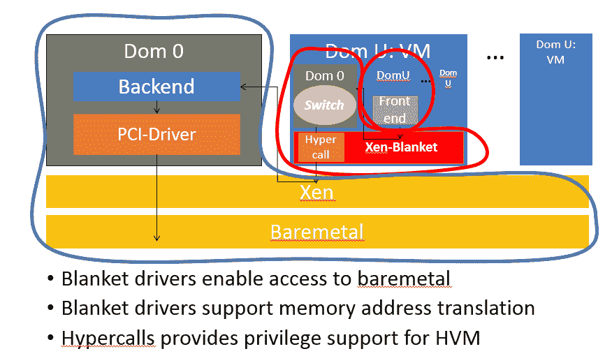

# 针对地理位置不断变化的工作负载的云移动性

> 原文：<https://thenewstack.io/cloud-mobility-for-geographically-shifting-workloads/>

[Futurewei](https://www.futurewei.com/) 赞助本帖。

 [哈基姆·韦瑟斯普

Hakim 是 Exotanium，Inc .的首席执行官和联合创始人。他是康奈尔大学计算机科学系的副教授，也是康奈尔大学数字农业计划(CIDA)的副主任。他在加州大学伯克利分校获得博士学位。他是 USENIX 董事会的副总裁，也是 ACM 云计算研讨会的指导委员会成员。](https://www.linkedin.com/in/hakim-weatherspoon-0592063/) 

不同云提供商之间的不兼容会导致供应商锁定问题。例如，亚马逊弹性计算云(EC2)和微软 Azure 构建在不同的虚拟机管理程序(分别是 Xen/KVM 和 Hyper-V)之上，它们使用不同的虚拟机(VM)映像格式。这反过来又迫使用户采用临时部署策略来容忍云故障，并限制了他们跨不同云进行工作负载迁移和资源扩展等活动的能力。

云提供商之间的不兼容性和供应商锁定使得无法将虚拟机工作负载从一种虚拟机管理程序实时迁移到另一种虚拟机管理程序。云提供商还为存储等基础设施提供不同的接口，并且不支持不同云中的虚拟机之间的联网。因此，应用程序被锁定在一个特定的云中，这使得使用来自多个云提供商的资源变得非常困难。

以下部分简要介绍了云移动性的可能用例场景，以及主要挑战。然后，我们将描述我们的创新技术方法，用于无缝解决这些与云移动性相关的挑战。

## 主要挑战–使用案例

### 将传统应用迁移到公共云

 [熊英

应是云实验室的负责人和未来微科技的技术副总裁。他在 MUSC 获得了计算机和信息系统博士学位。他目前的研究兴趣包括云计算和边缘计算和虚拟化、大规模资源调度和管理、高性能虚拟网络以及用于优化 ML 应用的 AI 平台。他是云计算原生计算基金会(CNCF)的董事会成员。](https://www.linkedin.com/in/ying-xiong-59a2482/) 

作为正在进行的数字化转型的一部分，企业正在努力实现云优先的方法。这些客户目前深陷于自己的数据中心环境中，正在努力提高业务灵活性。在不做任何更改的情况下迁移遗留应用程序资产将消除向云过渡的障碍，并将大大加快时间表。在开发新的绿地应用程序时，很容易实现“云优先”，但如何让运行在数据中心的核心业务应用程序(即所谓的棕地应用程序)轻松高效地迁移到云中呢？

例如，考虑一个三层传统应用程序堆栈，其中应用层在 KVM VM 环境中运行，数据库层在 VMWare ESX 环境中运行，公共云是基于 KVM 的环境。作为提升和转移一次性迁移方案的一部分，一个关键挑战是将运行应用程序堆栈的第一层虚拟机无缝离线迁移到公共云作为第二层虚拟机。这种迁移到公共云环境的场景的性能开销必须相当小，这一点非常重要。

### 混合云—传统应用的云爆发

作为数字化转型的一部分，公共云提供商专注于将企业客户过渡到云计算环境。云爆发是一个重要的用例。在这种模式下，一旦原始客户数据中心的可用资源超过某个阈值限制，虚拟机中的工作负载就会从企业数据中心突发到云提供商环境。通常，在混合云环境中采用实时虚拟机迁移机制，因此不需要关闭任何东西。

例如，假设客户数据中心正在 VMWare ESX 第一层虚拟机中运行基于特定版本 Linux 的应用程序。另一方面，公共云可能使用 KVM 或 Xen 作为底层虚拟机管理程序环境。作为混合云场景的一部分，关键挑战是在企业客户数据中心出现资源高峰时，应用程序的无缝实时虚拟机迁移。同样，性能开销需要很小，迁移需要实时进行，迁移时间也需要相当短。

### 多云场景

对于希望在多个云提供商之间迁移其遗留工作负载的跨国企业来说，多云选项可能是无价的，原因包括云提供商数据中心距离其最终用户较近，以符合地区或国家法规。

值得注意的是，应用不仅可以无缝迁移到公共云提供商环境(实时虚拟机迁移，零感知停机时间)，还可以跨其他云提供商迁移，如 Amazon EC2、Google Compute Engine (GCE)等。在虚拟机不运行的情况下，实时迁移有一个停止并复制阶段，但该阶段应足够短，以确保网络 TCP 连接不会中断。

## Xen-Blanket–创新的使能技术

Xen-Blanket 最初由康奈尔大学进行研究，现在由 [Exotanium](http://exotanium.io/) 开发和支持，是一项应对上述云移动性挑战的使能技术。Xen-Blanket 提倡以用户为中心的*观点，即用户能够在任何云上运行他们未经修改的虚拟机，而无需任何特殊的提供商支持。Xen-Blanket 是一个瘦的、可立即部署的虚拟化层，它使当今多样化的云基础架构变得均匀。它以 Xen-Blanket 虚拟机管理程序的形式使用嵌套的机器虚拟化，在虚拟设备和虚拟机映像中提供一致性。嵌套虚拟化解决了异构性问题，例如不同的虚拟机监视器和映像表示，以及硬件上的微小差异。*

Xen-Blanket 运行在各种广泛支持的硬件虚拟化虚拟机(HVM)上，并提供半虚拟化(PV)环境来运行(第二层)来宾虚拟机。Xen-Blanket 利用 Xen 上的 PV-on-HVM 驱动程序、KVM 上的 virtio 驱动程序和 Hyper-V 上的开明 I/O 驱动程序来优化性能。它使底层(异构)基础架构变得透明，并对第二层来宾虚拟机表现为同构 Xen 环境。关键是用户不仅可以控制第二层来宾虚拟机，还可以控制第二层 Xen-Blanket 虚拟机管理程序，从而实现“用户控制”的云环境。

### 将传统应用迁移到公共云

使用 Xen-Blanket 技术，客户的基于 ESX 的虚拟机可以轻松迁移到公共云环境，并在基于 Xen 或 KVM 的公共云环境中作为 Xen-Blanket 之上的第二层虚拟机运行，同时将性能开销降至最低-Xen-Blanket 支持将第一层虚拟机作为第二层虚拟机从 VMware 环境提升到公共云。

### 混合云—传统应用的云爆发

在这个特定的使用案例中，客户数据中心在 VMWare ESX 第一层虚拟机的 Xen-Blanket 之上的第二层虚拟机中运行基于特定 Linux 版本的应用程序。另一方面，公共云可能使用 KVM 或 Xen 作为底层虚拟机管理程序环境，并在第一层虚拟机中安装了 Xen-Blanket。使用 Xen-Blanket 作为底层技术展示了以最小的性能开销跨混合云环境实时迁移虚拟机的能力。

### 混合云—传统应用的云爆发

在这个特定的用例中，客户在 Xen-Blanket 之上的公共云环境中运行基于特定版本 Linux 的应用程序。使用 Xen-Blanket 作为底层技术展示了以最小的性能开销将应用程序堆栈的虚拟机从一个公共云无缝迁移到另一个公共云的能力。

## 技术协作

Futurewei 的云实验室和 Exotanium 合作开发了这个技术项目。这个项目的所有工件都开源到下面的公共 Github 库，希望其他人也能为开发工作做出贡献:

通过 Pixabay 的特征图像。

目前，新堆栈不允许直接在该网站上发表评论。我们邀请所有希望讨论一个故事的读者通过 [Twitter](https://twitter.com/thenewstack) 或[脸书](https://www.facebook.com/thenewstack/)访问我们。我们也欢迎您通过电子邮件发送新闻提示和反馈: [feedback@thenewstack.io](mailto:feedback@thenewstack.io) 。

<svg xmlns:xlink="http://www.w3.org/1999/xlink" viewBox="0 0 68 31" version="1.1"><title>Group</title> <desc>Created with Sketch.</desc></svg>