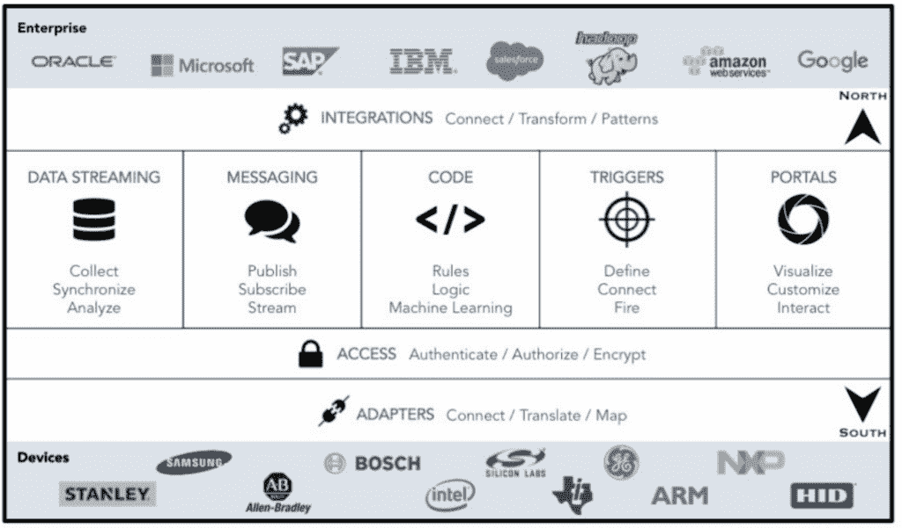
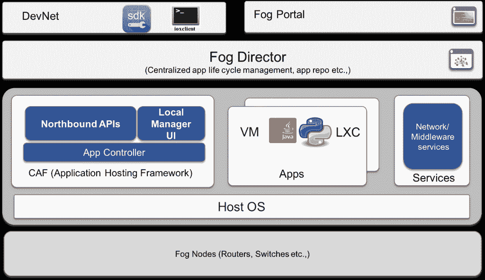
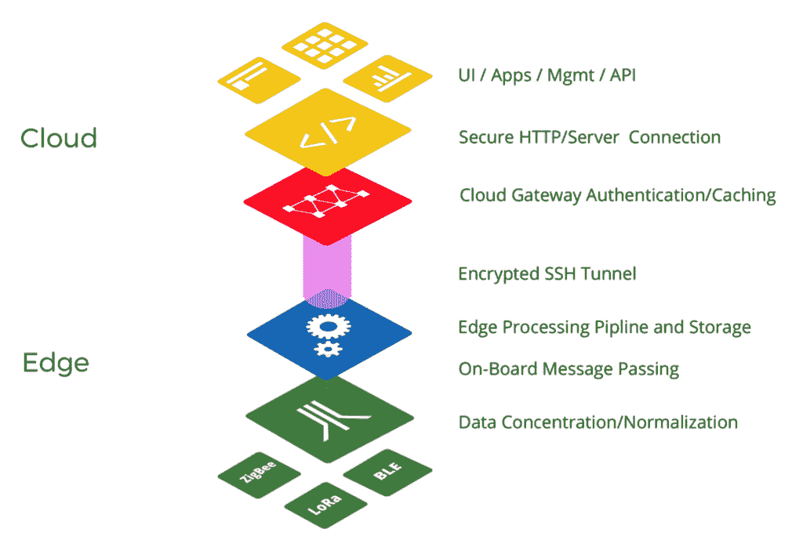

# 云不起作用的地方:工业物联网的机器学习

> 原文：<https://thenewstack.io/cloud-model-wont-work-preparing-ml-industrial-iot/>

一场静悄悄的竞赛正在进行，以建立工业物联网(IoT)所需的基础设施。人们普遍认为云模型[无法实时管理传感器数据](https://thenewstack.io/hpe-orchestrates-internet-things-edge/),因此硬件和网络提供商正争先恐后地发展他们的技术，并与工业客户签约，进行边缘处理的试点和早期实施计划。

比赛的第一阶段正在进行中，目前的重点是在位于现场(工厂、工作场所、城市、农场和建筑物)的硬件网关上实现边缘处理。为了做到这一点，许多人正在利用 Dockerized 容器(和[摩尔定律](https://thenewstack.io/farewell-moores-law/))来进行更强大的数据处理。一旦这个基础设施有了更多的健壮性，在边缘引入[机器学习](/category/machine-learning/) (ML)将引发第二波竞赛。

## 工业物联网中的边缘处理

在物联网架构中，传感器将以秒和微秒的间隔实时收集数据。

在制造业和采矿业，传感器可能会测量机器和平台的振动和噪声水平，或者监控煤气或水的泄漏。在精准农业中，传感器获取温度、风速、土壤湿度和湿度读数。在智能城市的实施中，传感器正在记录公共照明下的行人运动，检查停车位空缺，并跟踪交通流量。

所有这些场景都涉及到传感器每分钟甚至每秒钟获取多个读数，建立一大堆大部分无用的数据点，偶尔还有可操作的指标。在大多数情况下，传感器确认读数没有变化或变化在正常范围内。但偶尔它们可能会指示平台振动处于不安全水平，漏水正在发生，土壤干燥，或停车场刚刚腾空。当这些传感器读数出现时，传感器需要发出警报并采取行动:关闭一台设备，发出警报，打开喷水灭火系统，或更新 GPS 地图。

物联网数据科学家 [Ajit Jaokar](https://twitter.com/AjitJaokar) 和实施企业人工智能课程的召集人写道，典型工业用例中传感器的庞大数量意味着用数据读数 ping 云是没有用的。“一辆典型的一级方程式赛车携带 150-300 个传感器……目前的空客 A350 型号有近 6000 个传感器，每天产生 2.5 Tb 的数据。一个城市(例如，西班牙的智能城市桑坦德)包括一个由 25000 多个传感器组成的网络，”乔卡尔[T5指出。](http://www.kdnuggets.com/2016/09/evolution-iot-edge-analytics.html)

相反，边缘处理(有时也称为“雾计算”)允许传感器将读数发送到具有某种处理能力的硬件网关，该硬件网关充当传感器集群的中枢，并能够确定接收到的任何数据是否值得采取行动。

## (边缘处理的)时间快到了

虽然“边缘加工”一词已经推广了一年左右，但事实是，直到去年最后一个季度，行业才开始转变态度，开始认真对待边缘加工。

物联网平台 [ClearBlade](http://clearblade.com) 的首席技术官 Aaron Allsbrook 表示，直到去年 10 月或 11 月，市场才真正围绕边缘处理发生转变。

“亚马逊宣布推出绿草产品，这有助于获得市场资格。当一个大玩家帮助定义空间时，这总是有帮助的，”Allsbrook 解释道。在 ClearBlade，他说他的大多数企业客户已经完成了某种形式的物联网试点，评估了市场上的平台，并根据他们在试点阶段学到的知识开始实施新的部署。他举例说，在一个案例中，一个拥有工厂和仓库的客户现在将边缘视为其传感器基础设施的解决方案，知道他们不能在云中做所有事情。

“大多数人现在正在做的模型涉及运行在网关硬件上的绑定代理，”Allsbrook 说。“但我们在物联网平台中使用的堆栈利用了消息传递和编写 API。我们正在降低数据存储、安全模型、API 层和消息代理，并且可以在网关层执行这些功能。”

ClearBlade 认为物联网平台堆栈将使边缘处理成为可能

Allsbrook 认为，许多人认为边缘处理的问题在于，只是将传感器连接到网关，并在那里拥有一些处理能力，以决定哪些数据存储在云中，哪些数据更紧急，需要立即采取行动。但他表示，对于工业基础设施来说，这太短视了。

“人们试图将工厂连接起来，并将核心流程与工厂连接起来。他们必须能够自我控制。如果没有带全栈，就无法执行。您需要所有的规则都在附近，并且您希望获得 10 毫秒以下的延迟。您不能在那里设置足够的安全性，您需要在任何数据离开网关之前拥有完整的设备配置文件。”

## 码头工人在边缘

更大的竞争对手和初创公司正在展开正面竞争，以构建物联网边缘处理基础设施。大型网络提供商正在与较新的硬件制造商合作，并开始关注下一波机器学习初创公司，这种模式有点让人想起银行需要与金融科技初创公司合作才能在数字领域保持竞争力。

例如， [Foghorn Systems](https://foghorn-systems.com/) 直接向客户提供软件平台，并与 GE Predix、微软、思科和戴尔等公司合作。Foghorn Systems 首席执行官[王冠淇](https://www.linkedin.com/in/david-king-587b83122/)说:“90%的边缘数据来去匆匆，除非立即采取行动。”。“基本上，边缘处理有两种模式。首先是尽快将数据放入云中，然后在其上进行所有的分析。第二种方法是在机器旁边放置一个计算层。”

King 说，随着小硬件单元处理能力的提高，意味着他们可以提供两种产品。第一种允许小型复杂事件处理引擎位于网关硬件上。这在通过网关设备上的固件直接安装的插槽容器内运行应用。他说，这可以在风力涡轮机或钻机上运行，例如，直接在传感器位置提供低成本的计算能力。

金说，他的客户中大约有 70%采用这种方法。“他们创建了一个 Linux Docker 应用程序，有时用 Java，但大多数人使用 C++。然后传感器代理将数据带进来，有一个处理层，它有一个高速数据总线，然后是一个复杂的事件处理引擎，以及一个可以运行应用程序的 SDK。它是一个完整的边缘堆栈，有大量实时本地处理，然后智能数据也缓存到云中。”

金说，在另外 30%的病例中，使用的是微型版本。微型版本在 256MB 的硬件上运行，可以放入现有的网关中。他说，这种方法适用于户外环境或没有空间安装网关硬件的机器，如自动机械。

思科发布了他们的 IOx 产品 T1，作为可以在路由器上运行的虚拟机。[思科 DevNet](https://www.linkedin.com/in/jock-reed-7312464/) 的物联网开发者布道者乔克·里德说，IOx 主要用于支持 Docker 容器在边缘运行。“你可以为你想要得到的数据开发一个 Docker 应用程序，”Reed 说。“这样，当您开发应用程序时，您可以将其部署到路由器上的 IOx 主机。”IOx 为路由器提供了更多的计算能力。它用于加速工业用例中的计算处理，并可以在离线时继续运行，这是许多物联网工业实施的一个关键考虑因素，这些实施可能只想每天连接到云一次以进行数据转储，但希望在一天的其余时间仍然能够实时计算和跟踪传感器架构中的数据。

Reed 表示，IOx with [FogDirector](http://www.cisco.com/c/en/us/products/cloud-systems-management/fog-director/index.html) 是一个快速发展的平台，已经能够协调所有边缘设备，并充当边缘处理网关的 DevOps 层。Cisco DevNet 提供并继续[构建远程实验室](https://learninglabs.cisco.com/labs/tags/iox)，为开发人员和合作伙伴提供学习和试验边缘设备和 fog 编排层的能力。

## 将 ML 引入边缘

一些初创公司，如 [VIMOC Technologies](http://vimoc.com/) 已经在边缘引入了机器学习，而其他人则表示，这种需求尚未在工业和企业客户中充分发展。大多数企业目前只是在设置基础架构，并努力让数据收集与复杂的事件处理并行进行，以便跟踪哪些数据需要存储，哪些数据需要立即处理，哪些数据需要丢弃。

[VIMOC Technologies](https://www.linkedin.com/in/tarikhammadou/)的首席执行官兼联合创始人塔里克·哈马杜已经建立了硬件(VIMOC 的 [neuBox](http://vimoc.com/product-2/) 包括传感器和计算层)，以及在云级别运行的硬件无关软件平台，在云级别可以建立应用程序并通过 API 连接到传感器和网关。

“从架构的角度来看，边缘计算非常简单，”Hammadou 说。“但关键是如何有效地在边缘的不同节点之间分配处理，并在边缘执行复杂的任务。节点和云之间的合作是我们在过去三年中面临的主要挑战。”

VIMOC 的传感器和平台已经被停车场用来优化停车位，Hammadou 已经在网关上引入了深度学习算法，以更好地理解正在收集的传感器读数。

“我们正在使用深度学习和车辆分类来优化停车。要精准的做视觉智能，需要车辆识别系统。我们的深度学习能够高度准确地识别车辆何时进入停车场，随着我们在路线图中的前进，我们将能够向车库提供关于进入车库的车辆类型的信息。”

VIMOC Technologies 对边缘处理堆栈的看法

Allsbrook 表示，对于他的大部分客户来说，他们还没有准备好在边缘进行机器学习实验。“我们可以从机器学习算法中学习处理存储在云中的数据，然后在边缘执行我们从中学习的内容，但我们的客户还没有出现。他们将数据从边缘转移到云端，进行这种分析。”

Allsbrook 表示，在很大程度上，行业仍在学习他们的传感器需要收集哪些数据，如何构建这些数据，以及选择哪些算法将有助于理解收集的数据量。

在思科，Reed 和开发者传道者 Amanda Whaley 表示，他们正在确保思科的 IOx 和其他物联网计划能够与开源相关的数据分析方法合作。“我们正在考虑 [PNDA](http://pnda.io) ，一个大数据分析项目，是 Linux 基金会的一部分，[宙斯](https://developer.cisco.com/site/zeus/)，以及与沃森和其他机器学习供应商的个人合作关系，”Whaley 说。

Foghorn 的 King 表示，在户外行业、智能交通管理、停车和零售交通流量中有“大量的用例”，但将 ML 添加到边缘处理中仍需要“两三年的时间”。我们看到的是机器学习是有层次的。在 Foghorn，我们在边缘以毫秒为单位进行处理。这是一种不同类型的预测分析，不同于您从云中进行的预测分析。优势在于实时响应，因此 ML 可能用于优化灯光的工作方式，或者知道何时捕捉实时视频和音频。”

## 2017 年在边缘处理

边缘处理的技术和机器学习方面的进一步发展将在今年加快。虽然有人说硬件限制了创新的新潜力，并且 ML 处理将成为行业增长的主要部分，但思科、Foghorn、ClearBlade 和 VIMOC 正在实施的技术模型表明，在如何最好地配置工业物联网方面，仍有很多东西需要学习。

行业似乎越来越愿意投资实施推广，而不仅仅是试点项目，这可能有助于定义和巩固今年的边缘处理市场。更重要的是，只有当企业开始将数据放入云中的训练模型时，他们才会开始明白 ML 处理将能够在边缘完成。

<svg xmlns:xlink="http://www.w3.org/1999/xlink" viewBox="0 0 68 31" version="1.1"><title>Group</title> <desc>Created with Sketch.</desc></svg>