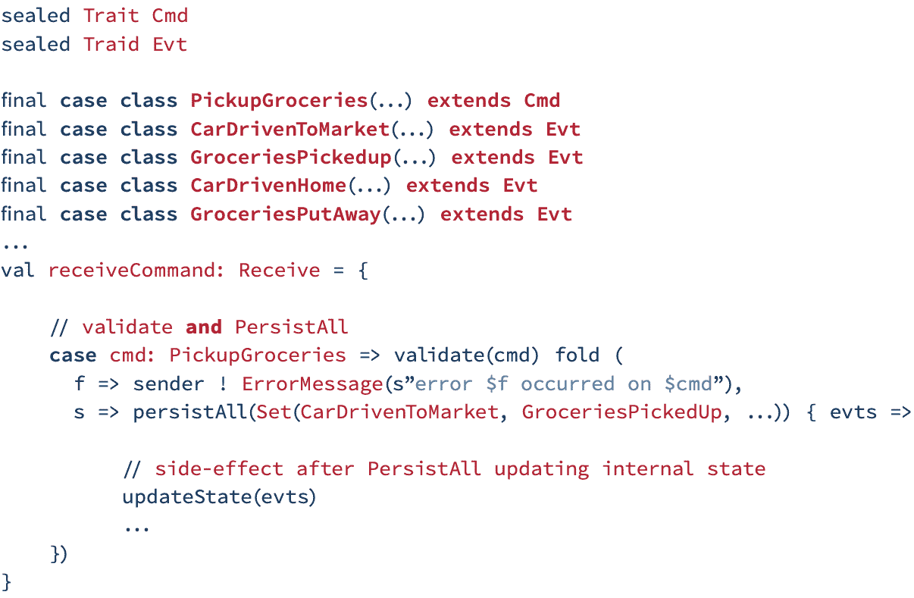
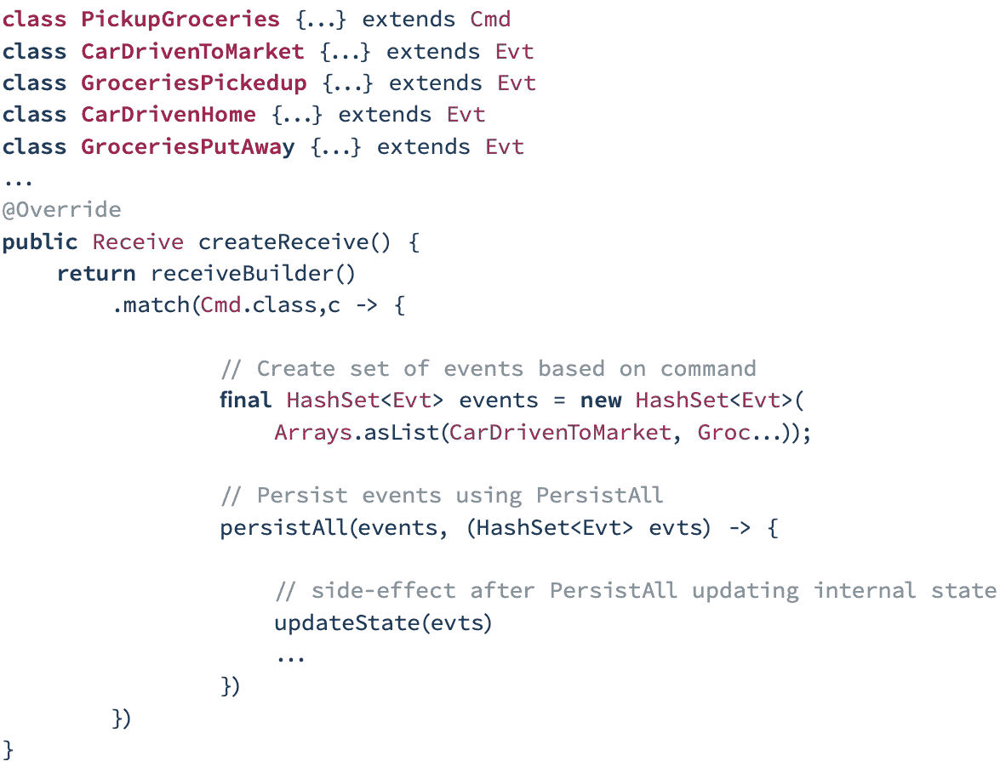
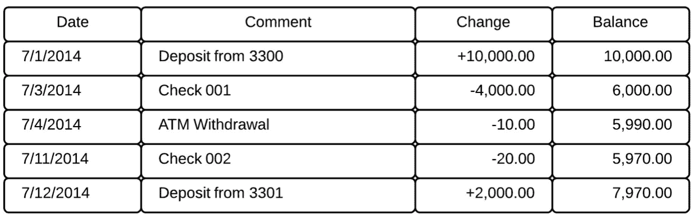

# 云原生应用程序:实现有状态消息传递

> 原文：<https://thenewstack.io/cloud-native-applications-implementing-stateful-messaging/>

[Lightbend](https://www.lightbend.com/) 赞助了这篇文章。

 [肖恩·沃尔什

Sean 是 Lightbend 的首席产品宣传员和现场首席技术官。他还是反应式应用程序开发(Manning Publications)的合著者。](https://www.linkedin.com/in/sean-walsh-b9672a6/) 

我们在这里使用的“原生云”的定义意味着友好和优化的分布式计算环境。这种环境的关键特征是弹性和复原力，以及同步(点对点)、异步和并行通信。反应式消息传递基础设施提供松耦合设计，这对于分布式计算至关重要。在本帖中，我们将探讨消息为何如此重要，并揭示如何将消息类型、事件源和命令查询责任分离(CQRS)应用于云原生应用。

## 什么是消息？

首先，让我们定义什么是消息。[维基百科有一个很好的定义](https://en.wikipedia.org/wiki/Message):“消息是一个离散的通信单位，由消息来源提供给一些接收者或接收者群体使用。”我们还将为这个定义添加一条额外的关键信息:分布式系统中的消息必须是不可变的。

现在我们有了一个可行的定义，让我们来看看我们将要探索的不同类型的消息:

*   命令
*   事件(声明性/历史性)
*   询问(问题)

您选择的消息类型或消息模式将直接影响您的应用程序的行为。

### 查看命令(命令式)

命令在本质上是命令性的，代表来自“某处”的做“某事”的请求。“某事”经常导致请求改变“某处”的状态因此，可以拒绝命令。此外，一个命令如果有效，通常会被转换成一个或多个事件。例如:

**Scala 中的命令**

**Java 中的命令**

通常，一个命令遵循 VerbNoun 格式，比如我们上面看到的 PickupGroceriesas。

### 查看事件(陈述性/历史性)

另一方面，事件是声明性的。它们代表“某事”已经发生。它们在本质上是历史性的。在上面的例子中，我们看到在处理一个有效的 pick up 杂货命令时，生成了四个事件:CarDrivenToMarket、GroceriesPickedup、CarDrivenHome 和 GroceriesPutAway。您还会注意到，事件的结构与 command 相反:NounVerb。关于一个事件另一件要注意的事情是，由于它们的声明性，它们不能被否认。

事件本质上应该是原子性的，并代表一种针对域集合的状态形式。

**账户注册示例**

理解事件源的最佳方式之一是查看银行帐户注册的典型示例。在成熟的商业模型中，跟踪行为的概念非常普遍。例如，考虑一个银行会计系统。客户可以存款、开支票、从 ATM 机取款以及将钱转到另一个账户。

在上图中，我们看到了一个典型的银行账户注册。账户持有人首先向账户存入 10，000.00 美元。接下来，他们开了一张 4，000 美元的支票，在自动取款机上取款，再开一张支票，最后存款。我们将每个事务作为一个独立的事件来保存。为了计算余额，将当前交易的增量应用于最后一个已知值。因此，我们有一个可验证的审计日志，可以对其进行协调以确保有效性。任何时候的当前余额都可以通过重放到该点为止的所有交易来获得。此外，我们已经掌握了账户持有人管理其财务的真正意图。

### 查看查询(问题)

查询类似于命令，因为它们是对信息的请求。查询不会改变状态，所以它们通常不会导致事件。但是，如果需要对查询预测进行审核，或者需要所有执行的查询的日志，它们可能会导致事件。查询通常依赖于同步或点对点通信(不是必需的)，而命令/事件通常使用异步的“一劳永逸”通信。

## 基于消息的抽象—事件源

正如我们所讨论的，事件源提供了一种方法，通过这种方法我们可以捕捉用户的真实意图。在事件源系统中，所有的数据操作都被视为一系列事件，这些事件被记录到一个只加存储中。这种模式可以通过以下方式简化复杂领域中的任务:

*   避免同步数据模型和业务领域的需求。
*   提高性能、可扩展性和响应能力。
*   为交易数据提供一致性。
*   维护完整的审计跟踪和历史记录，以便采取补救措施。

要了解更多信息，请查看这篇关于使用事件源来克服分布式系统的复杂性和 CAP(一致性、可用性、分区)定理的文章。

## 基于消息的抽象—命令查询责任分离(CQRS)

命令查询责任分离(CQRS)是一种模式，通过这种模式，我们可以使用单独的接口将读取数据的操作与写入数据的操作分离开来。这种模式可以:

*   最大限度地提高性能、可扩展性和安全性
*   通过更高的灵活性支持系统随时间的演进
*   防止写入(更新命令)导致域级别的合并冲突。

这个模式实现了两条不同的路径:命令端(写)和查询端(读)。在大多数情况下，这些都是独立的微服务，运行在它们自己的 JVM 上。

## 为什么在基于消息的系统中一致性是明确的

在设计传统的单体系统时，一致性常常被认为是理所当然的，因为您有连接到中央数据库的紧密耦合的服务。这些类型的系统默认具有很强的一致性，因为对于给定的服务，只有一条到数据存储的路径——而且这条路径本质上是同步的。

然而，在分布式计算中，情况并非如此。按照设计，分布式系统是异步的、松散耦合的，并且依赖于原子共享内存系统和分布式数据存储等模式来实现可用性和分区容差。因此，正如 CAP 定理所指出的，强一致性系统不能作为一个整体连续系统来分配。

一致性强的系统可以分布式。他们只需要使用一些东西来协调他们的工作，比如分布式原子提交或分布式共识。显然，这强调了 CAP 的一致性，而可用性和分区却大打折扣。

## 一致性模型

在分布式计算中，如果操作遵循由模型识别的特定规则，则系统支持给定的一致性模型。该模型规定了程序员和系统之间的契约协议，其中系统保证如果遵循规则，存储器将是一致的，并且结果将是可预测的。

### 最终一致性

最终一致性是分布式计算中使用的一致性模型，它非正式地保证如果没有对给定数据项进行新的更新，最终对该项目的所有访问将返回最后更新的值。最终一致性是分布式系统的一个支柱——通常被称为乐观复制——起源于早期的移动计算项目。

一个已经达到最终一致性的系统通常被称为已经收敛，或者达到了副本收敛。虽然像线性化(强一致性)这样的更强模型最终通常是一致的，但反过来就不成立了。最终，一致的服务通常被归类为基本(基本上，可用，软状态，最终一致性)语义，与更传统的 ACID(原子性，一致性，隔离性，持久性)保证相反。

### 因果一致性

因果一致性是一种更强的一致性模型，它确保操作过程按照预期的顺序进行。更准确地说，操作的偏序是通过元数据实现的。例如，如果操作 A 发生在操作 B 之前，那么任何看到操作 B 的数据中心必须首先看到操作 A。定义潜在因果关系的规则有三个:

1.  **执行线程**:如果 A 和 B 是一个执行线程中的两个操作，那么 A - > B 如果操作 A 发生在 B 之前。
2.  **Reads-From** :如果 A 是写操作，B 是读操作，返回 A 写的值，那么 A - > B
3.  **传递性**:对于运算 A、B、C，若 A - > B and B - > C，则 A - > C .因此，运算之间的因果关系是前两条规则的传递闭包。

因果一致性比最终一致性更强，因为它确保这些操作按顺序出现。

## 结论

消息驱动架构非常适合有状态的云原生需求，应该利用不同类型的消息或消息模式(命令、事件、查询)，以及基于消息的抽象，如事件源和 CQRS。

*如果您想更详细地探索有状态应用程序，请下载由 Akka 的创建者和 Lightbend 的 CTO Jonas bonér 撰写的* *"* [***构建有状态云本机应用程序***](https://www.lightbend.com/ebooks/build-stateful-applications) *"* *，并开始以简单高效的方式运行有状态服务。*

通过 Pixabay 的特征图像。

目前，新堆栈不允许直接在该网站上发表评论。我们邀请所有希望讨论某个故事的读者通过推特[推特](https://twitter.com/thenewstack)或[脸书](https://www.facebook.com/thenewstack/)与我们联系。我们也欢迎您通过电子邮件发送新闻提示和反馈:[feedback @ thenewstack . io](mailto:feedback@thenewstack.io)。

<svg xmlns:xlink="http://www.w3.org/1999/xlink" viewBox="0 0 68 31" version="1.1"><title>Group</title> <desc>Created with Sketch.</desc></svg>