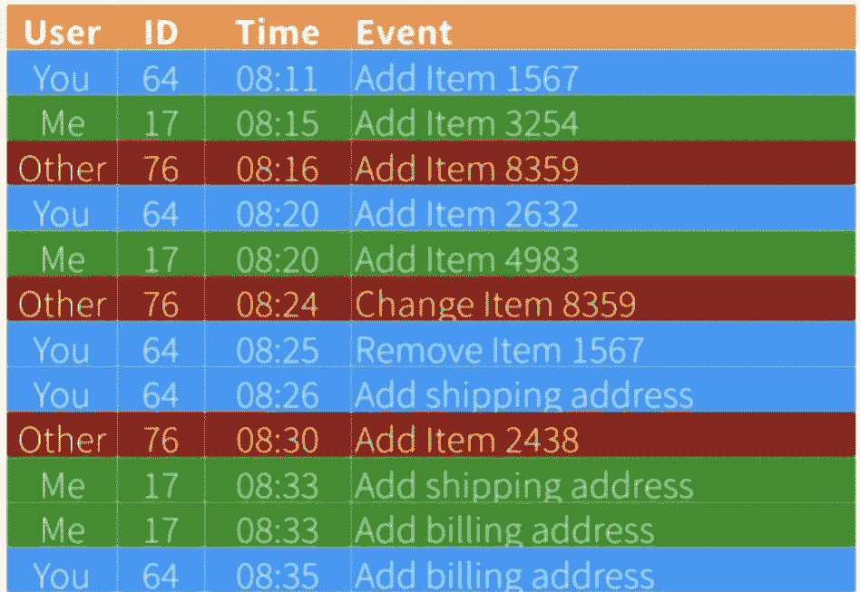

# 云原生应用:无状态还是有状态服务？

> 原文：<https://thenewstack.io/cloud-native-applications-stateless-or-stateful-services/>

[Lightbend](https://www.lightbend.com/) 赞助了这篇文章。

 [休·麦基

Hugh 是 Lightbend 的开发者拥护者。他在构建应用程序方面有很长的职业生涯，这些应用程序发展缓慢，没有有效地利用它们的基础设施，而且很脆弱，容易失败。他现在的重点是帮助其他开发人员和架构师构建弹性和可伸缩的分布式系统。Hugh 经常在会议上发言，并且是《设计反应式系统:分布式架构中参与者的角色》(O'Reilly)一书的作者。](https://www.linkedin.com/in/mckeehugh/) 

长期以来，无状态服务一直是开发者的首要选择。使用无状态协议的原因之一是，它提供了故障恢复能力、故障时的恢复策略，以及增加和减少处理能力以处理流量变化的选项。

虽然从表面上看，构建无状态的 web 应用或微服务可能是正确的方式，但在某些情况下，这不一定是[云原生服务](https://thenewstack.io/10-key-attributes-of-cloud-native-applications/)的最佳方式。在这篇文章中，我们将讨论无状态和有状态应用程序设计之间的区别，并提供一个进一步探索的途径。

构建无状态系统有两个主要优势。首先，编程复杂度降低。接收、处理和遗忘传入的请求。第二，不需要维护状态，复杂性通常围绕着维护会话状态，这通常涉及在集群中复制会话状态。这种复制方法用于在其中一台服务器离线时维护会话状态。

在[维基百科对无状态协议的定义](https://en.wikipedia.org/wiki/Stateless_protocol)的最后一句话中，它写道:“无状态协议的这一属性使它们成为大容量应用程序的理想选择，通过消除因保留会话信息而导致的服务器负载来提高性能。”虽然无状态方法确实没有维护会话状态的开销，但是它引入了处理模式，这些模式有自己的开销和性能成本。

无状态这个术语有点误导。应用程序本质上处理事物的状态——这就是它们所做的，它们创建、读取、更新和删除有状态的项目。无状态流程的典型处理流程是接收请求，从持久性存储(如关系数据库)中检索状态，更改所请求的状态，将更改后的状态存储回持久性存储，然后忘记发生的任何事情。

虽然可以减少与不在服务器上维护会话状态相关的开销，但是将状态管理委托给应用程序之外可能会有相关的成本，例如将状态管理的唯一责任委托给持久层。当持久层由于高度争用而变慢时，经常会看到这种开销。也许真的有可能通过增加或减少无状态服务器的数量来扩展应用层的处理能力；然而，持久层并不具有无限的处理能力，这也是事实。一旦超过了持久性处理能力，应用程序通常就不能再快了。

通过将状态管理从应用层委托给持久层，理解使用无状态方法的决定导致了持久能力的限制是很重要的。

## 何时使用有状态方法

对于许多使用[云原生应用](https://thenewstack.io/what-are-cloud-native-patterns-and-how-should-you-use-them/)的开发人员和架构师来说，我们的直觉告诉我们，从表面上看，有状态方法具有优势。最明显的好处是有可能减少与每个请求的状态检索相关的开销。然而，我们的直觉也告诉我们，维护状态是有代价的，有可能增加复杂性。

然而，这种复杂性增加的感觉通常是因为我们从我们当前做事方式的角度来看待问题。这是我们当前跨集群维护状态的方法，也是我们当前处理持久性的基于关系型 CRUD 的方法。

让我们看看基于事件的状态持久性。这种有状态的替代方案共享一种事件优先的方式来处理和保持状态变化。使用经典的购物车场景，购物车状态的每次更改都作为一系列事件被持久化。

图一。持续事件

上图展示了一系列购物车状态更改事件。这是一个事件日志的例子。当每个事件发生时，事件被保存到存储在数据库中的事件日志中。

事件是事实的陈述，是过去某个时间点发生的事情的日志，是历史记录。在上面的事件日志中，事件聚合显示您的购物车包含一个商品——商品 1567——和一个送货和账单地址。我的购物车包含两个项目以及送货和帐单地址。最后，另一个购物车包含两个商品。

另外，请注意，事件日志记录了各种购物车更改。例如，您从购物车中移除了一件商品。其他用户更改了购物车中的一个商品。这是使用传统的基于 CRUD 的持久性方法时通常会丢失的历史数据类型的一个例子。

在任何时间点，都可以通过回放事件来确定购物车的状态。当然，这使得在当前时间恢复任何购物车的当前状态成为可能。它还可以查看购物车在过去某个时间的状态。例如，在 08:20，您的购物车中有两件商品。

使用事件持久化数据的一个优点是，现在可以记录所有随时间发生的有趣事件，这些事件导致了每个购物车的当前状态。这种事件数据，例如删除或更改项目，对于下游数据分析来说是非常有趣的。

事件日志的另一个优点是持久性数据结构是一个简单的键和值对。在这个示例中，键是用户 Id、项目 Id 和时间，值是事件数据。事件日志也是幂等的，事件是只插入的，没有更新也没有删除。仅插入的方法减少了持久层的负载和争用。

## 结论

像往常一样，当谈到云原生软件系统时，确定最佳方法取决于具体情况。当考虑无状态和有状态系统时，这当然适用。在许多情况下，无状态方法是一个可以接受的解决方案；然而，在越来越多的场景中，使用有状态方法是更好的选择。对于不断增长的对高性能、接近实时和基于流的系统的需求来说，这无疑是正确的。

*如果您想更详细地探索有状态应用程序，请下载 Lightbend 的 Akka 创始人兼 CTO Jonas bonér 撰写的“ [**构建有状态云原生应用程序**](https://www.lightbend.com/ebooks/build-stateful-applications) ”的副本，开始以简单高效的方式运行有状态服务。*

通过 Pixabay 的特征图像。

目前，新堆栈不允许直接在该网站上发表评论。我们邀请所有希望讨论一个故事的读者通过推特或脸书访问我们。我们也欢迎您通过电子邮件发送新闻提示和反馈:[feedback @ thenewstack . io](mailto:feedback@thenewstack.io)。

<svg xmlns:xlink="http://www.w3.org/1999/xlink" viewBox="0 0 68 31" version="1.1"><title>Group</title> <desc>Created with Sketch.</desc></svg>