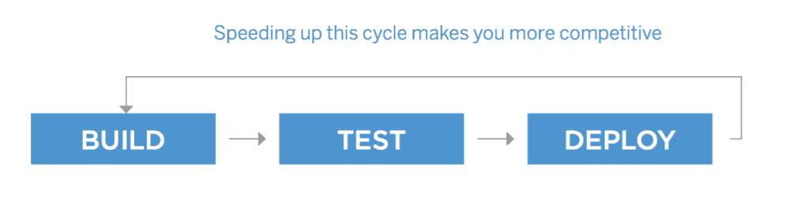

# 云原生架构:一个堆栈，多种选择

> 原文：<https://thenewstack.io/cloud-native-architecture-one-stack-many-options/>

 [苟饶，Portworx

苟饶，Portworx 联合创始人兼首席技术官，曾任戴尔数据保护部门和思杰系统 ASG 公司首席技术官；Ocarina Networks 和 Net6 的联合创始人兼首席技术官；也是英特尔和洛克希德·马丁公司的主要架构师。他拥有计算机科学学士(班加罗尔大学)和硕士(宾夕法尼亚大学)学位。](http://www.portworx.com) 

作为一家专门从事[云原生存储](https://portworx.com/cloud-native-storage/)的公司的首席技术官，我对企业 IT 领域正在发生的巨大变革有着第一手的看法。简而言之，现在有两件事情同时发生，使得构建、部署和运行复杂的应用程序变得非常简单。

首先是向云的迁移。这个话题讨论得太多了，我就不试着补充什么新东西了。我们都知道它正在发生，我们都知道它的影响是巨大的。

第二个是迁移到[云原生架构](https://thenewstack.io/what-are-cloud-native-patterns-and-how-should-you-use-them/)。由于这是一个相对较新的发展，我想在今天的帖子中重点关注它，特别是可插拔的云原生架构的重要性。但是在深入探讨如何为云原生架构之前，让我们先定义一下。

## 云原生是什么意思？

给原生云下一个准确的定义很困难，但是大多数人都会同意这个简短的属性列表:

*   该架构基于微服务
    *   松散耦合的系统更容易构建、部署和更新
*   它是自动化的
    *   CICD、API、自动化配置管理—一切都是自动化的。
*   DevOps 驾驶它
    *   构建应用程序的人也运行该应用程序。不要再把申请扔在墙上了。

微服务、自动化和 DevOps 文化的结合导致了两个方面的根本改进:软件团队的敏捷性和应用程序的弹性。

### 灵活

大的不再吃小的了。快者吃慢者。软件驱动的创新正在改变每一个主要行业。如果一个团队能够比它的竞争对手更快地加快构建-测试-部署周期，它就能获得更大的市场份额，因为它能更好地响应不断变化的条件。

云原生应用程序通过将应用程序分成多个更小的部分来提高 IT 团队的敏捷性，这些部分可以由小团队独立构建、自动测试和部署，并且每个部分不会影响应用程序的任何其他部分。

这些云原生应用程序与通常所说的“单一”应用程序形成对比。通常，在一个单一的应用程序中，改进代码的一部分需要改变另一部分。这种将特性紧密耦合到单一代码库的方式导致了不频繁的高风险软件发布。那些每季度或每年才发布新版本软件的企业很容易被更灵活的竞争对手破坏。

另一方面，云原生应用通过重视自动化来提高敏捷性。自动化任务意味着可以更快更频繁地完成任务，而不会增加人为错误的风险。自动化还可以让您专注于自动化当前手动完成且容易出错的其他任务。

### 弹性

基于容器的微服务构建、测试和部署更快，但是它们的质量更高吗？来自企业的证据表明答案是肯定的。

这是因为微服务是“松散耦合”的；系统某一部分的故障不太可能影响到另一部分。例如，如果使用微服务构建的在线银行服务的“转移资金”功能出现问题，用户仍然可以在线查看账户余额或支付账单，因为每个单独的功能都是其自己的微服务，拥有自己的数据库。虽然用户可能会体验到降级的体验，但是作为功能部件的组合，服务仍然是有用的。

将这种云原生弹性与整体银行应用程序进行对比；如果用户无法访问单个 Oracle 数据库，他或她也无法查看帐户余额、转移资金或支付账单。

## 云原生意味着容器原生

所以，云原生是牛逼的:我懂了，你说。但是你是怎么做到的呢？越来越多的答案是集装箱。容器对于云原生架构有一些非常引人注目的好处:

*   **快速** —容器的启动速度比基于虚拟机的同类产品快得多，因为同一主机上的多个容器共享一个操作系统。
*   **轻量级**——因为容器非常轻量级，所以你可以在一台主机上获得比虚拟机更多的容器，Linux 在提供资源隔离方面做得很好。
*   **一致**——因为容器是和它的依赖项一起打包的，所以在不同的环境中一致地运行容器化的应用程序更容易。

事实上，容器如此引人注目，以至于很难想象不基于容器的云原生架构。你说网飞怎么样？[甚至它正在移动到集装箱](https://www.slideshare.net/AmazonWebServices/aws-reinvent-2016-netflix-container-scheduling-execution-and-integration-with-aws-con313)。

因此，问题变成了，云原生架构看起来像什么？

## 带上你自己的积木

多亏了[云原生计算基金会](https://www.cncf.io/) (CNCF)，一个正在形成的共识是[云原生架构包括几个层](https://github.com/cncf/landscape)，所有这些层都是可插拔的，并且基于工作的最佳工具。

下面的 CNCF 图表提供了这种架构的简化视图:

顶部是一个调度器，在这里是 Kubernetes，但是如果我们愿意，我们也可以包括 DC/OS 或 Swarm。

在调度器的下面是容器执行运行时，它现在基于[开放容器倡议](https://www.opencontainers.org/) (OCI)规范，其中 runC 是最流行的选项。但是，由于这是一个可插拔的架构，您可以使用任何符合 OCI 标准的运行时，而不必大幅重新设计您的应用程序。

OCI 下面还有另外两个重要标准:集装箱网络接口(CNI)和集装箱存储接口(集装箱安全倡议)。

CNI 允许不同的工具为多主机容器部署提供覆盖网络。用户可以使用 Weave、Contiv 或 Docker 网络来提供网络服务，并根据需要更换它们。因为所有这些服务都符合 CNI，所以转换成本很低，用户可以尝试多种解决方案来找到最适合的方案。

CSI 以同样的方式工作，但是用于云原生应用数据层，通常称为持久层。

我的公司[Portworx](https://portworx.com/)深入参与了 CSI 项目，我们相信，像堆栈的其他层一样，CSI 为用户提供了关于他们运行哪些工具的选择。CSI 使得针对基于文件的工作负载采用 GlusterFS 以及针对数据库工作负载采用 Portworx 或 RexRay 或 StorageOS 变得非常容易。关键是用户永远不会被锁定在一个供应商上。因为任何数量的服务提供商都可以接入 CSI，所以从一个解决方案开始的用户可以转到另一个解决方案。

例如，在 Portworx，我们认为我们是持久存储的绝佳解决方案，但我们不认为我们的用户应该被束缚在一个架构中，如果 Portworx 不是合适的工具，就强迫他们使用它。我们很自豪能够成为推动 CSI 和其他项目的社区的一员，使云原生架构成为一个具有许多选项的堆栈。

<svg xmlns:xlink="http://www.w3.org/1999/xlink" viewBox="0 0 68 31" version="1.1"><title>Group</title> <desc>Created with Sketch.</desc></svg>